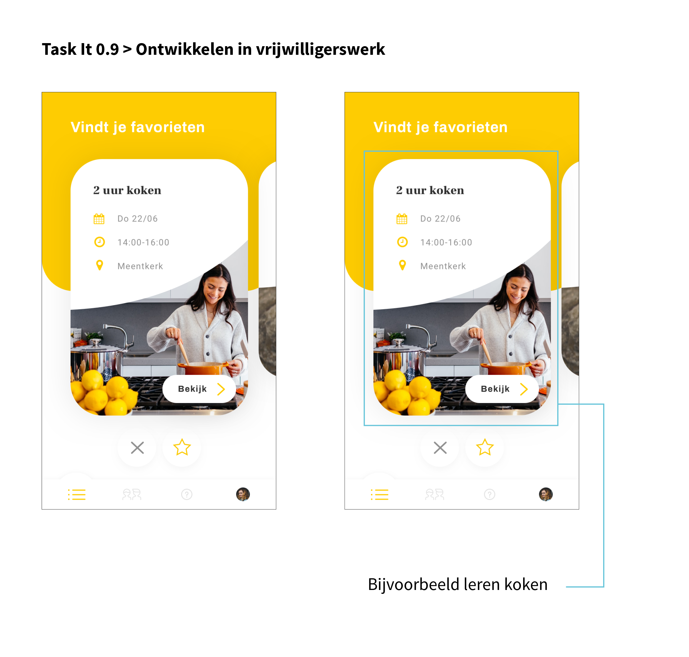
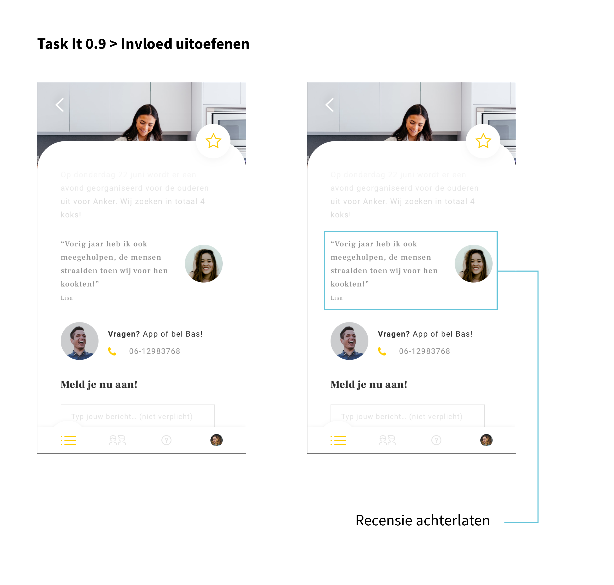
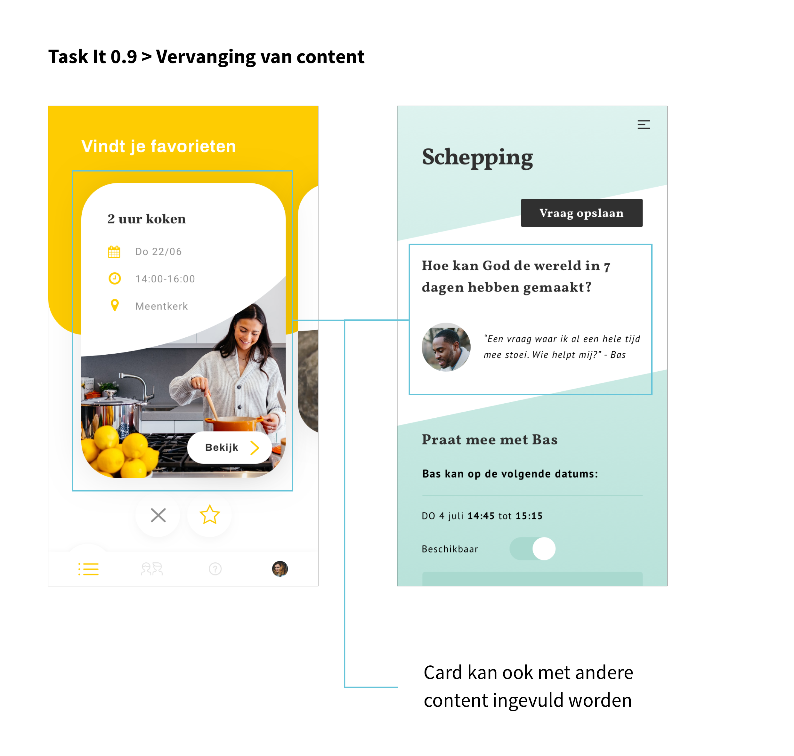

# Visie

| Behandelde onderzoeksvraag |  |
| :--- | :--- |
| **Hoofdvraag: wat is nodig om tot een nieuw product te komen?** |  |

## Gedachtegang achter Task It

### Aanloop naar het concept

Hieronder staan relevante conclusies beschreven die meegenomen zijn naar het concept Task It. Deze conclusies komen voort uit eerder gedaan onderzoek en gesprekken. Dit zijn gesprekken geweest met stakeholders en met school.

#### Uit onderzoek naar de [doelgroep](https://maroeska-productbiografie.gitbook.io/productbiografie/inzichten-april-+-mei/persona) is gebleken dat zij:

* Wat willen betekenen voor de kerk
* Vrijwilligerswerk willen uitvoeren wat bij hen past \(of leuk/gezellig is\)
* Het lastig vinden om in te schatten waar behoefte is aan vrijwilligerswerk
* Het gevoel hebben dat zij vast zitten aan het vrijwilligerswerk wanneer zij zich hiervoor opgeven en zich niet makkelijk kunnen uitschrijven

#### Uit gesprekken met het [jeugdpastoraat](https://maroeska-productbiografie.gitbook.io/productbiografie/onderzoek/stakeholders-1/anne-karine-jeugdpastoraat) is gebleken dat:

* Zij behoefte hebben aan iets waardoor de doelgroep bij elkaar komt en eigen initiatief neemt
* Zij behoefte hebben aan niet meer iets wat van bovenaf organiseren, maar van onderaf \(vanuit de doelgroep\) 

#### Uit gesprekken met [school](https://maroeska-productbiografie.gitbook.io/productbiografie/inzichten-mei-+-juni/school-meetings-fase-1#18-06-19-meeting-met-studenten-en-sjef-marije) is gebleken dat:

* Ik aan de gebruiker inspiratie kan aanbieden wat betreft vrijwilligerswerk, ookal is dit nog niet perse hun eerste interesse is waar zij aan denken. Volgens Sjef en Marije weten sommige mensen niet wat zij nu echt interessant vinden. 

#### Uit het gesprek met de [HGJB](https://maroeska-productbiografie.gitbook.io/productbiografie/onderzoek/stakeholders-1/hgjb#23-05-19-kennismakingsgesprek-hjgb) is gebleken dat:

* Een accuut probleem in kerkelijke gemeenschappen is het niet \(of weinig\) hebben van vrijwilligers

### Essentie van het concept

In Task It wordt de gebruiker geïnspireerd om taken uit te voeren. Deze kunnen zowel kortdurig als langdurig zijn. Tijdens het aanmaken van een account kan de gebruiker opgeven welke activiteiten hem/haar aanspreken. Vervolgens verschijnen taken in beeld die bij de gebruiker kunnen matchen. De taak bevat heldere informatie, zodat de gebruiker weet waar hij/zij aan toe is en of de taak bij hem/haar past. Op deze manier kan de gebruiker vrijwilligerswerk uitkiezen dat bij hem/haar past, mensen ontmoeten en zichzelf ontwikkelen in de soorten taken.

### Nieuwe leden motiveren

Tijdens de[ literature study](https://maroeska-productbiografie.gitbook.io/productbiografie/onderzoek/literature-study#communities) is beschreven dat volgens Staal \(2017\) een lid gemotiveerd wordt om deel te nemen aan een community door de volgende 5 redenen:

1. Leren. Leden nemen deel aan een community, omdat zij ergens beter in willen worden \(beroep, hobby of interesse\). Dit doen zij door vragen te stellen, uitdagingen op te lossen en/of informatie te lezen.

2. Profileren. Leden zoeken status.

3. Invloed uitoefenen. Leden hopen verschil te kunnen maken met hun bijdrage. Zij willen graag het gevoel hebben van betekenisvol zijn.

4. Ergens bij willen horen. Leden willen niet het gevoel hebben dat zij alleen zijn. Zij willen nieuwe mensen ontmoeten en bij een groep horen.

5. Anderen willen helpen.

#### Ontwerp keuze

In Task It zijn deze 5 redenen vertaald in het ontwerp:

* Leren: ontwikkelen in vrijwilligerswerk

* Profileren: het uitvoeren van vrijwilligerswerk en hiervoor waardering krijgen.

* Invloed uitoefenen: recensie kunnen achterlaten van een uitgevoerde taak.

* Ergens bij willen horen: zichtbaar hoeveel mensen nodig zijn of deelnemen aan een taak

* Anderen willen helpen: in de vorm van vrijwilligerswerk iets voor een ander betekenen

### Vaste gasten taken geven en belonen

Om een community te laten rollen, zijn er volgens Staal \(2017\) vrijwilligers nodig de taken kunnen oppakken. **Het is belangrijk voor een community om taken te zoeken bij al aanwezige competenties** in plaats van taken toe te wijzen aan deelnemers die niet over de juiste competenties of interesses beschikken.

Wanneer taken zijn gedaan door leden, helpt het hen om te worden beloont. Bijvoorbeeld door middel van een punten systeem, hoe meer punten er verdient worden hoe meer privileges het lid krijgt.

Leden die taken oppakken kunnen extra zichtbaar worden gemaakt in de community en kunnen extraatjes krijgen.

#### Ontwerp keuze

In het ontwerp wordt de gebruiker geïnspireerd met afbeeldingen van activiteiten. De gebruiker kiest de afbeeldingen uit die hem/haar aanspreken. Vervolgens krijgt de gebruiker taken te zien met betrekking tot de gekozen interesses van de gebruiker. Daarnaast is er nagedacht over een recensie kunnen achterlaten. Dit helpt leden om gemotiveerd actief te zijn binnen de community. Het punten systeem is verwerkt in het concept Social Up en kan worden toegepast in Task It.

### Overige kernbehoeftes kunnen vervangen

In Task It staat het matchen van taken met de persoon centraal. Dit is 1 van de kernbehoeftes van de gebruiker. De overige 2 kernbehoeftes waren: 

1. **Praten over gemeenschappelijke interesses met een bekend of onbekend persoon, inclusief gemeenschappelijke geloofsvragen**
2. Gepassioneerd vrijwilligerstaak doen, zowel korte en afgeronde taken als lange en doorlopende taken \(verwerkt in concept\)
3. **Makkelijk kunnen creëren van een plek van samenkomst over geloof of makkelijk hieraan kunnen deelnemen**

#### **Ontwerpkeuze**

De taken in Task It kunnen vervangen worden door personen met dezelfde interesses als de gebruiker \(of juist nieuwe suggesties bieden\). Wat ook zou kunnen, is dat de gebruiker kan aangeven met welke geloofsvragen hij/zij zit en dat er gespreksgroepen of gesprekspersonen in beeld verschijnen die deze vragen ook willen behandelen. Op deze manier kan het matchen van interesses of geloofsvragen ook gekoppeld worden aan de gebruiker.

