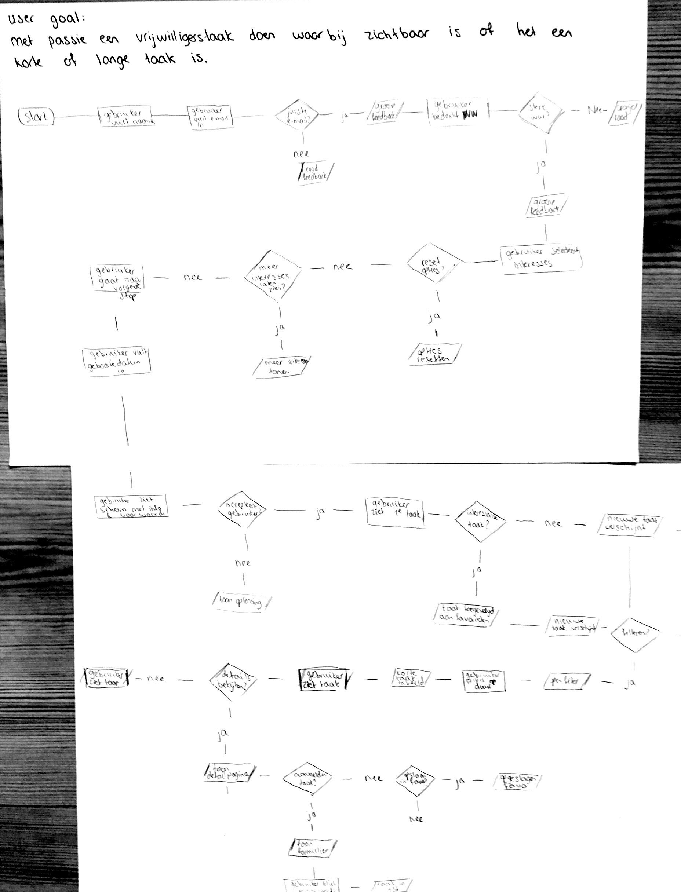
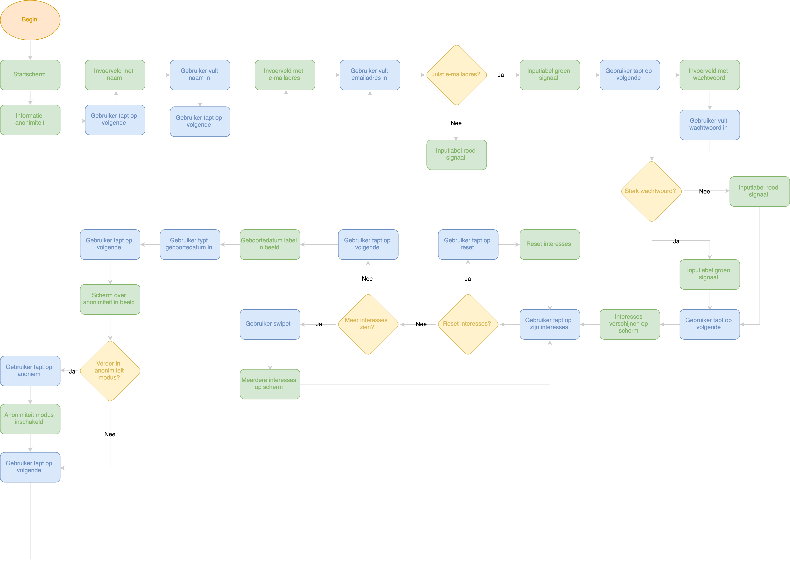
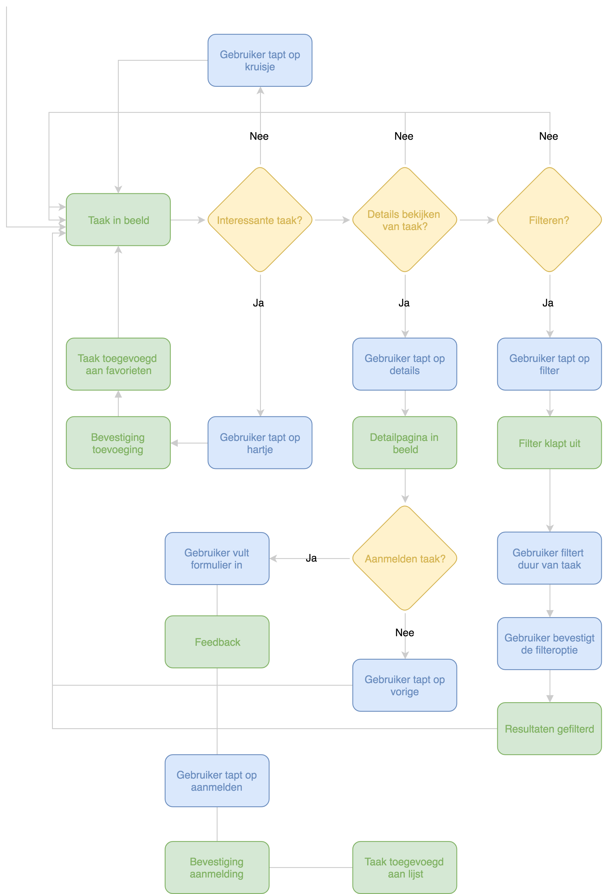

# Flows

| Behandelde onderzoeksvragen |  |
| :--- | :--- |
| **Hoofdvraag: wat is nodig om tot een nieuw product te komen?** |  |
| Hoe creëren we een persoonlijke gebruikerservaring? |  |

De basis flow van de app bestaat uit het aanmaken van een profiel en swipen door taken, deze toevoegen aan favorieten en hiervoor aanmelden.

## Schets

## Flow chart

## Proces

Aan het begin vond ik het best lastig om een flow te maken, omdat ik dit al een tijdje niet had gedaan. Ik heb veel gezocht naar voorbeelden en tools. Ik kwam uit op op draw.io en dit werkte prettig, omdat het heel basic was. 

