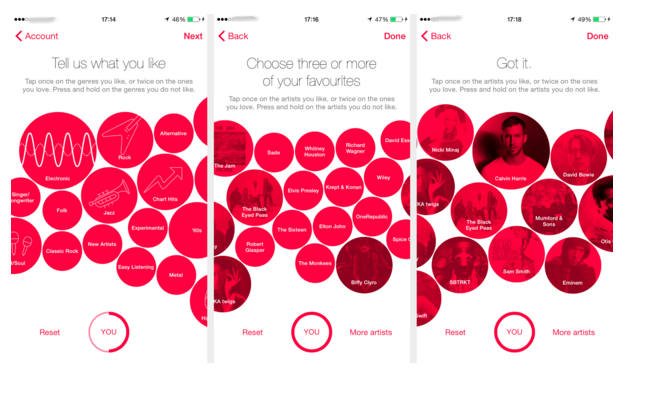
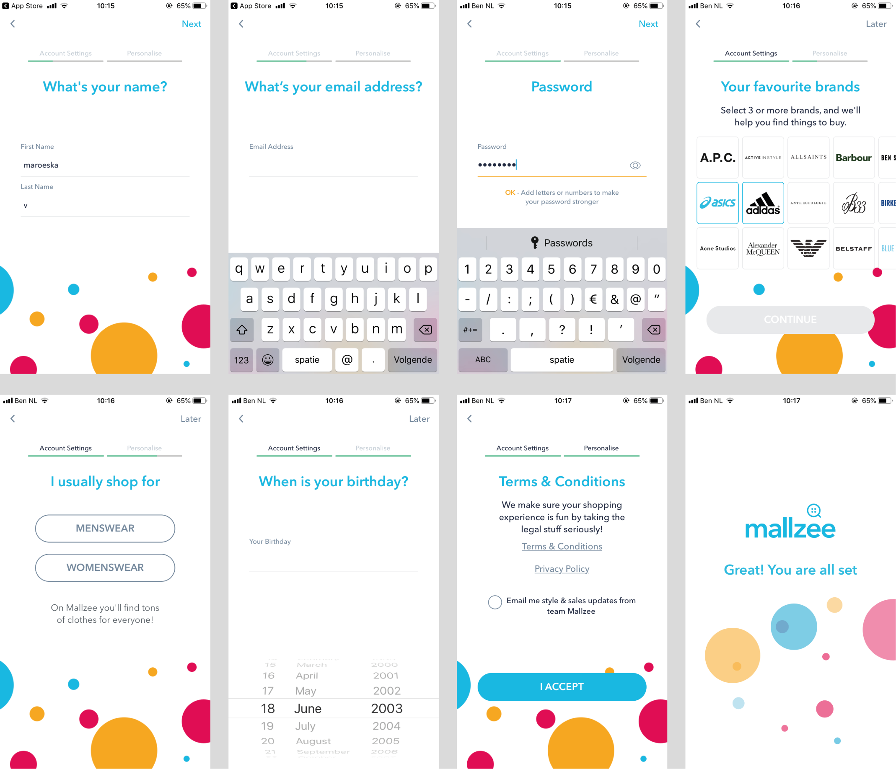
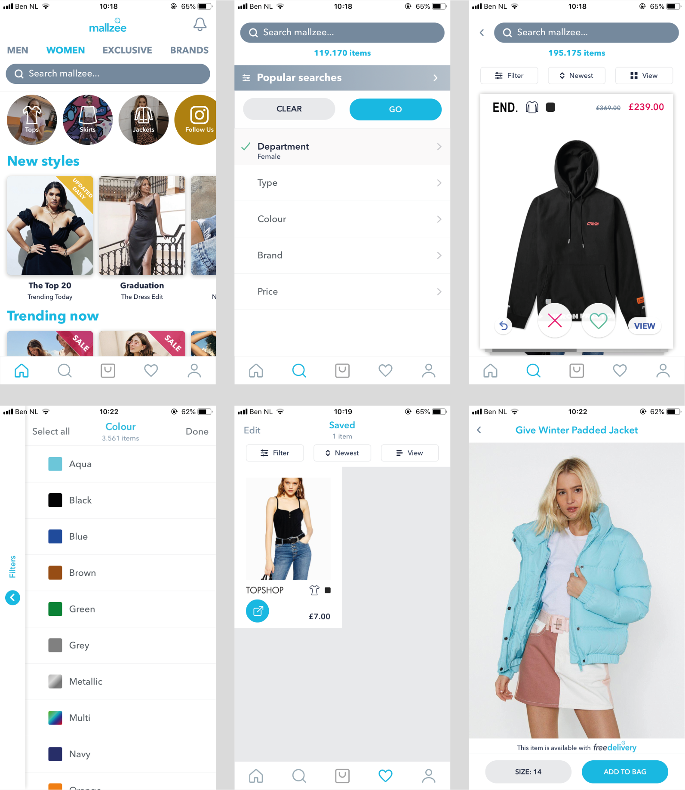
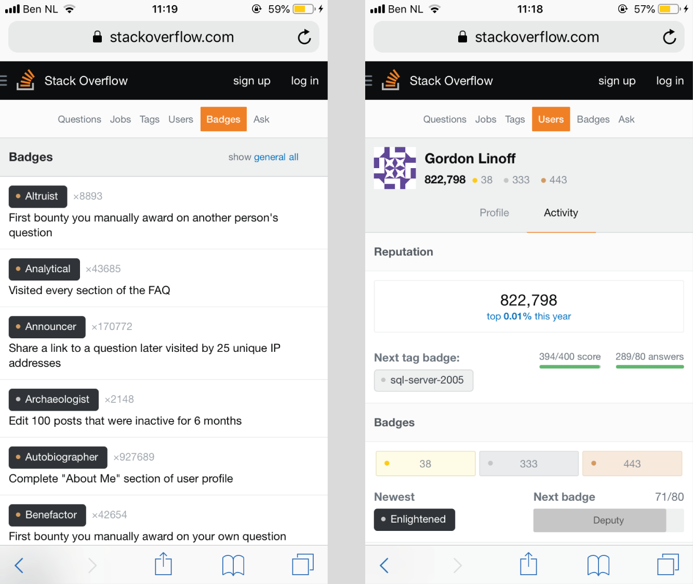
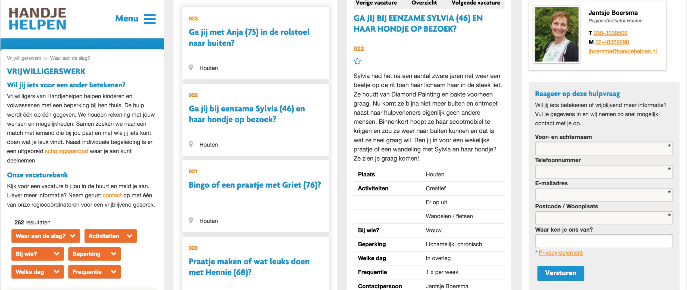
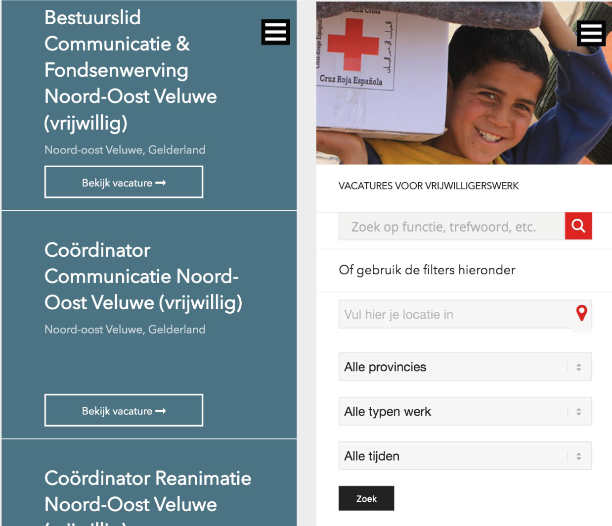
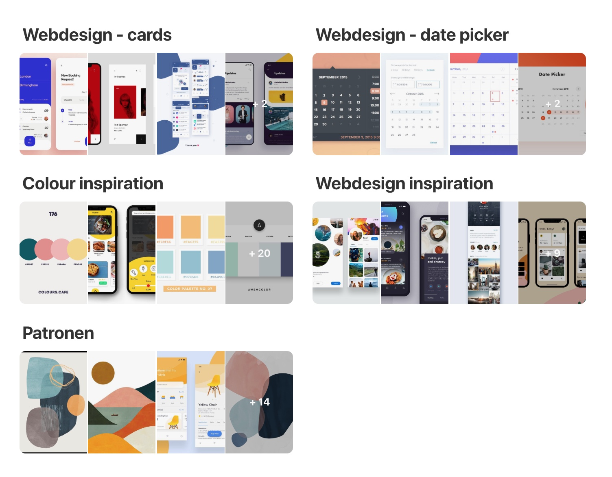
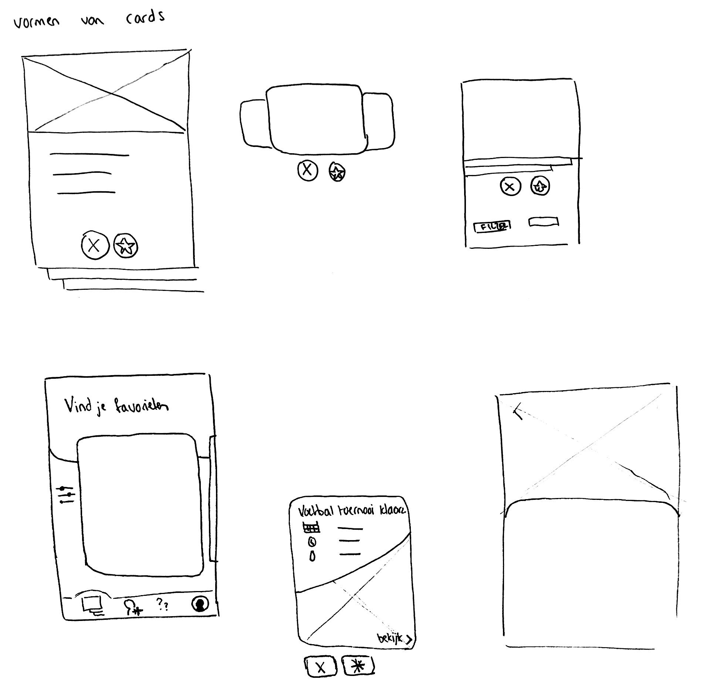
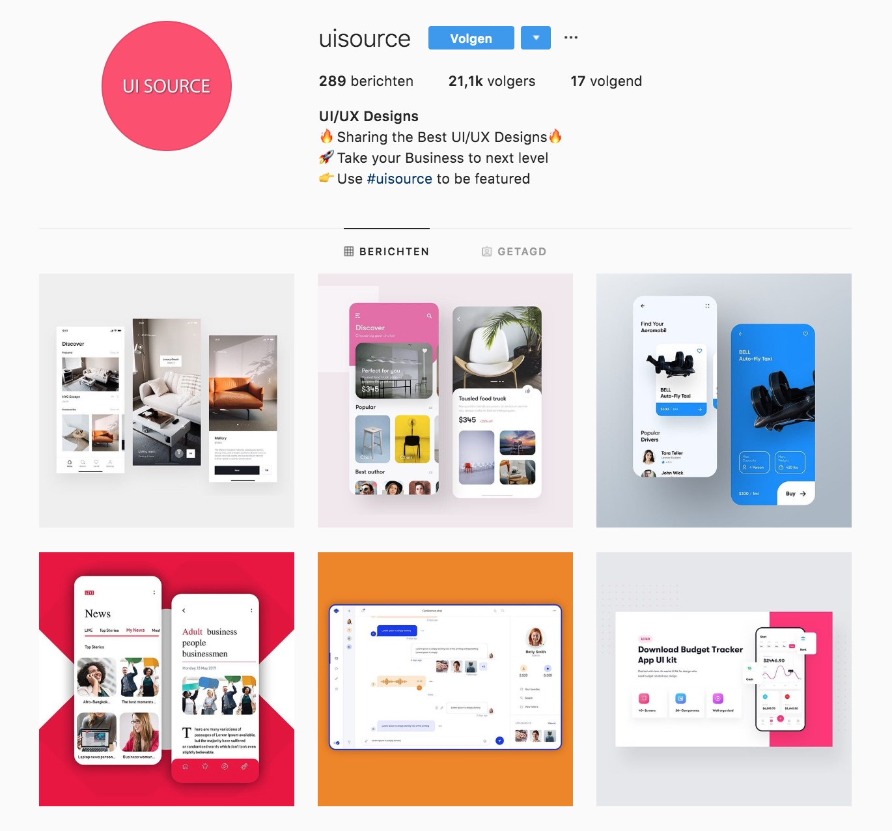
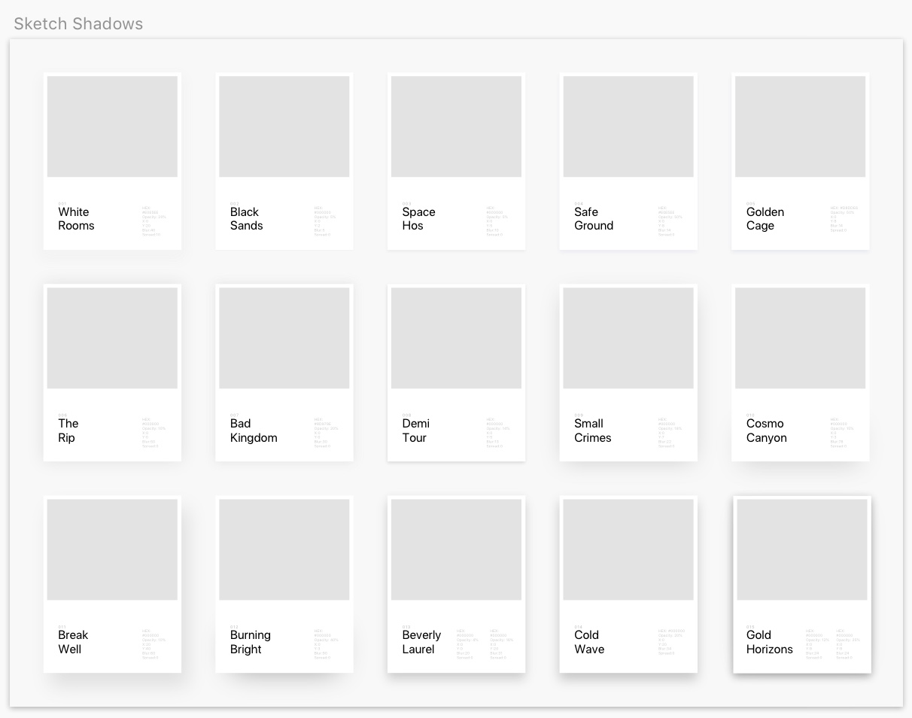

# Inspiratie

| Behandelde onderzoeksvragen |
| :--- |
| **Hoofdvraag: wie is de concurrentie?** |
| Wat kunnen wij leren van de concurrentie? Wat doen zij fout en wat goed? |
| Hoe bieden concurrenten hun content aan? |
| Hoe kunnen we ons onderscheiden van de concurrentie? |

## Personalisatie

### Apple Music

Bij een eerste aanmelding voor Apple Music komen deze schermen in beeld. De cirkels bewegen zachtjes mee en het aanmeldproces verloopt soepel en snel.

### Airbnb 

Airbnb gebruikt de eerdere ervaringen en reizen van een gebruiker om persoonlijke ervaringen aan te bieden. Airbnb probeert deze voorkeuren aan te passen aan accommodaties waarvan hij denkt dat deze het beste bij de gebruiker passen. Airbnb biedt ook persoonlijke trips aan.

### Mallzee

Mallzee is een winkel-app in Europa \(ook beschikbaar in de VS\), die de Tinder-interface gebruikt om te winkelen. De app verzamelt gegevens over gebruikersvoorkeuren \(favoriete merken, kleuren, stijl, dat soort dingen\) en stuurt vervolgens unieke suggesties over wat gebruikers volgens haar leuk vinden om te dragen. 

Ik heb zelf de personalisatie van Mallzee doorlopen. Het match systeem zit in de hele app verwerkt. In plaats van dat alle kleding in een lijst onder elkaar staat, moet de gebruiker bij elk thema aangeven of het een go of no go is.

#### Gebruikersvoorkeuren 

Wat interessant is aan deze stappen, is dat de voortgangsbalk bovenin te zien is en dat de stappen laagdrempelig zijn. Het naar rechts swipen om merken te zien, werkt prettig. Ook zijn de logo's op een goed formaat zichtbaar.

#### Match systeem

Tijdens het matchen kan de gebruiker een filter instellen en bekijken wat trends zijn. Bijna alles wordt gedaan door het match systeem. Alleen de favoriete items van de gebruiker of van anderen worden in een lijst weergegeven. 

## Punten systeem

### Stack overflow

In de community Stack Overflow, een vraag en antwoord forum voor programmeurs, kan de gebruiker badges en punten verdienen als hij/zj goede antwoorden geeft. Hoe meer punten de gebruiker behaalt, hoe meer privileges hij/zij krijgt.

### wikiHow

wikiHow is een community voor simpele how-to’s en recepten. De gebruiker mag bijvoorbeeld pas leden welkom heten, als hij/zij zich al hebt bewezen als toegevoegde waarde in de community. 

## Taken

### Handje helpen

Wat interessant is aan handjehelpen.nl is dat de oproep vragend wordt gesteld wat persoonlijker overkomt. Daarnaast staat ook een foto met contactgegevens van de persoon die over deze taak gaat.

### Rode kruis

De filters van rodekruis.nl vind ik duidelijk, daarnaast geeft het ontwerp en tekst de indruk alsof de gebruiker echt voor een baan solliciteert. 

### Zonnebloem

Zonnebloem.nl brengt de call to action opvallend in beeld en geeft de basis informatie in de card duidelijk en kort weer.

## Vormgeving

De inspiratie voor het vormgeven van Task It is van pinterest gehaald & Instagram. Ik heb ook een bestand gedownload voor shadows onder cards en buttons, omdat ik hier niet heel veel mee heb gewerkt. Door middel van dat bestand heb ik kunnen oefenen met soepele schaduwrandjes. Opvallend is dat op elke inspiratiebron voor webdesign, er veel gebruik wordt gemaakt van afgeronde cards. Dit is meegenomen in mijn ontwerp.

