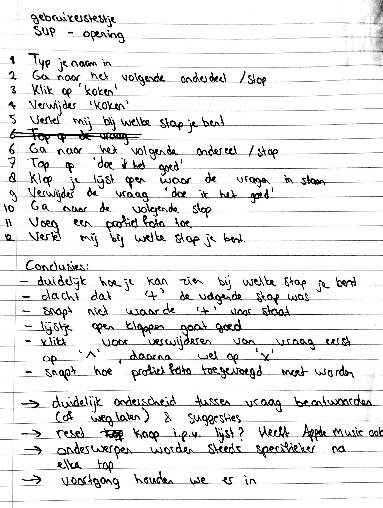

# Prototype + gebruikerstest

| Behandelde onderzoeksvragen |  |
| :--- | :--- |
| **Hoofdvraag: wat is nodig om tot een nieuw product te komen?** |  |
| Hoe creëren we een persoonlijke gebruikerservaring? |  |

| Behandelde onderzoeksvragen |  |
| :--- | :--- |
| **Hoofdvraag: hoe stel ik een goede prototype + test op?** | \*\*\*\* |
| Welke prototyping tool is het meest geschikt om het ontwerp in te testen? |  |
| Waarin lopen gebruikers vast tijdens het testen? |  |

## Onderdeel 1: opening met suggesties

Elk onderdeel is getest met 1 persoon door middel van een paper prototype. Hierdoor werden er al snel fouten uitgehaald.

Voordat de paper prototype uitgewerkt werd, is er op een rijtje gezet wat voor concept er ongeveer gecreëerd kon worden.

### Paper prototype

Het eerste deel van het concept \(de opening met suggesties\) is uitgewerkt in een paper prototype.

### Testplan met vragen en conclusies

## Onderdeel 1 iteratie + onderdeel 2: taken

### Schetsen van de taken

### Prototype \(digitaal\)

In Sketch is een mid-fi prototype gemaakt om nog een keer het proces te doorlopen van aanmelden met aansluitend het matchen aan taken. Dit is getest met 1 gebruiker.

Klik [hier](https://sketch.cloud/s/oLma3/a/M0ZbY3/play) voor de link naar het prototype.

### Testplan met vragen en conclusies

### Conclusies uit de testen

* De app moet voorzien zijn van een scherm waarbij de gebruiker snapt waarvoor hij/zij zich aanmeldt. Als dit niet het geval is, moeten de stappen uitgebreidere uitleg bevatten
* De 'terug' button moet groter in beeld
* De ster en kruis button wordt gesnapt

## Prototype verbetering

In het nieuwe prototype is het stuk van anonimiteit weggehaald, omdat het anders voor de gebruiker lastig wordt om aan te melden voor een taak. Het stukje anonimiteit is meegenomen naar concept 3 die meer op persoonlijke vragen in gaat. Daarnaast is de 'terug' button groter gemaakt. Ook start de app met uitleg.

Klik [hier](https://sketch.cloud/s/oLma3/a/d5wb7E/play) voor de link naar het prototype.

#### 

