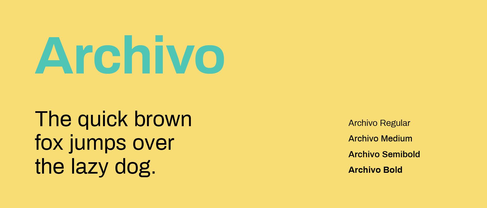
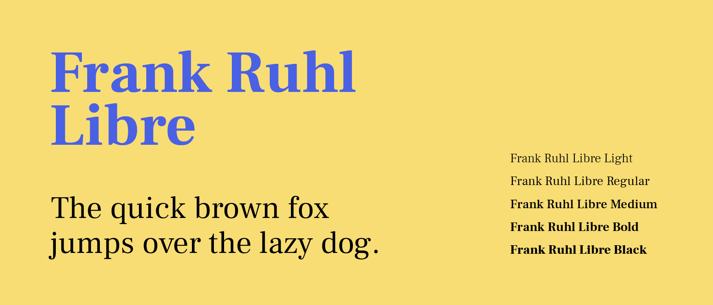
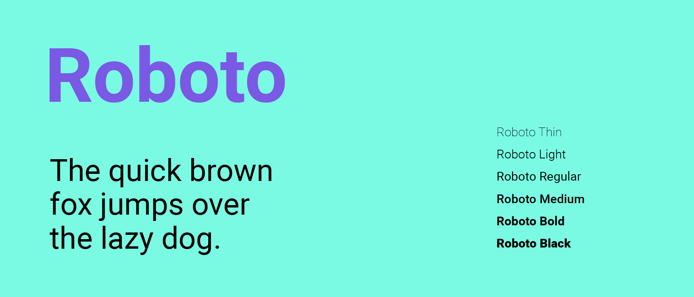

# Visual Design

| Behandelde onderzoeksvragen |  |
| :--- | :--- |
| **Hoofdvraag: wat is nodig om tot een nieuw product te komen?** |  |
| Hoe creëren we een persoonlijke gebruikerservaring? |  |

## Visual design Task It

Hieronder staan 5 schermen uitgewerkt hoe een visual design van het concept eruit zou kunnen zien.

## Argumentatie van het visual design

**Kleur**

Volgens Thuijs \(2012\) staat de kleur geel voor activatie van de hersenen. Het staat ook voor optimisme en energie, een mens wordt actief van de kleur geel. Leren, logica, intellect, wijsheid en groeien zijn termen die bij de gele kleur horen. Geel is naar buiten gericht. Binnen mijn concept past de kleur geel, want de gebruiker wordt gestimuleerd om actief deel te nemen aan de community. Ook kan de gebruiker zich ontwikkelen en leren door taken uit te voeren. 

**Cards**

Er is gebruik gemaakt van afgeronde cards, omdat dit minder statisch en zakelijk oogt dan wanneer de vorm recht is. 

**Beeld**

In plaats van dat de gebruiker moet lezen of typen om interessante activiteiten toe te voegen, kan de gebruiker foto's aanklikken. Volgens Haas \(2018\) is 70% van de mensen visueel ingesteld en brengt visualisatie context en overzicht, hierdoor wordt informatie beter begrepen én beter onthouden. 

**Kort en bondig**

Vanuit interviews met de doelgroep kwam naar voren dat de doelgroep niet van lange stukken tekst lezen houdt of van lange overdenkingen. Daarom is de informatie in de app kort en bondig weergeven. 

**Typografie**

Ter inspiratie voor de typografie is het artikel van Awwwards erbij gehouden. Via Google fonts is gekeken welke lettertypes daar weer bij passen. De trends van typografie zijn  [hier](https://maroeska-productbiografie.gitbook.io/productbiografie/inzichten-mei-+-juni/typografie) beschreven op het gebied van webdesign die voor mij als ontwerper een inspiratie hebben gevormd**.**

Er zijn 3 lettertypes gecombineerd in het ontwerp. 

