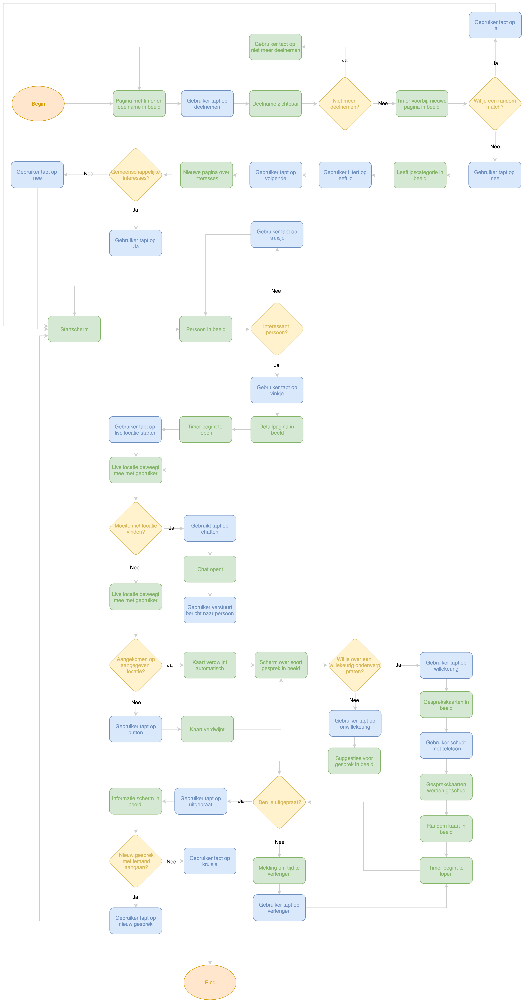
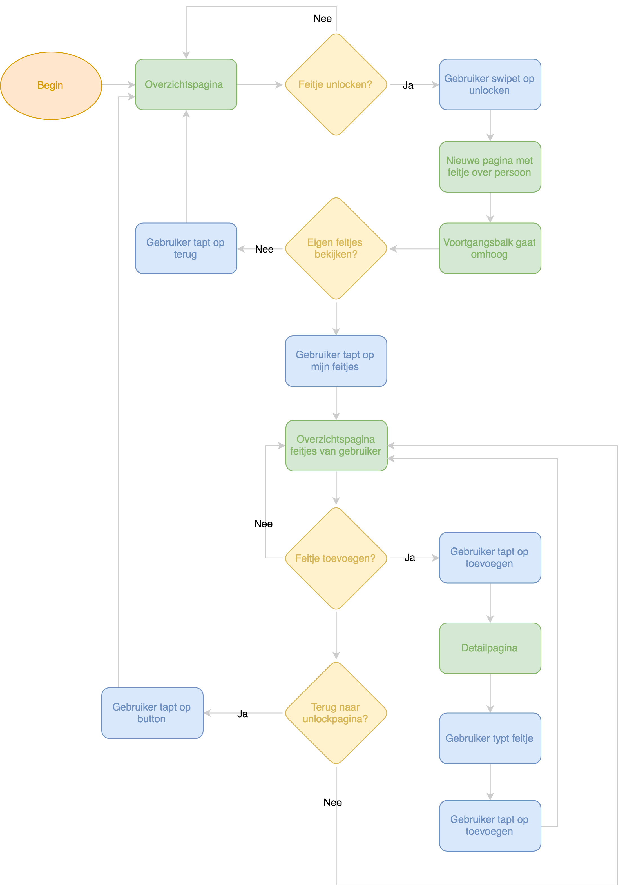

# Flows

| Behandelde onderzoeksvragen |  |
| :--- | :--- |
| **Hoofdvraag: wat is nodig om tot een nieuw product te komen?** |  |
| Hoe creëren we een persoonlijke gebruikerservaring? |  |

Voordat de wireframes zijn gemaakt, is er een flow van de stapjes uitgewerkt waar de gebruiker doorheen loopt.

## Flow - matchen van gebruikers

## Flow - unlocken van feitjes 

