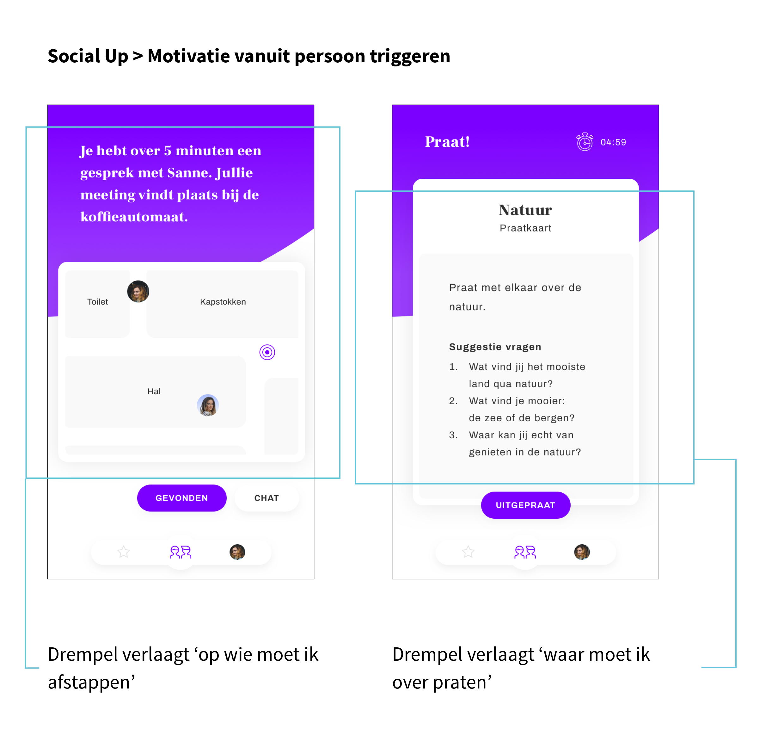

# Visie

| Behandelde onderzoeksvraag |  |
| :--- | :--- |
| **Hoofdvraag: wat is nodig om tot een nieuw product te komen?** |  |

## Gedachtegang achter Social Up

### Aanloop naar het concept

Hieronder staan relevante conclusies beschreven die meegenomen zijn naar het concept Social Up. Deze conclusies komen voort uit eerder gedaan onderzoek en gesprekken. Dit zijn gesprekken geweest met stakeholders en met school.

#### Uit onderzoek naar de [doelgroep](https://maroeska-productbiografie.gitbook.io/productbiografie/inzichten-april-+-mei/persona) is gebleken dat zij:

* Andere mensen in de kerkelijke gemeenschap willen leren kennen, ook van andere generaties
* Meer contact willen hebben met leeftijdgenoten in de kerkelijke gemeenschap
* Doordeweeks gemeente willen zijn en niet alleen op zondag
* Het moeilijk vinden van afstappen op onbekende mensen in de kerkelijke gemeenschap

#### Uit gesprekken met het [jeugdpastoraat](https://maroeska-productbiografie.gitbook.io/productbiografie/onderzoek/stakeholders-1/anne-karine-jeugdpastoraat) is gebleken dat:

* Zij behoefte hebben aan een digitale plek waar mensen elkaar kunnen vinden

#### Uit gesprekken met [school](https://maroeska-productbiografie.gitbook.io/productbiografie/onderzoek/meetings-fase-1#02-05-19-meeting-met-marije-en-medestudenten) is gebleken dat:

* Een soort van dating platform voor kerkgangers interessant kan zijn voor mijn project, op deze manier is de tool zelfdragend en hoeft alleen de techniek uitgewerkt te worden

### Essentie 

In Social Up worden mensen aan elkaar gekoppeld om een kort gesprekje te voeren om elkaar beter te leren kennen. Na de kerkdienst kunnen mensen deelnemen aan 'Social Up'. De helft van de gebruikers heeft invloed op met wie hij/zij wil praten. De andere helft van de gebruikers ontvangt een melding wanneer hij/zij gekozen is door een andere gebruiker om mee te praten. De gebruiker kan invloed hebben op de leeftijdscategorie en praten over gemeenschappelijke interesses. Vervolgens biedt Social Up 3 suggesties aan met wie de gebruiker kan praten. Social Up brengt vervolgens door een live locatie de 2 gebruikers bij elkaar. Zij mogen kiezen of zij vrijblijvend willen praten met elkaar, of dat zij een random gesprekskaart willen gebruiken tijdens het praten. Na afloop van het gesprek kan de gebruiker een feitje unlocken van de persoon waarmee hij/zij heeft gepraat. Dit kan pas een paar uur later, zodat de gebruiker terug komt op de app. Na elk unlockte feitje gaat de Social balk van de gebruiker 'up'.

### Intrinsieke motivatie

Binnen Social Up is gebruik gemaakt van gamification. Volgens \(Van den Berg, 2017\) is voor een succesvol concept het belangrijk om intrinsieke motivatoren van de gebruiker in kaart te hebben: dit is de motivatie vanuit de persoon zelf. De gebruiker wil graag gemeenteleden beter leren kennen, dit is een intrinsieke motivatie, alleen ervaart hij/zij drempels, zoals 'op wie moet ik afstappen, zitten zij te wachten op mij' en 'waar moet ik het met die persoon over hebben?'.

#### Ontwerp keuze

Binnen Social Up wil ik de drempels 'op wie moet ik afstappen' en 'waar moet ik over praten' verlagen of zelfs oplossen.

### Herkenning en erkenning

Mensen houden van herkenning en erkenning. Ook zijn mensen geneigd om dingen te doen, wanneer een ander dit ook doet. Gedrag wordt op deze manier gevormd door mensen om ons heen. Wanneer wij ergens bij horen, geeft dit ons een goed gevoel over onszelf. 

#### Ontwerp keuze

Binnen Social Up wordt inzicht gegeven aan de gebruiker hoeveel mensen meedoen aan een social round, zodat de gebruiker gemotiveerd raakt om ook mee te doen. 

### Staat van flow

Van den Berg \(2017\) concludeert dat de ‘flow’-theorie uitgaat van dat elk mens een optimaal niveau van prikkeling heeft. Volgens Csikszentmihalyi is een mens het gelukkigst wanneer hij/zij zich in een staat van opperste concentratie bevindt en daardoor helemaal opgaat in de activiteit die hij/zij moet uitvoeren. Het heeft de juiste balans tussen stress en verveling. Een mens is van nature altijd op zoek naar een balans tussen ‘continu moeten vechten’ en ‘zonder enige uitdaging in hun luie stoel zitten’. Daartussenin bevinden ze zich in een ‘flow’.

#### Ontwerpkeuze

Binnen Social Up is de flow-theorie toegepast. Deze theorie bestaat uit de volgende kenmerken:

* De gebruiker heeft een duidelijk doel 
  * het doel van de gebruiker is meer gemeenteleden leren kennen
* De gebruiker is geconcentreerd en werkt doelgericht 
  * voor het uitvoeren van een activiteit staat een bepaalde hoeveelheid tijd

* De gebruiker gaat volledig op in de activiteit en de omgeving vervaagt, hij/zij voert de activiteit bijna automatisch uit
  * het zoeken op locatie naar de juiste persoon zorgt ervoor dat de focus alleen op de opdracht van de gebruiker ligt

* De gebruiker verliest het besef van tijd
  * door het gesprek met de ander, kan de gebruiker de tijd vergeten
* De gebruiker krijgt directe feedback en kunt daar zijn/haar gedrag op aanpassen om de activiteit met succes uit te voeren
  * het product leidt de gebruiker door de opdracht heen en geeft feedback wanneer iets wel of niet goed gaat

* Er is een balans tussen de activiteit en de gebruiker zijn/haar eigen mogelijkheden. De gebruiker wordt uitgedaagd, maar de activiteit is niet te moeilijk
  * de opdracht uitvoeren is haalbaar: het verlaagt drempels en motiveert de gebruiker om deel te nemen, maar de gebruiker moet wel zelf kiezen óf hij/zij deel wil nemen en of hij/zij een gesprekje wil voeren \(= uitdaging\)
* De gebruiker heeft het gevoel in controle te zijn van de activiteit
  * door de feedback en tijdsdruk van de activiteit, kan de gebruiker het gevoel krijgen in controle te zijn van de activiteit.

* De gebruiker is intrinsiek gemotiveerd de activiteit uit te voeren. De activiteit zelf is dus leuk genoeg voor de gebruiker om deze zonder externe stimulans uit te voeren
  * de activiteit is bedoelt voor gebruikers die behoefte hebben aan meer contact tussen gemeenteleden \(= intrinsieke motivatie\)

