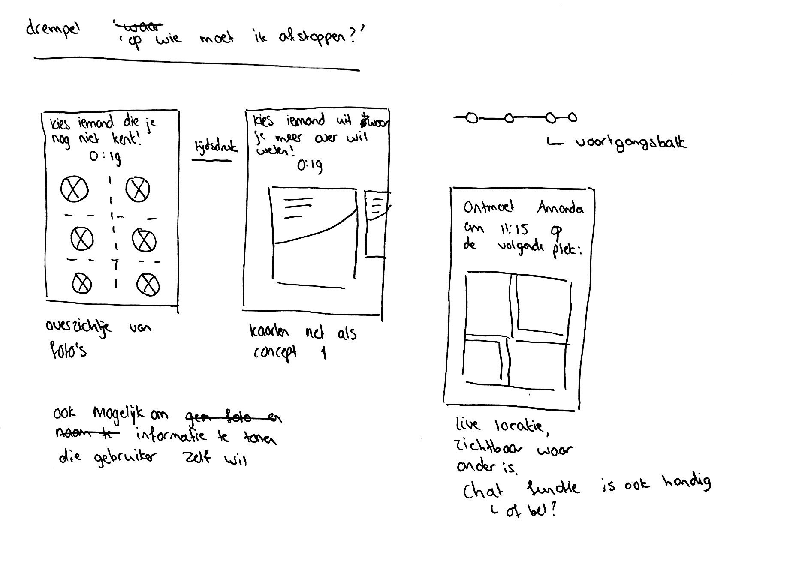
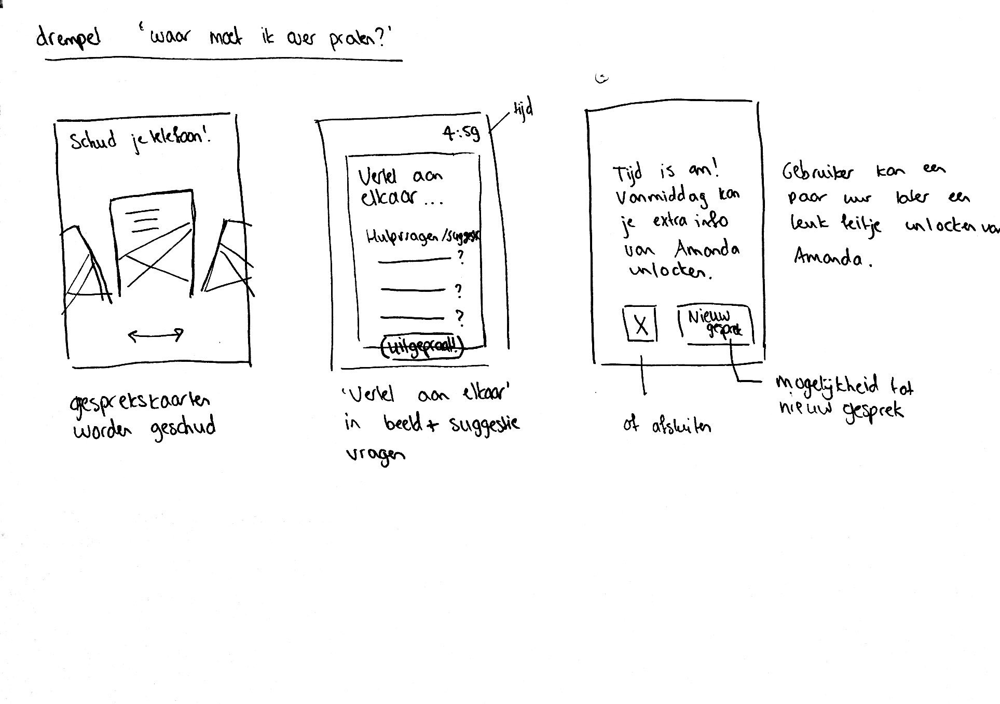
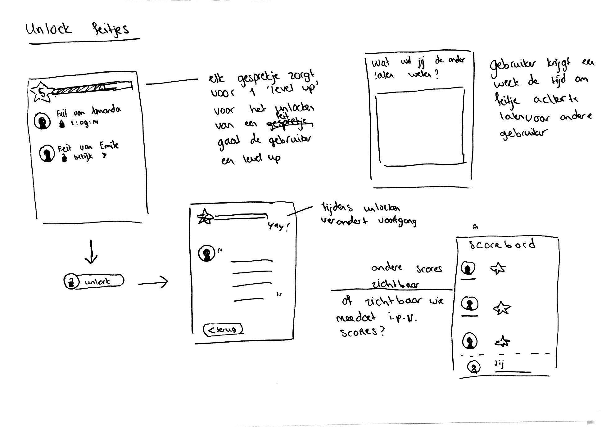
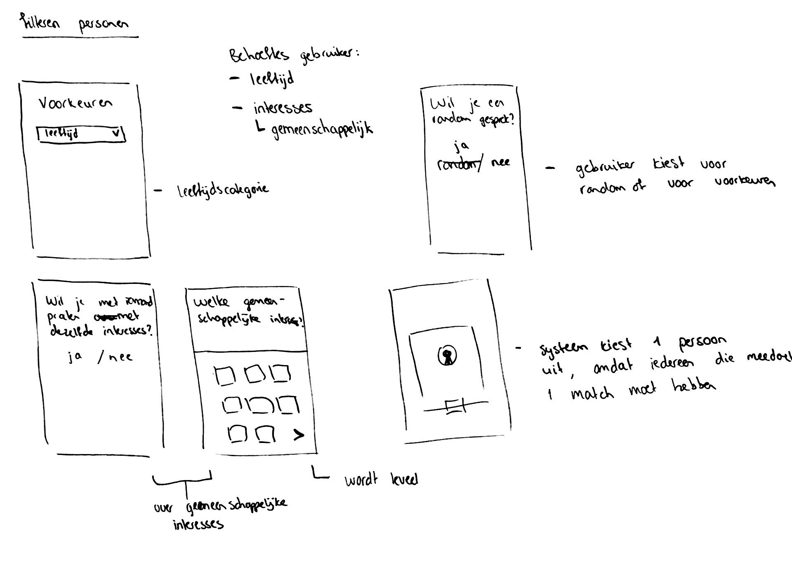
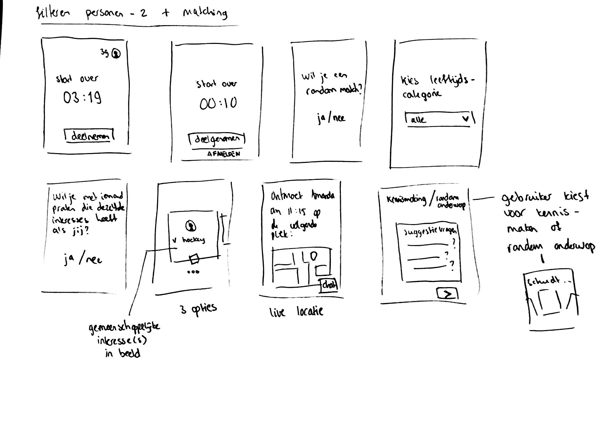

# Idee schetsen

| Behandelde onderzoeksvraag |  |
| :--- | :--- |
| **Hoofdvraag: wat is nodig om tot een nieuw product te komen?** |  |

Om de drempel 'op wie moet ik afstappen?' op te lossen, is mijn voorstel om het systeem een persoon te laten matchen aan de gebruiker. In eerste instantie was het idee om direct meerdere gebruikers aan de gebruiker te laten zien. Toen vertelde Marije mij dat als mij ontwerp een succes wordt, ik moet nadenken over categorieën. Dit heb ik verderop uit geschetst. 

Om de drempel 'waar moet ik over praten?' op te lossen, laat het systeem gesprekskaarten zien aan de gebruikers. Het systeem kiest een random kaart uit. Maar het kan voorkomen dat gebruiker puur alleen wil kennis maken met de andere gebruiker of vrijblijvend wil kletsen. Dit is verderop uit geschetst. 

Om de gebruiker meer te motiveren, kan de gebruiker na afloop van een gesprekje een interessant feitje unlocken van de persoon met wie hij/zij gepraat heeft. De gebruiker kan zelf interessante feitjes insturen. Het systeem kiest een feitje uit om achter te laten.

Uit het onderzoek met de doelgroep zijn diverse behoeftes wat betreft praten met een ander in de kerk. De 1 wil met leeftijdsgenoten praten, de ander niet. De 1 wil over gemeenschappelijke interesses praten, de ander maakt dit niet uit. De gebruiker krijgt de mogelijkheid om te kiezen uit leeftijdcategorie en of hij/zij met iemand wil praten die eenzelfde interesse heeft. Het systeem biedt vervolgend 3 matches aan waar de gebruiker uit kan kiezen. De gekozen gebruiker krijgt een melding met wie hij/zij gaat praten. 

