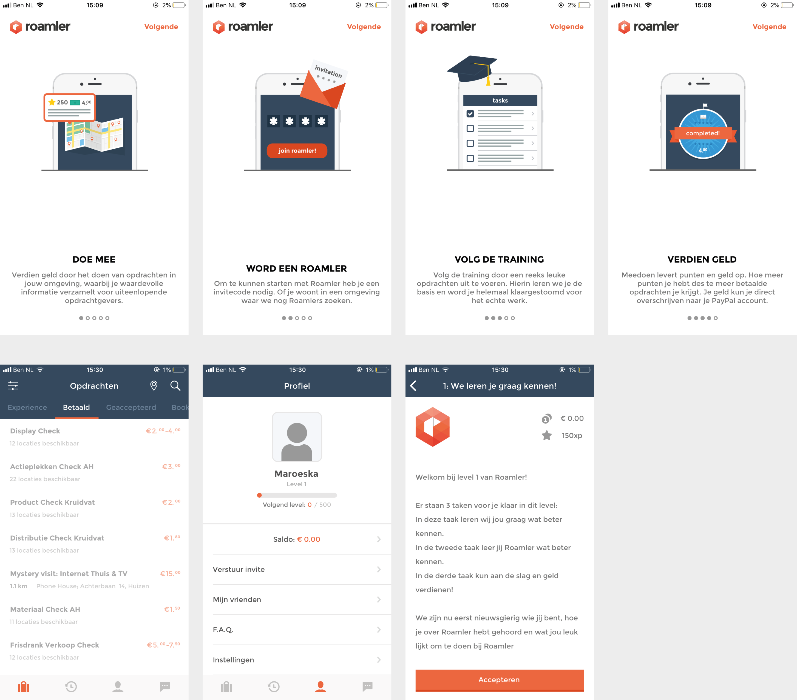
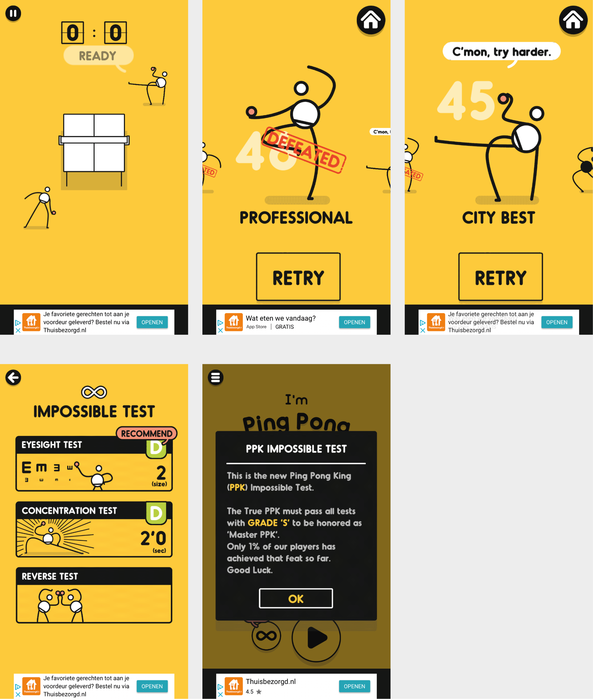
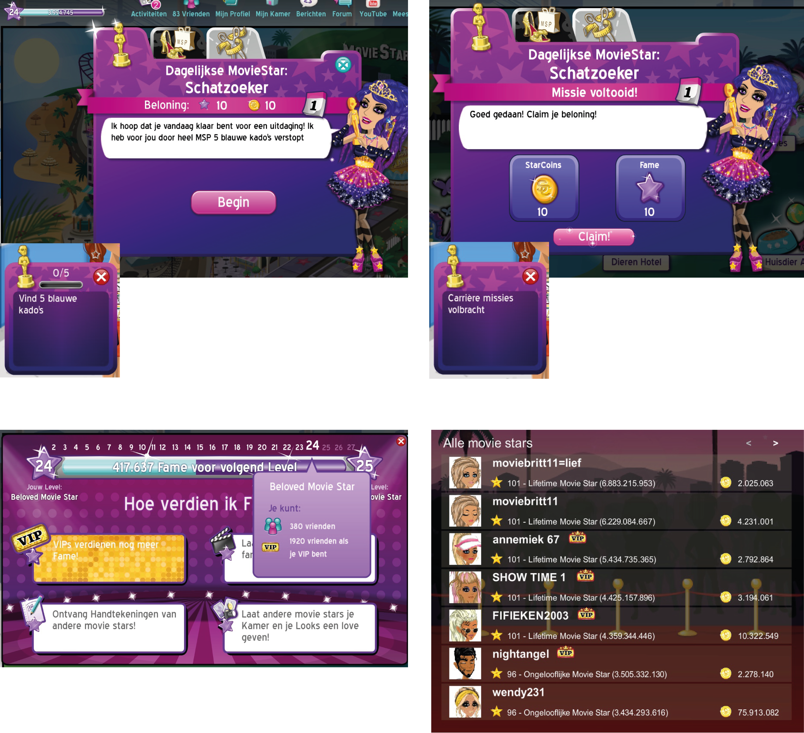
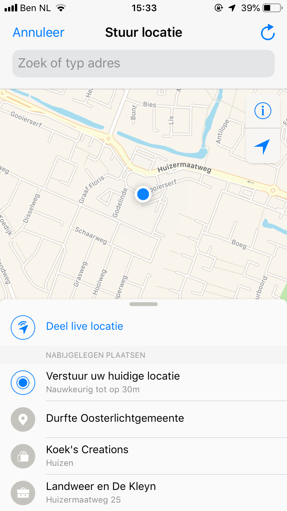

# Inspiratie

| Behandelde onderzoeksvragen |
| :--- |
| **Hoofdvraag: wie is de concurrentie?** |
| Wat kunnen wij leren van de concurrentie? Wat doen zij fout en wat goed? |
| Hoe bieden concurrenten hun content aan? |
| Hoe kunnen we ons onderscheiden van de concurrentie? |

## Opdrachten uitvoeren

### Roamler

Wanneer de gebruiker zich aanmeldt bij Roamler, wordt hij/zij ook een roamler genoemd. Bij Roamler kan de gebruiker opdrachten in zijn/haar omgeving uitvoeren die meestal de rol aannemen als mystery shopper. Bij Roamler kan de gebruiker Experience Points \(XP's\) en geld verdienen. Hoe meer XP's, hoe hoger het level level. Bij een hoger level kan de gebruiker moeilijkere taken \(voor meer geld en meer punten\) uitvoeren en krijgt hij/zij meer privileges.

Voor mijn project is de voortgangsbalk interessant en de weergave van opdrachten.

## Levels

### Ping pong king :\)

Ping Pong King :\) is een game waarbij de gebruiker 50 levels ping pong kan spelen. De gebruiker krijgt een nieuwe titel bij een gehaald level. Het spel is eenvoudig qua vormgeving en hoeveelheid mogelijkheden, maar biedt wel uitdaging aan. Sinds een poosje is de impossible test aangeboden binnen de app, waarbij vermeld staat dat 1% van de spelers dit heeft gehaald. Dit kan de gebruiker triggeren om ook de uitdaging aan te gaan en bij die 1% te horen.

Voor mijn project is de manier van titels laten zien interessant. Daarnaast is het heel makkelijk om deel te nemen aan het spel.

##  Combinatie opdrachten & levels

Tijdens mijn jeugd heb ik moviestarplanet gespeeld. Ik herinnerde mij pas dat gamification hier ook sterk naar voren komt, dus ging ik weer mijn inloggegevens opvragen. De gebruiker kan een aantal opdrachtjes uitvoeren om fame en coins te verdienen. Door fame te verdienen kan de gebruiker omhoog gaan in levels. Met coins kan de gebruiker nieuwe items kopen. 

Voor mijn project is de voortgangsbalk interessant en de ranking van deelnemers.

## Live locatie

### WhatsApp

Live locatie is interessant om elkaar in de gaten te houden. Zo weten de gebruikers van elkaar waar zij zijn en of zij elkaar tegemoet lopen.

