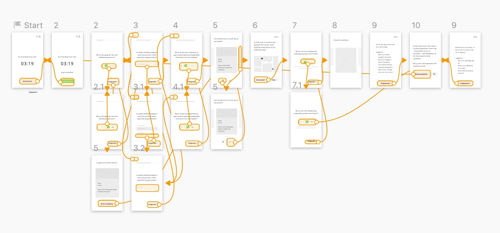

# Prototype + gebruikerstest

| Behandelde onderzoeksvragen |  |
| :--- | :--- |
| **Hoofdvraag: wat is nodig om tot een nieuw product te komen?** |  |
| Hoe creëren we een persoonlijke gebruikerservaring? |  |

| Behandelde onderzoeksvragen |  |
| :--- | :--- |
| **Hoofdvraag: hoe stel ik een goede prototype + test op?** | \*\*\*\* |
| Waarin lopen gebruikers vast tijdens het testen? |  |

## Digitaal prototype

De flow van matchen en een gesprek voeren met de gebruiker is getest aan de hand van digitale schetsen. 

Klik [hier](https://sketch.cloud/s/gbwEM/a/bYL0v4/play) voor de link naar het prototype.

## Testplan voor de test

Om de flow te testen, zijn er kleine opdrachtjes voor de gebruiker geformuleerd. 

## Conclusies uit de test

* De testpersoon vond de kleur groen bij de schakel button alleen toepasselijk bij het antwoord 'ja'. Voor het antwoord 'nee' vond zij een andere kleur toepasselijker
* Tijdens het matchen zag de gebruiker het kruisje als 'geen interesse' en het vinkje als 'wel interesse'
* 1/3 interpreteerde de gebruiker als 'meer informatie over de persoon' of 'meerdere mensen'
* Doordat de timer in beeld niet liep, dacht de gebruiker dat het de tijd betekende in de zin van hoe laat het was. Zij vindt een klok icoontje logischer voor de cijfers
* De gebruiker was enthousiast tijdens het testen vanwege de speelse benadering. 'Handig dat je iemand zijn feitje kan unlocken, dat zorgt ervoor dat mensen de app blijven gebruiken!' en 'Dit kan voor vriendschappen zorgen of het kan ook gebruikt worden voor een leuke manier van daten en stages zoeken', waren reacties van de gebruiker.

De uitslagen zijn meegenomen in de volgende iteratie. De reactie van de testpersoon was leuk om te horen. Ook omdat zij zei dat deze vorm van interactie ook voor andere doeleinden gebruikt kan worden. Voor mij als ontwerper was het handig om te weten dat sommige buttons of stukjes informatie anders opgevat werden voor de gebruiker. Dit kan ik dan aangepast worden in de volgende iteratie. 

## Prototype met verbeteringen

De punten die ik hierboven zijn beschreven in de conclusies, zijn aangepast in een nieuwe versie.

Klik [hier](https://sketch.cloud/s/gbwEM/a/jYbVw9/play) voor de link naar de nieuwe versie van het prototype.

