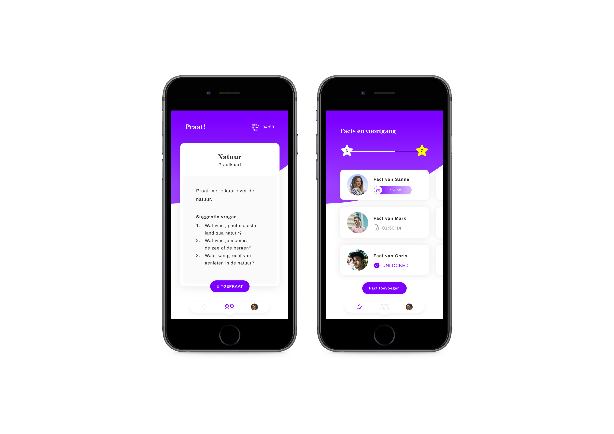
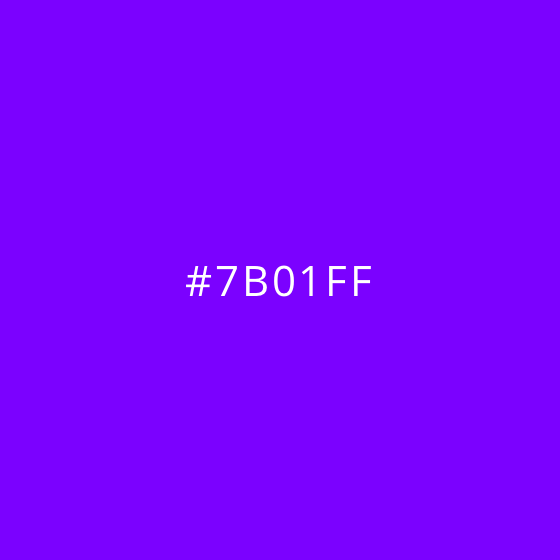
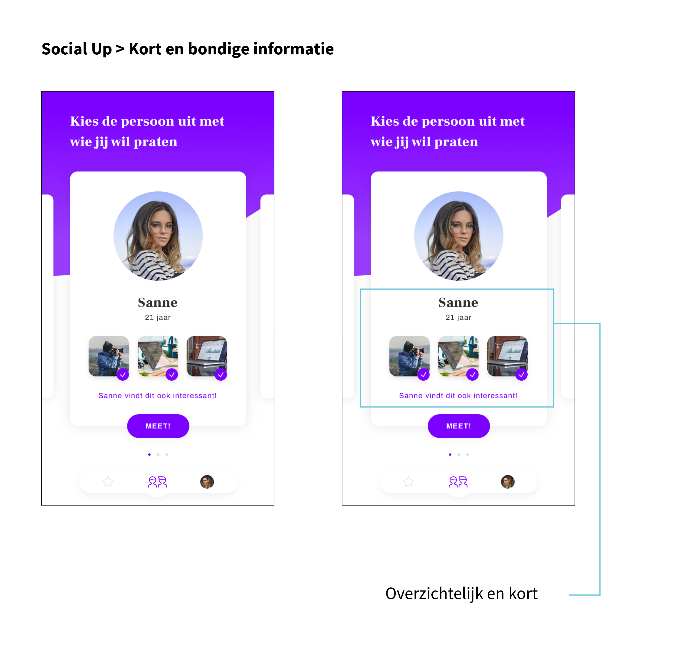
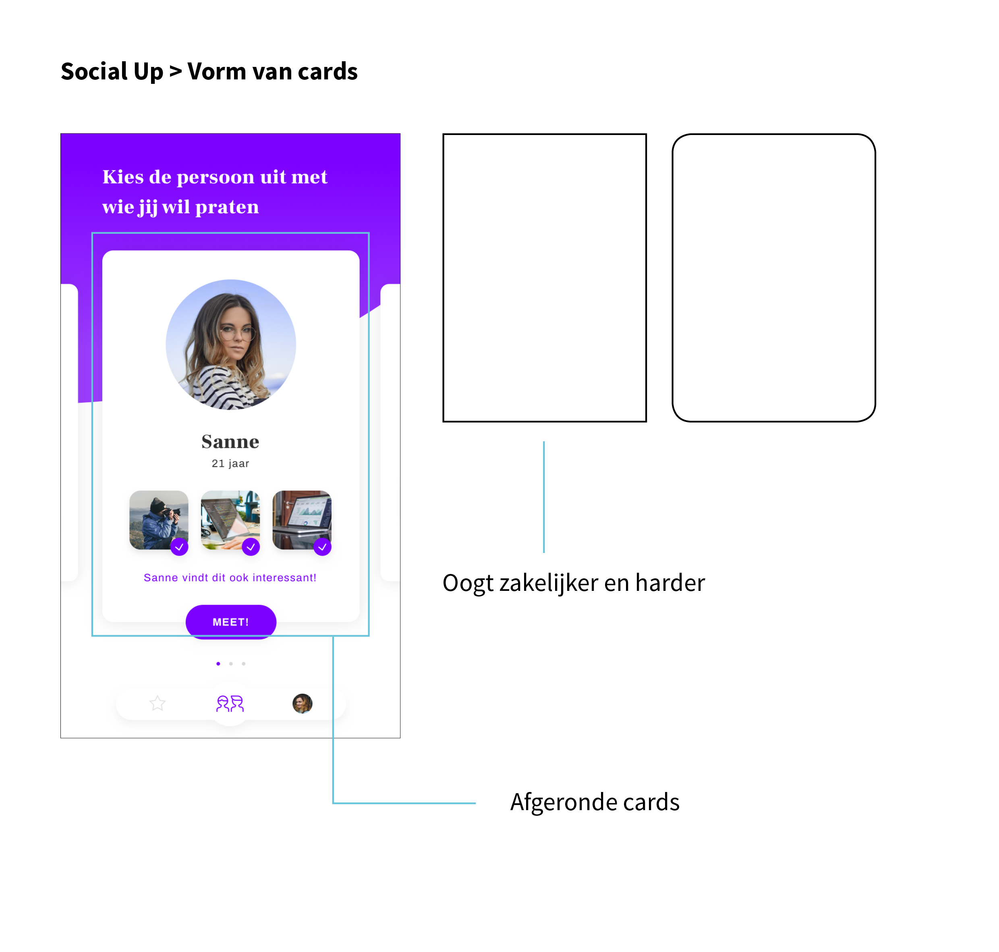
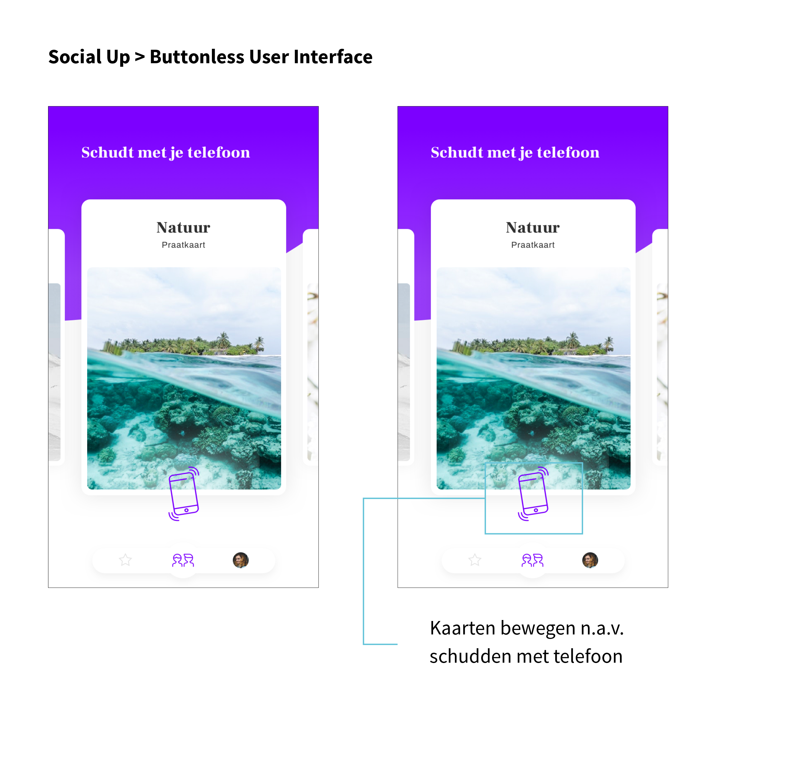
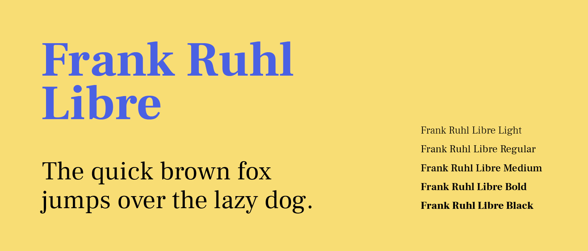
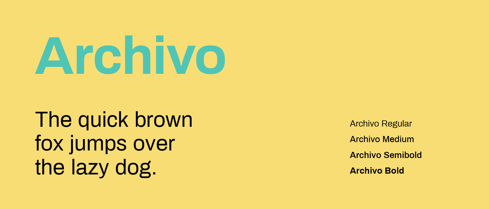
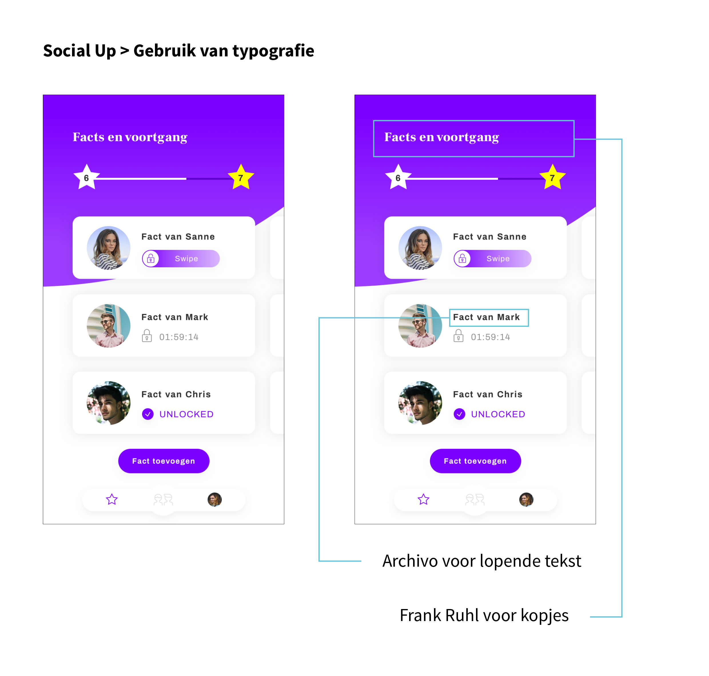
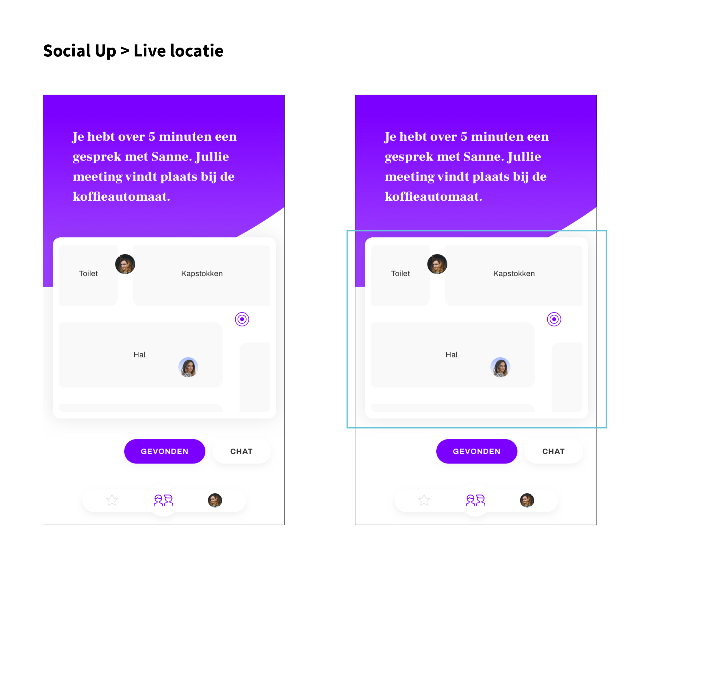

# Visual Design

| Behandelde onderzoeksvragen |  |
| :--- | :--- |
| **Hoofdvraag: wat is nodig om tot een nieuw product te komen?** |  |
| Hoe creëren we een persoonlijke gebruikerservaring? |  |

## Visuals

Hieronder zijn 5 schermen uitgewerkt hoe een visual design van het concept eruit zou kunnen zien.

## Argumentatie

**Kleur**

Volgens Beeldbank \(2015\) staat de kleur paars voor luxe, stijl en rijkdom. Door de eeuwen heen werd paars veel in koningshuizen gebruikt. Binnen het concept kan de gebruiker punten verdienen en gaat zijn/haar voortgangsbalk omhoog. De gebruiker wordt als het ware rijker door het verdienen van punten.

**Tekst**

Ook binnen dit concept is beeld laten zien en korte, bondige teksten. Op deze manier kan de gebruiker het product snel scannen, want er ligt tijdsdruk op sommige onderdelen.

**Cards**

Er is gebruik gemaakt van afgeronde cards, omdat dit minder statisch en zakelijk oogt dan wanneer de vorm recht is. 

**Buttonless User Interface**

Op 1 scherm is gebruik gemaakt van 'buttonless UI', een [trend](https://uxplanet.org/15-hot-trends-in-ui-design-for-web-and-mobile-in-2018-eff86df6d868) waarbij de gebruiker nergens op hoeft te tappen. Deze benadering bespaart de kostbare ruimte op het scherm voor meer informatie en er wordt zelfs aangenomen dat dit de eerste stap is naar de virtuele interfaces, alleen op basis van gebaren.

**Typografie**

Ter inspiratie voor de typografie is het artikel van Awwwards erbij gehouden. Via Google fonts is gekeken welke lettertypes daar weer bij passen.

**Live locatie**

Net als bij WhatsApp is live locatie verwerkt in het concept. Op deze manier kunnen de gebruikers precies zien waar zij zich bevinden en of zij elkaar tegemoet lopen.

