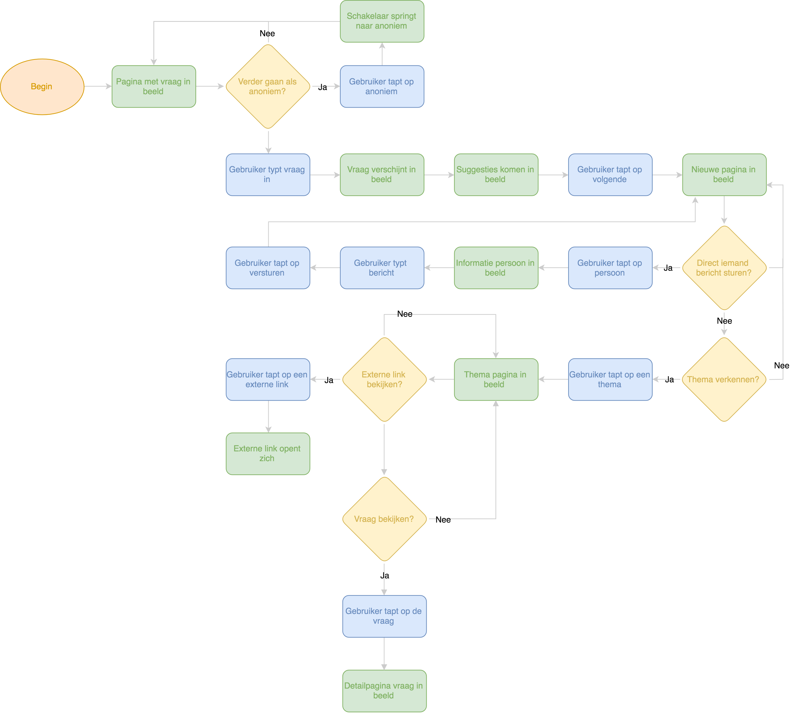
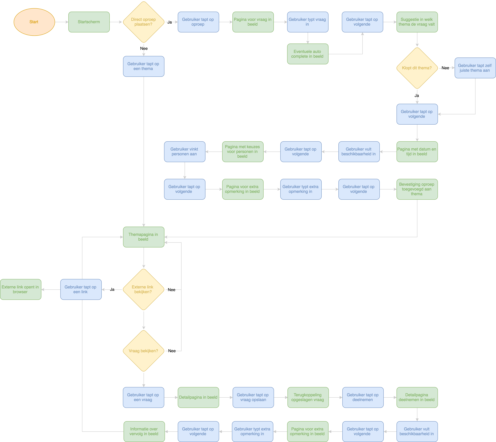

# Flows

| Behandelde onderzoeksvragen |  |
| :--- | :--- |
| **Hoofdvraag: wat is nodig om tot een nieuw product te komen?** |  |
| Hoe creëren we een persoonlijke gebruikerservaring? |  |

## Flow versie 0.9 \(oud, niet af\)

De eerste flow is gebaseerd op het eerste idee wat ik in dit concept had. Namelijk eerst de vraag stellen en vervolgens komt de rest. Dit liep niet helemaal goed met de vervolg stappen van het digitale product. 

## Flow Versie 1.0

