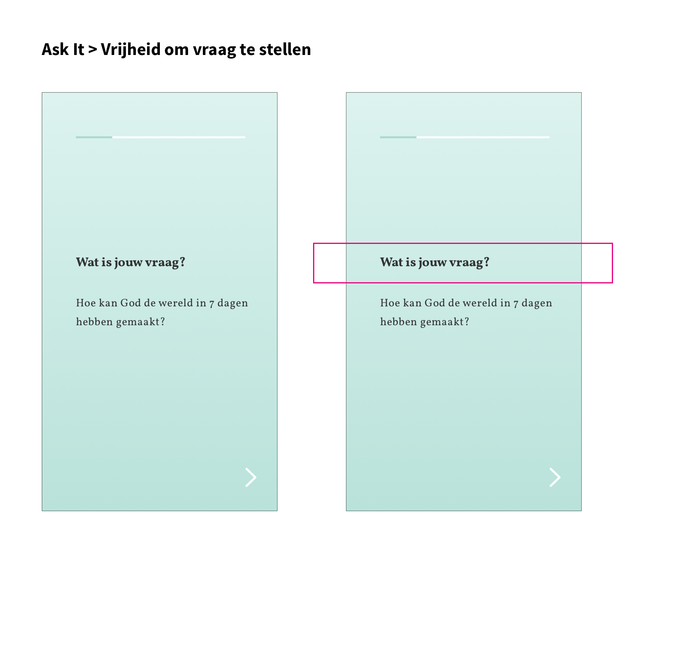
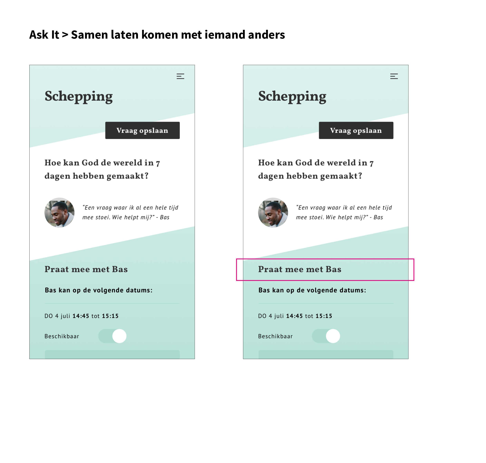
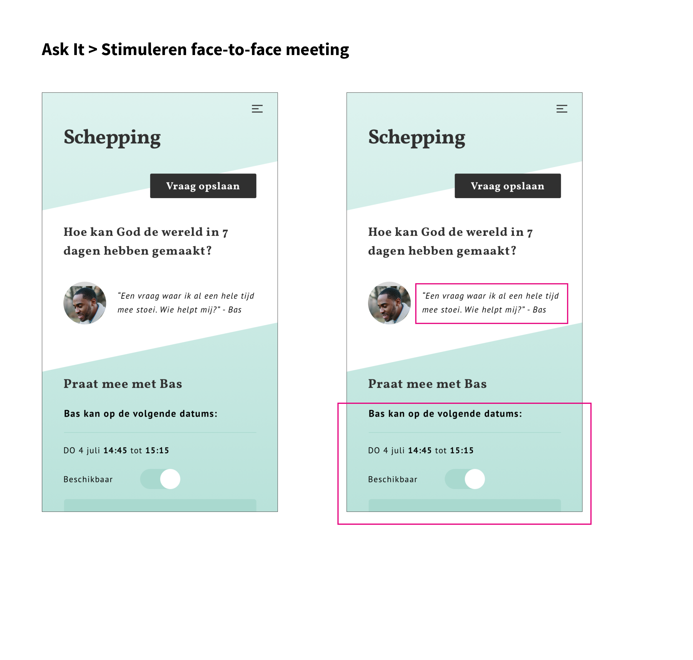
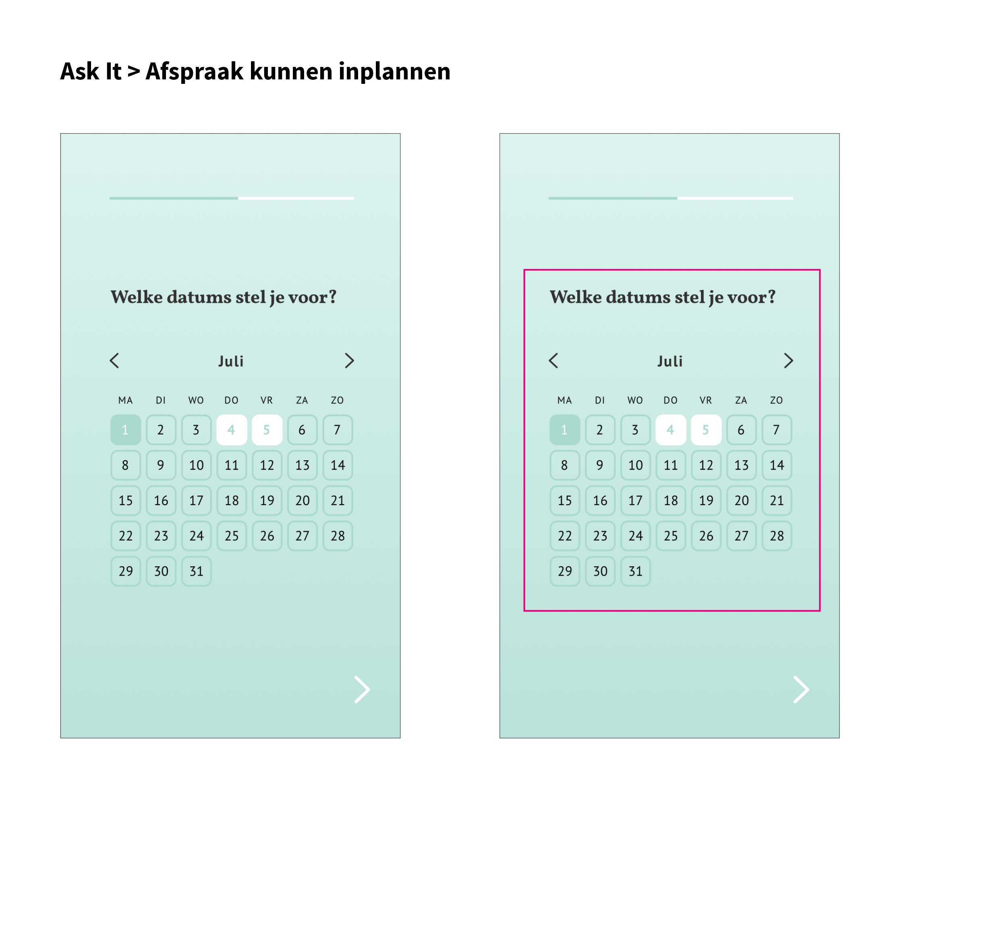

# Visie

| Behandelde onderzoeksvraag |  |
| :--- | :--- |
| **Hoofdvraag: wat is nodig om tot een nieuw product te komen?** |  |

## Gedachtegang achter Ask It

### Aanloop naar het concept

Hieronder staan relevante conclusies beschreven die meegenomen zijn naar het concept Ask It. Deze conclusies komen voort uit eerder gedaan onderzoek en gesprekken. Dit zijn gesprekken geweest met stakeholders en met school.

#### Uit onderzoek naar de [doelgroep](https://maroeska-productbiografie.gitbook.io/productbiografie/inzichten-april-+-mei/persona) is gebleken dat zij:

* Met andere christenen willen praten die dezelfde geloofsvragen hebben als hen
* Makkelijk willen deelnemen aan een praatgroep over geloof
* Niet weten bij welke praatgroep zij kunnen aansluiten

#### Uit gesprekken met het [jeugdpastoraat](https://maroeska-productbiografie.gitbook.io/productbiografie/onderzoek/stakeholders-1/anne-karine-jeugdpastoraat) is gebleken dat:

* Zij in gesprek willen gaan met de doelgroep o.a. over geloof

#### Uit gesprekken met [school](https://maroeska-productbiografie.gitbook.io/productbiografie/onderzoek/meetings-fase-1#14-05-19-meeting-met-marije-en-medestudenten) is gebleken dat:

* Ik de drempels van de doelgroep in kaart moet hebben

#### Uit gesprekken met [Zig](https://maroeska-productbiografie.gitbook.io/productbiografie/inzichten-mei-+-juni/inspiratie-sessies#vertrouwen) is gebleken dat:

* Vertrouwen en privacy van data erg belangrijk is in een digitaal product zoals Ask It

### Essentie

In het concept Ask It kan de gebruiker een meeting organiseren rondom de geloofsvraag die hij of zij heeft. Vervolgens kunnen andere gebruikers zich hiervoor aanmelden als zij die vraag ook hebben of ook interessant vinden. Binnen Ask It speelt het jeugdpastoraat een belangrijke rol: zij kunnen ook gevraagd worden door de gebruiker om mee te praten en zij beheren de externe links. De externe links zijn links die gedeeld zijn door gebruikers over een thema waarin zich geloofsvragen bevinden. Op deze manier kan de gebruiker zowel thema's verkennen als meetings organiseren om te praten over zijn/haar geloofsvragen.

### Scenario van de gebruiker

Als aanvulling van de persona en customer journey uit fase 1 zijn er een aantal punten gevormd in de scenario van de gebruiker \(in dit geval Derek\). Op deze manier probeer ik het probleem uit elkaar te halen. Dit is gedaan door middel van onderstaande stapjes:

1. Derek ligt in bed en begint na te denken over hoe de wereld is geschapen
   * Het probleem begint bij kritisch nadenken over situaties die met geloven te maken hebben
2. Derek stelt in zijn hoofd kritische vragen, hij weet niet waar hij antwoord kan vinden
   * Derek zichzelf stelt vragen bij de situatie
3. Derek vindt het moeilijk om in zijn eentje antwoorden te vinden in de bijbel. Hij weet niet waar hij moet zoeken in de bijbel om antwoorden te krijgen
   * Derek heeft moeite om antwoorden te gaan opzoeken in de bijbel
4. Derek vraagt zichzelf af of een ander dezelfde vragen heeft die hij heeft
   * Derek wil liever met iemand praten die dezelfde geloofsvragen heeft \(gehad\) dan in zijn eentje op zoek te gaan naar antwoorden in de bijbel
5. Derek heeft behoefte om met iemand te praten over dezelfde vragen die hij heeft
   * Op deze manier voelt Derek zich niet de enige met deze vragen en kan hij met de ander gedachten uitwisselen

De punten '**kritische vragen hebben**', '**moeite om antwoorden vinden op vragen**' en '**praten met iemand die ook geloofsvragen heeft of dezelfde geloofsvragen heeft**' moeten meegenomen worden binnen het concept.

### Criteria punten voor oplossing

De oplossing moet NIET:

* de gebruiker in zijn eentje zijn vragen uit vogelen
* de gesprekken tussen gebruikers alleen digitaal laten plaats vinden
* een dump van antwoorden geven aan de gebruiker; daar zijn ook andere sites voor

De oplossing moet WEL: 

* de gebruiker vrijheid en mogelijkheid bieden om zijn vraag te stellen

* de gebruiker met een andere gebruiker laten samen komen om te praten

* de gebruiker stimuleren om iemand anders face-to-face te meeten

* een afspraak kunnen in plannen met 1 of meerdere personen

* mogelijkheid geven om de gebruiker anoniem weer te geven

### Veiligheid en vertrouwen

Volgens Staal \(2017\) is voor een lid het belangrijk dat hij/zij zich veilig voelt, want dan laat hij/zij sneller iets van zichzelf zien. Dit leidt tot hechtere netwerken. Vertrouwen opbouwen kan door bijvoorbeeld privacy en dataveiligheid. Verder is face to face contact belangrijk. Tijdens een gesprek met Henk \(UX designer bij Zig\) vertelde hij ook dat vertrouwen binnen mijn product belangrijk is.

#### Ontwerp keuze

In mijn ontwerp is privacy en dataveiligheid belangrijk, en face to face contact ook. Het is belangrijk dat de leden weten wat er met hun gegevens gebeurd. Mocht de gebruiker anoniem content willen bekijken of plaatsen, dan moet hiervoor de mogelijkheid zijn.

 

