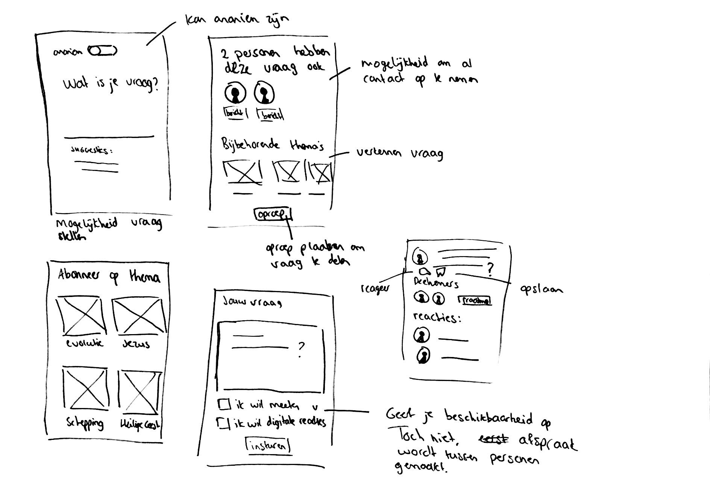
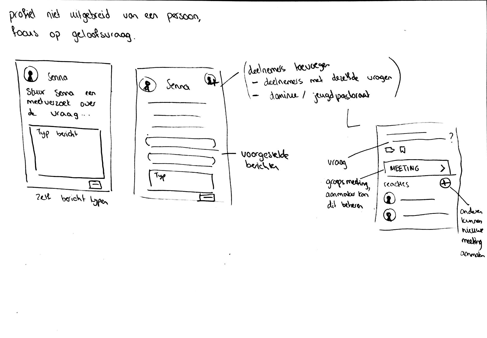
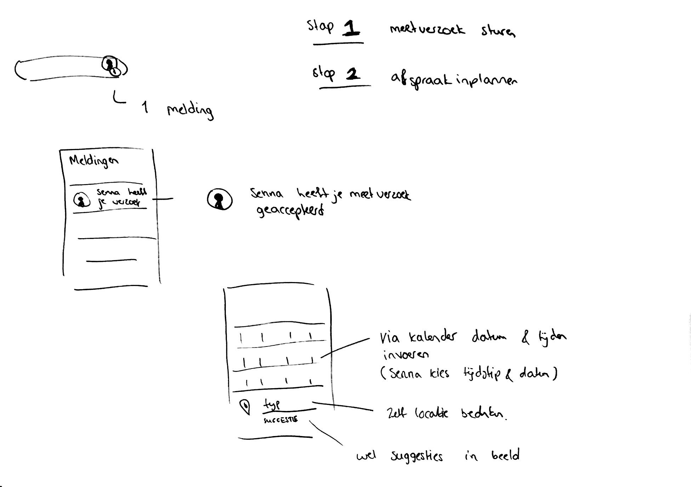
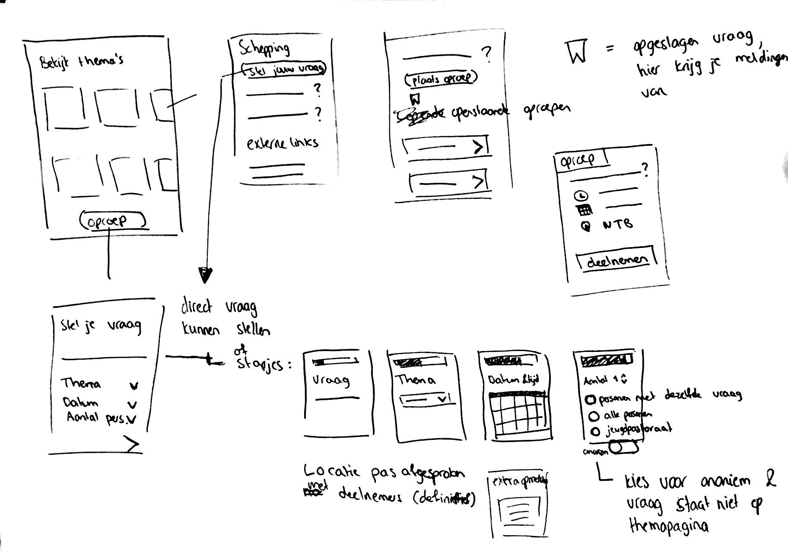
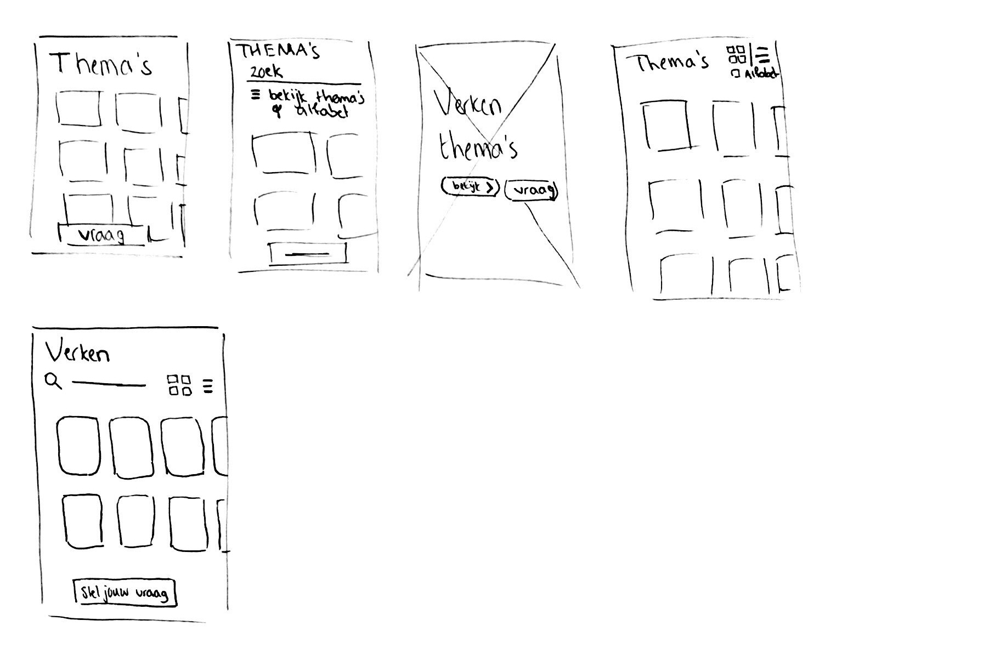

# Idee schetsen

| Behandelde onderzoeksvraag |  |
| :--- | :--- |
| **Hoofdvraag: wat is nodig om tot een nieuw product te komen?** |  |

Met dit concept ben ik een aantal keer vast gelopen. Er komen behoorlijk veel functionaliteiten bij kijken als een gebruiker zijn vraag wil delen en meetings wil plannen. 

## Ideeën voor concept - 1

Het eerste idee was om de gebruiker direct zijn vraag te laten stellen, zonder al een meeting te plannen. Het is een persoonlijke benadering, maar toch wat onlogisch voor de vervolg stappen. Op een later moment zou de gebruiker dan weer zichtbaar moeten zijn \(als hij anoniem had aangeklikt\) en de stappen om een meeting in te plannen liep door de war. 

Wat voor de gebruiker handig is, is om vragen op te slaan zodat hij/zij er later op terug kan komen en meldingen kan ontvangen van deze vraag.

## Ideeën voor concept - 2

Het tweede idee is om de gebruiker eerst thema's aan te bieden waarin zijn/haar vraag zou kunnen vallen. De gebruiker kan alsnog direct een vraag stellen en wel of niet indelen in een thema. Wanneer de gebruiker niet weet in welke thema de vraag hoort, gaat een moderator dit voor hem/haar doen. De gebruiker kan stapsgewijs de vraag indienen en meteen een meeting inplannen. Ook kan de gebruiker deelnemen aan meetings van andere gebruikers over vragen.

Moderators \(bijvoorbeeld het jeugdpastoraat\) gaan over externe links op de pagina. De gebruiker kan een interessante link delen met de moderator.

De gebruiker kan kiezen met hoeveel mensen hij/zij een meeting wil hebben. De gebruiker kan specifiek met mensen wil praten die dezelfde vragen als hem/haar hebben of met mensen die ook andere vragen hebben. Ook kan de gebruiker er voor kiezen om met het jeugdpastoraat te praten.

Wanneer de oproep definitief is gemaakt, stelt de beheerder van de oproep een locatie voor. Anderen kunnen deze locatie accepteren of een nieuw voorstel indienen. Dit gaat via een soortgelijke groepschat als WhatsApp.

Hierboven zijn een aantal schetsen gemaakt voor de thema pagina.

