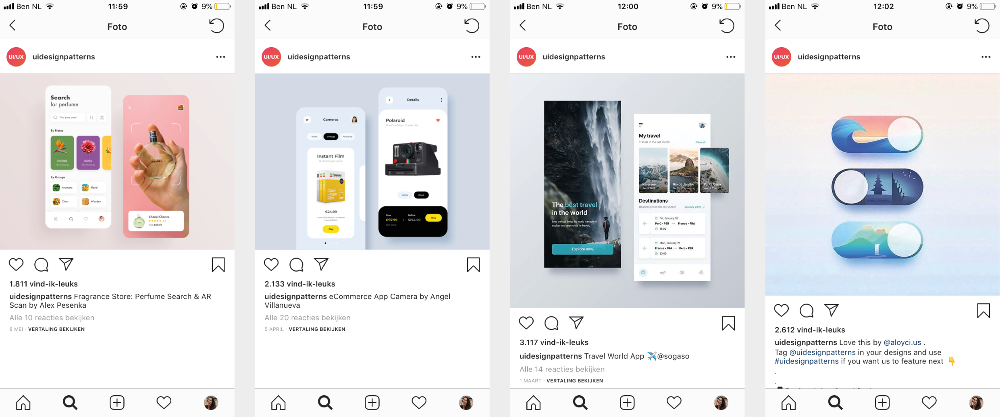

# Inspiratie

| Behandelde onderzoeksvragen |
| :--- |
| **Hoofdvraag: wie is de concurrentie?** |
| Wat kunnen wij leren van de concurrentie? Wat doen zij fout en wat goed? |
| Hoe bieden concurrenten hun content aan? |
| Hoe kunnen we ons onderscheiden van de concurrentie? |

## Deelname

### Meetup

Bij Meetup staan de evenementen op een rijtje weergegeven waarde gebruiker deel aan kan nemen. Wat  sterk is aan Meetup, is dat regelmatig aan de gebruiker aangeboden wordt om deel te nemen aan het concept.

## Reacties 

### Instagram

De gebruiker kan op Instagram heel makkelijk een reactie achterlaten onder een foto van iemand. Het gaat via 1 druk op de knop, waardoor de gebruiker snel en makkelijk een reactie kan achterlaten. Wat ook interessant is,  is het opslaan van een foto die binnen de app in een album verschijnt. Dit zou ook met geloofsvragen een interessante functie zijn, want geloofsvragen en twijfel kunnen vaker terug komen bij een persoon.

### Mudita

Op de community van Mudita kan de gebruiker vragen stellen per categorie. Andere gebruikers kunnen op de vraag reageren. Het is interessant voor mijn project om vragen in categorieën onder te verdelen.

### Datumprikker

Binnen het concept is er gebruik gemaakt van een meeting aanmaken. De flow van datumprikker is doorlopen ter inspiratie.

## Hot trends in User Interface design

Voordat het ontwerpen van visuals begon, is er een artikel gelezen over  [trends op het gebied van UI design voor Web en Mobile.](https://uxplanet.org/15-hot-trends-in-ui-design-for-web-and-mobile-in-2018-eff86df6d868)

Websites die vormgegeven zijn door met digitale tekeningen zijn een trend. Een design met illustraties in plaats van foto's had ik nog willen maken voor mijn eigen ontwerp. Helaas koste dat teveel tijd.

## Thema's

Net als de ontwerpen hierboven, zijn iets afgeronde cards het meest geschikt voor mijn ontwerp. Dit oogt minder zakelijk. De schakelaar met de illustratie vind ik mooi vorm gegeven, alleen ik zie het nut er alleen van in mijn dag- en nachtlicht schakelen.

