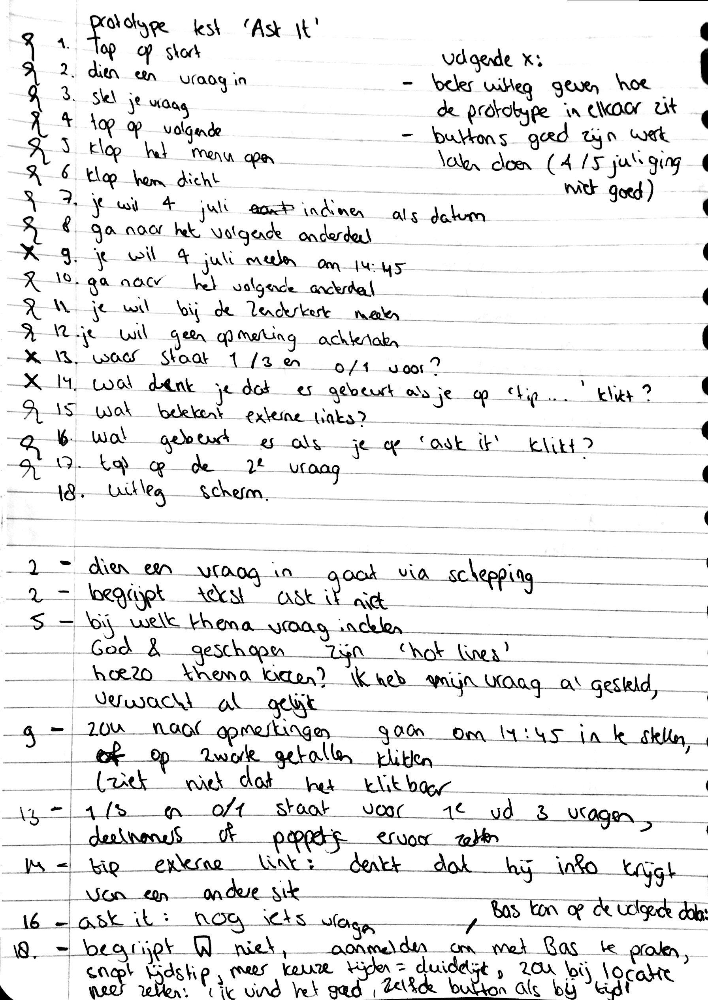

# Prototype + gebruikerstest

| Behandelde onderzoeksvragen |  |
| :--- | :--- |
| **Hoofdvraag: wat is nodig om tot een nieuw product te komen?** |  |
| Hoe creëren we een persoonlijke gebruikerservaring? |  |

| Behandelde onderzoeksvragen |  |
| :--- | :--- |
| **Hoofdvraag: hoe stel ik een goede prototype + test op?** | \*\*\*\* |
| Waarin lopen gebruikers vast tijdens het testen? |  |

## Prototype

Er is met een gebruiker getest hoe de belangrijkste stapjes werken om een geloofsvraag in te dienen en hoe de gebruiker zich kan aanmelden voor een gesprekje.

Klik [hier](https://sketch.cloud/s/rwp7x/a/d5DLD3/play) voor de link naar het prototype.

## Testplan en conclusies

Wat ik heb het geleerd uit de test is dat ik volgende keer beter moet uitleggen hoe een prototype werkt en dat niet alles klikbaar is. Nu dacht de gebruiker dat hij kon typen, omdat ik niet gezegd had dat dit niet kon. De volgende punten worden meegenomen naar de volgende iteratie:

* De gebruiker begreep de button 'Ask it' niet
* De gebruiker snapte niet waarom hij zijn vraag bij een thema moest indelen. 'Ik heb mijn vraag toch al gesteld?'
* De gebruiker snapte dat de gemarkeerde 'God' en 'geschapen' hot lines waren
* De gebruiker zag niet dat de getallen van de tijdstippen klikbaar waren
* De gebruiker zag niet in dat 1/3 en 0/3 stond voor het aantal deelnemers. 'Dat moet dan echt duidelijker', zei hij
* De button 'tip een externe link' dacht hij dat hij info zou krijgen als hij erop zou klikken. De functie van externe links begreep hij
* De gebruiker snapte dat wanneer hij op 'Ask It' zou klikken, hij nog iets zou vragen
* De gebruiker snapte het opslaan icoon niet, de gebruiker gaf een tip om het tussenkopje 'Bas kan op de volgende data:' neer te zetten en om 'Ik vind het goed' of een schakelaar button neer te zetten wanneer de gebruiker ook op het tijdstip zou kunnen meeten

## Prototype met verbeteringen

Na aanleiding van de test is er een iteratie gemaakt. Niet alle knoppen zijn uitgewerkt. Het prototype laat 1 flow zien.

Klik [hier](https://sketch.cloud/s/rwp7x/a/eLp7op/play) voor de link naar de nieuwe prototype.

