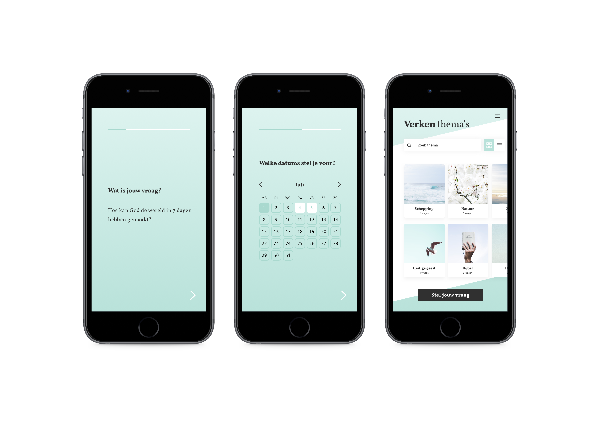
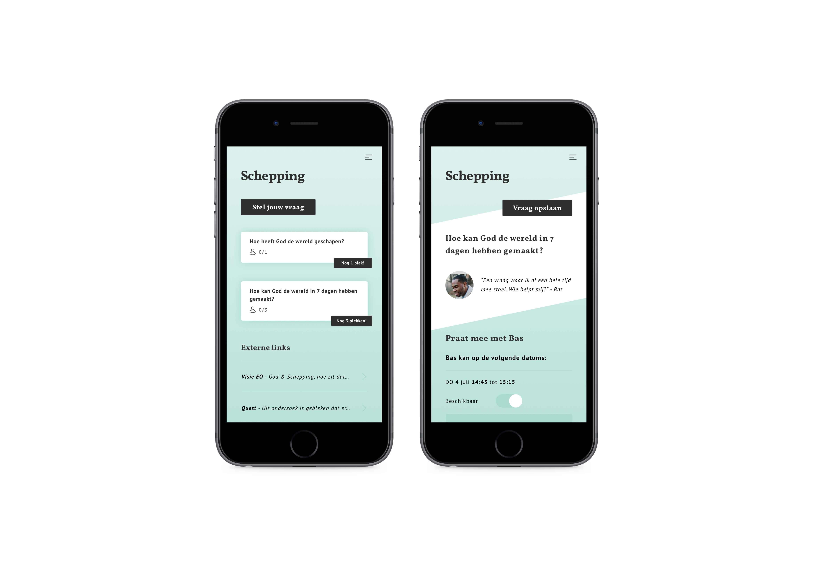
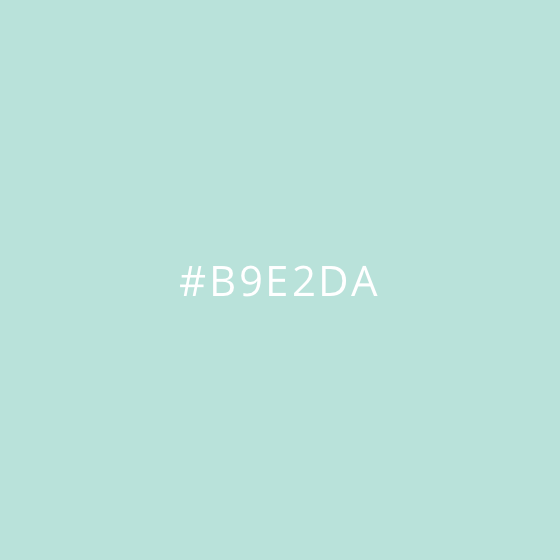
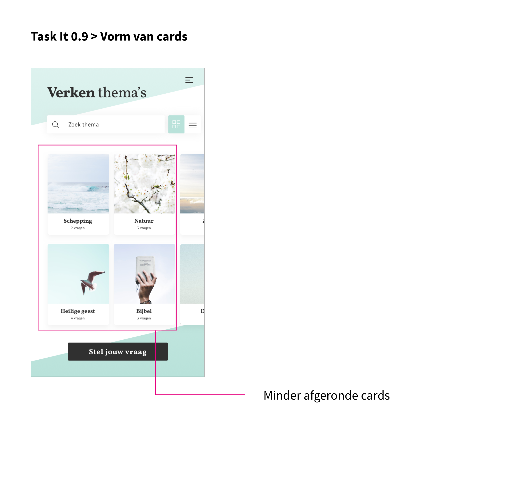
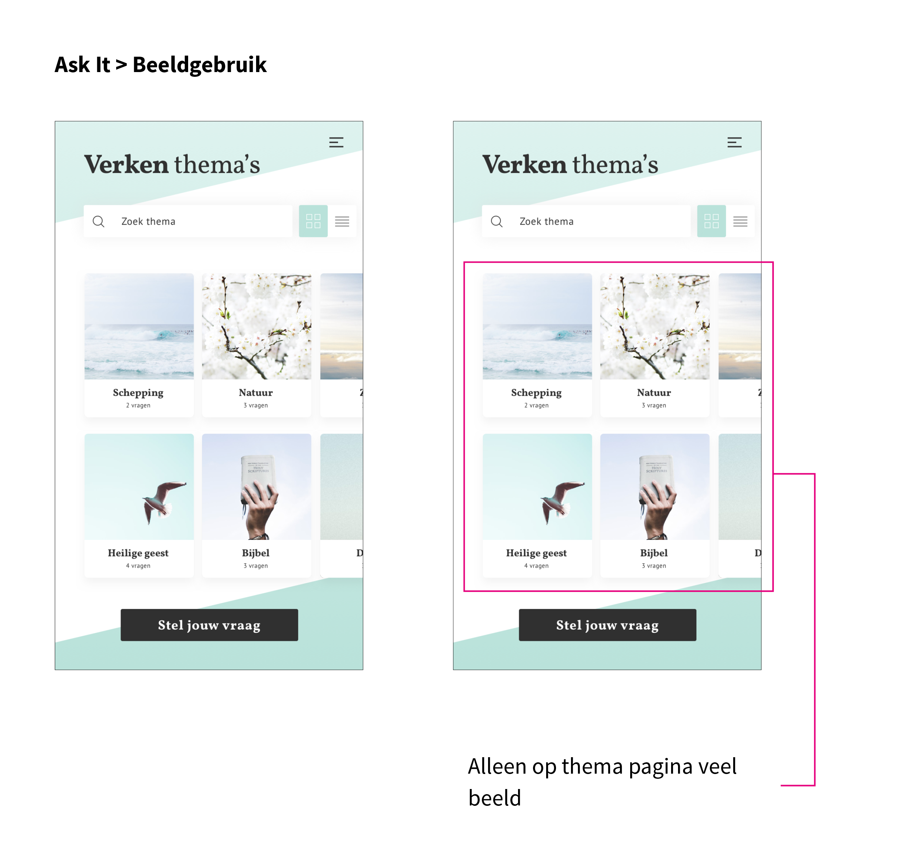
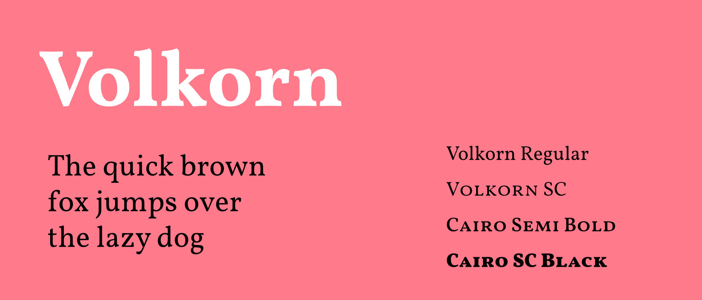
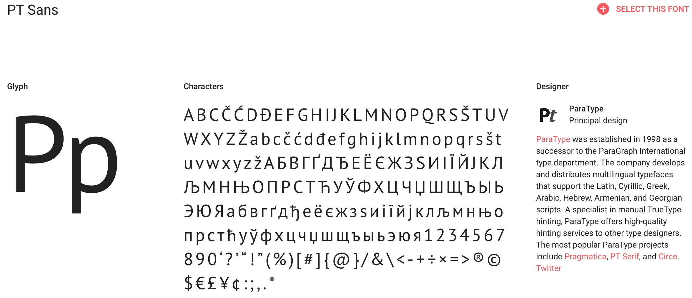
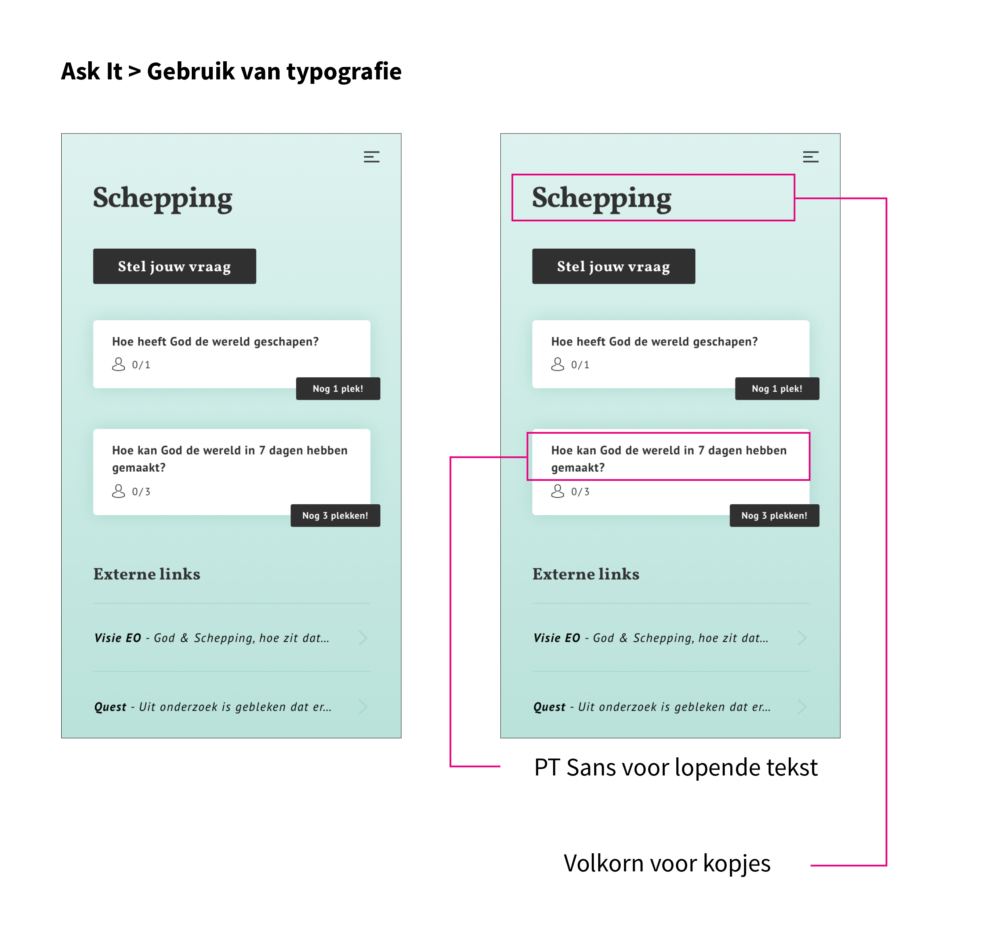

# Visual Design

| Behandelde onderzoeksvragen |  |
| :--- | :--- |
| **Hoofdvraag: wat is nodig om tot een nieuw product te komen?** |  |
| Hoe creëren we een persoonlijke gebruikerservaring? |  |

Hieronder zijn er 5 schermen uitgewerkt hoe een visual design van het concept eruit zou kunnen zien.

## Argumentatie

**Kleur**

Er is voor een frisse kleur gekozen wat niet hard blauw is, maar meer richting mint groen. Volgens Beeldbalie \(2015\) staat de kleur blauw voor geest, intelligentie en verstand. Daarnaast wordt de kleur blauw ook gezien als een kleur van vertrouwen, duidelijke communicatie en betrouwbaarheid. Binnen de app is vertrouwen belangrijk en speelt de geest en verstand ook een rol; mensen denken na over hun \(geestelijke\) geloofsleven. 

**Cards**

Bij dit ontwerp zijn de cards minder afgerond dan de andere ontwerpen. Dit is gedaan, omdat ik wilde experimenteren met wat rechtere cards en omdat op een aantal schermen de achtergrond gebroken wordt door de strakke, rechte en witte vorm. De vorm van de cards hebben hier dus wat weg van.

**Beeld**

Er zijn alleen op de thema pagina foto's gebruikt. Op de detailpagina's is hier niet voor gekozen, omdat daar met grotere ruimtes en de witte vorm is gespeeld. Daarnaast wil ik dat de gebruiker direct ziet dat hij/zij zich kan aanmelden voor een meeting wanneer hij op de detailpagina tapt.

**Typografie**

Er is een serif font gebruikt voor de kopjes en een sans serif font voor lopende tekst. Het serif font heeft iets weg van editorial design door de verschillende diktes in combinatie met het witte, diagonale vlak. Er is hier voor gekozen, omdat dit ook een trend is binnen webdesign \(Awwwards, 2019\).

