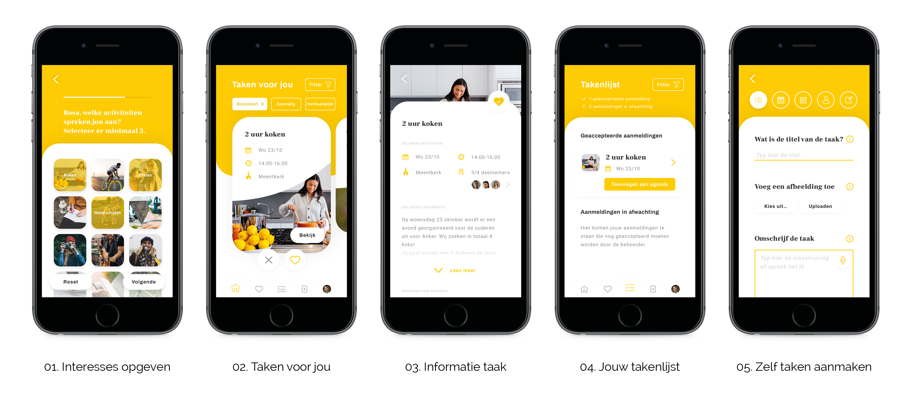

# Prototype 1.0 \(eindontwerp\)

## Het eindontwerp

Uit prototype 0.9 en de gebruikerstest kwamen nog een aantal punten naar voren die zijn meegenomen zijn naar het eindontwerp. Hierna is geen test gedaan, maar er heeft wel een validatie plaatsgevonden van Jonathan \(UX designer, EO\) en ik heb zelf met een kritische blik gevalideerd.   

De volgende punten zijn aangepast ten opzichte van [prototype 0.9](https://maroeska-productbiografie.gitbook.io/productbiografie/productontwikkeling/3.5.3-test-prototype-1.0):

* Opslaan is vastgezet in filter
* Extra animaties toegevoegd bij een taak liken
* 3 manieren om een taak te verwijderen uit favorieten
* Uitleg gegeven bij takenlijst
* Hint gegeven voor de + in de footer
* Nieuw formulier ontworpen voor taak aanmaken: combinatie tussen stapsgewijs en lang formulier onder elkaar
* Contactpersoon invullen bij taak aanmaken staan de gegevens standaard ingevuld van de persoon die de taak aanmaakt
* Persoonlijk verhaal is geschrapt uit de taak aanmaken
* Achteraf wijzigen is toegevoegd aan taak aanmaken
* Duidelijkheid over afmelden 
* Naam verandert van de term ‘weten’ naar ‘geloven’
* Tags zichtbaar bij het opgeven van interesses
* Deelnemers zichtbaar die meedoen aan taak

## Video van het eindontwerp

Hieronder staat de video van het prototype met uitleg.



## Link naar het eindontwerp



