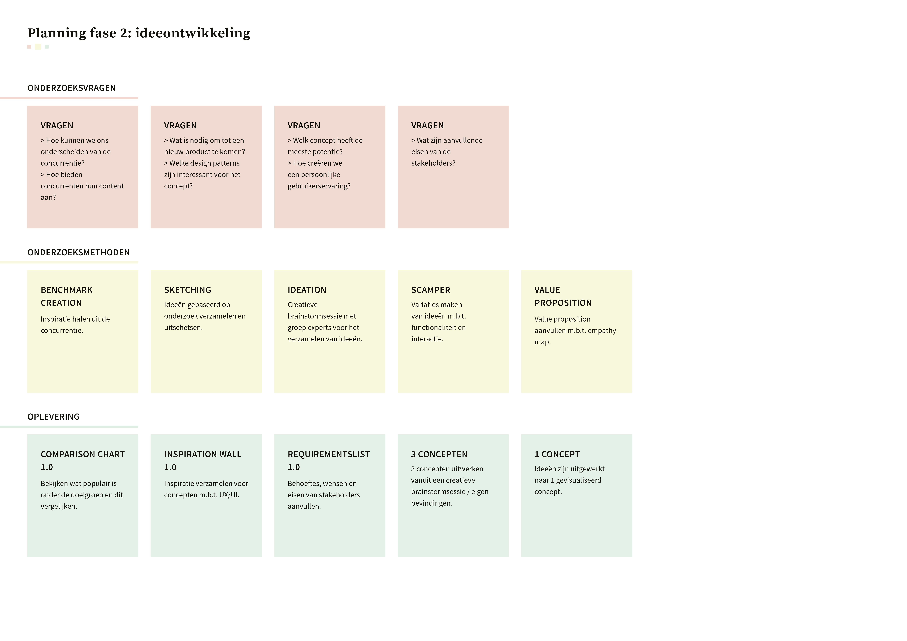

# Planning van het project

De workshop planning heb ik gemist, vanwege uitloop van een gesprek met mijn afstudeerbegeleider. Ik heb de workshop zelf thuis georganiseerd. De foto's staan onderaan op de pagina.

Per fase is er een digitale, dynamische planning gemaakt in Trello. Hierin is het proces bijgehouden.

## Planning fase 1: analyse

In deze fase wordt het probleem helder, wordt er onderzoek gedaan naar de stakeholders en naar de gebruiker en wordt er literatuur ingezet om meer te weten te komen over het onderwerp. Ook wordt er gekeken naar trends, ontwikkelingen en mogelijke consequenties die invloed hebben op het ontwerp. In de eerste fase wordt een design brief opgesteld en wordt het onderzoek voortgezet.

Klik [hier](https://trello.com/b/sDtlfeHd/fase-1-analyse) voor het digitale bord in Trello van fase 1. \(Alle aanpassingen zijn hier up-to-date\)

## Planning fase 2: ideeontwikkeling 

In fase 2 worden er ideeën gegenereerd naar aanleiding van voorgaand onderzoek. Tijdens deze fase kan het voorkomen dat er extra onderzoeksmethoden worden ingezet om vragen goed te kunnen beantwoorden. Tijdens deze fase worden er experts ingeschakeld om mee te brainstormen en wordt er inspiratie opgedaan vanuit de concurrentie. Ook wordt de empathy map aangevuld na aanleiding van een value proposition.

Klik [hier](https://trello.com/b/bEaPnEYN/fase-2-ideeontwikkeling-week-6-10) voor het digitale bord in Trello van fase 2. \(Alle aanpassingen zijn hier up-to-date\)

## Planning fase 3: ontwerp

Tijdens de derde fase wordt er bezig gehouden met ontwerpen. Het definitieve concept wordt uitgewerkt in lo-fi en hi-fi prototypes. Deze prototypes worden getest met gebruikers en vanuit deze testresultaten worden nieuwe iteraties ontwikkeld. In deze fase worden ook experts betrokken.

Klik [hier](https://trello.com/b/g0ou26Zu/fase-3-ontwerp-en-afronding-week-12-20) voor het digitale bord in Trello van fase 3. \(Alle aanpassingen zijn hier up-to-date\)

## Workshop planning \(thuis\)















