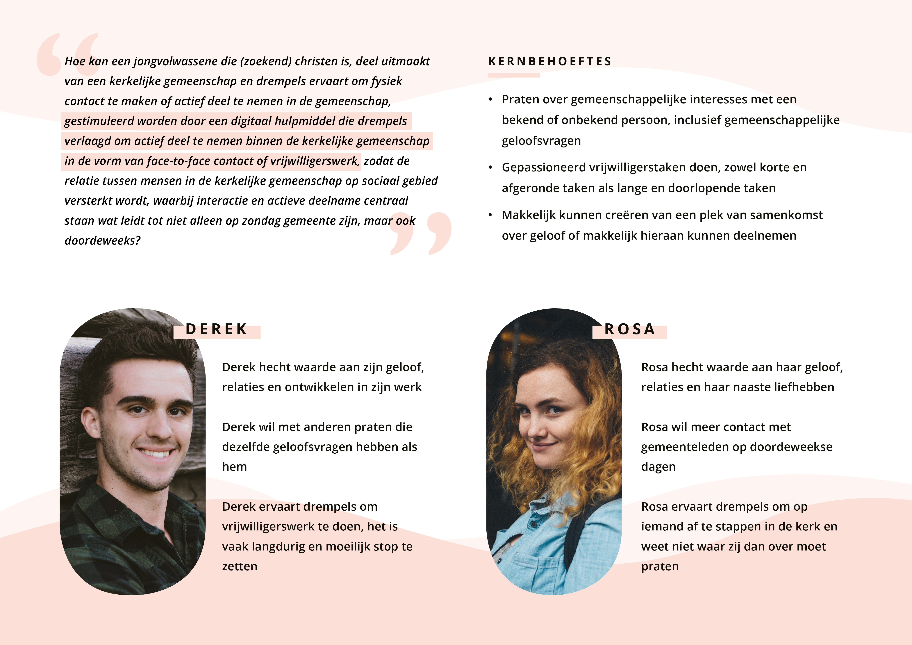
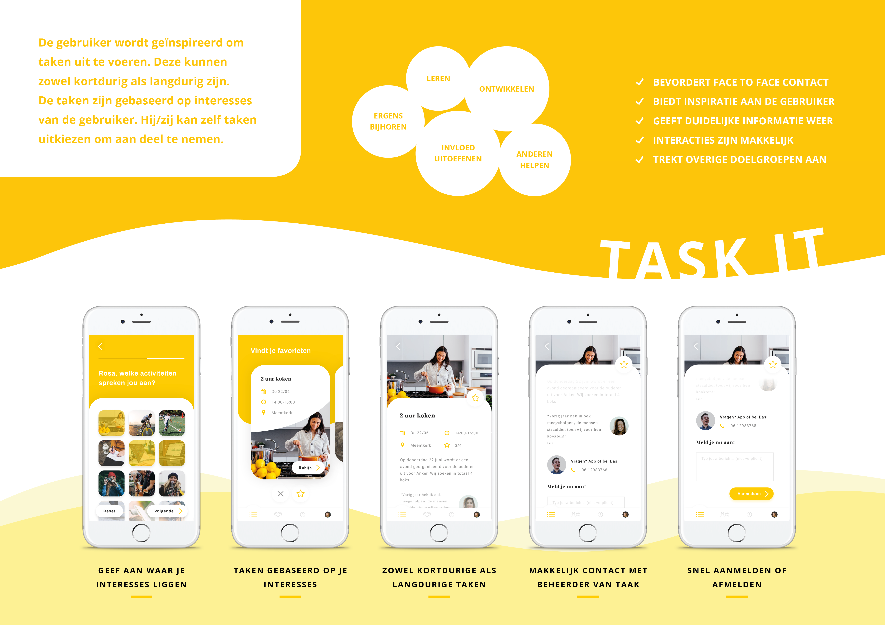
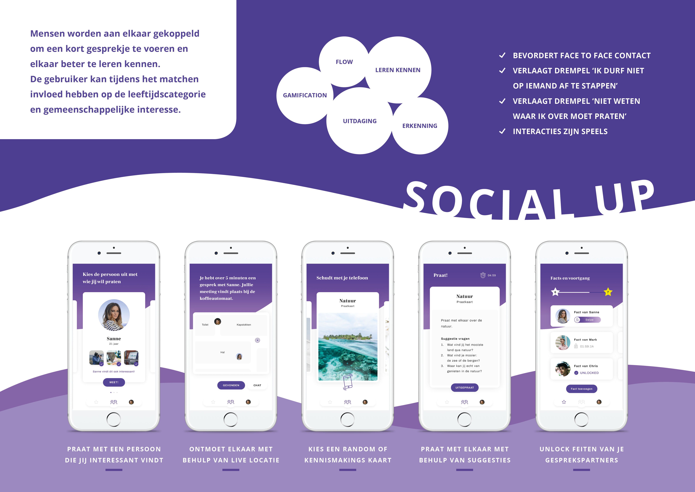
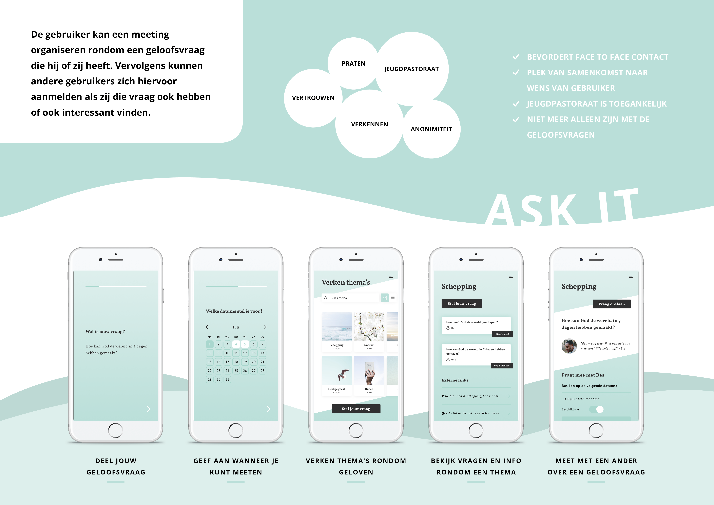

# Feedback vanuit Olaf en Henk \(Zig\)

Op vrijdag 5 juli zijn de 3 concepten gepresenteerd aan Olaf en Henk \(van Zig\). Dit is gedaan aan de hand van een keynote presentatie met uitgeprinte posters. 

## Presentatie



Tijdens het presenteren werden de posters uitgedeeld waar de informatie nog een keer op stond. Dit werd als fijn ervaren vanuit Olaf en Henk. Hieronder staan de posters met advies en feedback vanuit Olaf en Henk. De kleuren van de concepten zijn doffer geworden doordat het op print kwaliteit is gemaakt.

## Posters van concepten

### Task It

#### Feedback vanuit Olaf & Henk voor Task It

* Het is praktisch en snel in te vullen 
* Er zit massa in
* Er zijn push notifications en triggers nodig om gebruikers terug te laten komen en te stimuleren
* Favorieten zou ik kunnen beperken naar dat een gebruiker een aantal favorieten kan uitkiezen, bijvoorbeeld 3. Anders is de keuzemogelijkheid erg groot

### Social Up

#### Feedback vanuit Olaf & Henk voor Social Up:

* De voortgangsbalk zou gemeentebreed kunnen zijn en niet alleen van het individu. Zo is inzichtelijk hoe de voortgang in de gemeente gaat
* Medailles zouden per stadium verdient kunnen worden
* Het concept kan ook toegepast worden in verenigingen of andere plekken waar mensen elkaar kunnen leren kennen. Het zou ook in de vorm van activiteiten of spelletjes gedaan kunnen worden, i.p.v. gesprekskaarten. Bijvoorbeeld truth or dare

### Ask It

#### Feedback vanuit Olaf & Henk voor Ask It:

* Heeft padding nodig vanuit de gemeente
* Lichte en donkere modus: donkere modus is de anonieme modus
* Anonimiteit moet duidelijk naar voren komen
* Chat functie voor als mensen anoniem willen blijven, dit is een lagere drempel dan afspreken met mensen
* Geboortedatum opgeven kan voor mensen al een stap zijn. Geboortejaar of categorie invullen is al voldoende
* Speelse anonimiteit namen i.p.v. nummers. Bijvoorbeeld: bijvoeglijk naamwoord + zelfstandig naamwoord

#### Algemene aanvullingen

* Een poll zou interessant kunnen zijn, bijvoorbeeld wat de gebruiker verandert wil zien
* Gebruikers betrekken bij ontwikkeling van de kerk
* Alle 3 de concepten zouden gecombineerd kunnen worden in 1 app
* Naast een concept bedenken is het handig om een advies te geven over de geldcomponent en hoe het concept levensvatbaar kan zijn. Henk adviseerde om te kijken naar het desirebility schema

### Conclusies uit de feedback

Ik kon mij in alle punten vinden van Olaf & Henk. De volgende punten zijn meegenomen in de volgende iteratie:

* Onderzoek en ontwerpen van push notifications en triggers 
* Aantal favorieten beperken of hierin ook gelaagdheid aanbrengen
* Voortgangsbalk gemeentebreed maken of hierin gelaagdheid aanbrengen
* Anonieme chat functie met speelse naam bedenken, eventueel donkere modus
* Aanmeld systeem finetunen: geboortedatum vervangen door geboortejaar
* Iteratie van de 3 concepten met elkaar gecombineerd
* Advies over het ontwerp, geld en stakeholders

