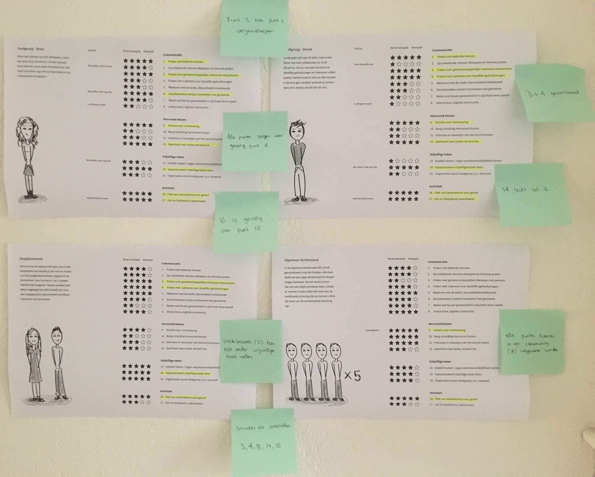

# Definitieve focus van het project

| Behandelde onderzoeksvragen |
| :--- |
| Wat zijn wensen, behoeftes, doelen & gedrag van de doelgroep? |
| Welke problemen ondervindt de doelgroep nu \(m.b.t. Hervormd Huizen\)? |
| Wat zijn drempels van de doelgroep? |
| Wat zijn de behoeftes, doelen en pijnpunten van de stakeholders? |

## De kernbehoeftes van de gebruiker

Hieronder staan de belangrijkste inzichten uit dit hoofdstuk.

* **Praten over gemeenschappelijke interesses met een bekend of onbekend persoon, inclusief gemeenschappelijke geloofsvragen**
* **Gepassioneerd vrijwilligerstaak doen, zowel korte en afgeronde taken als lange en doorlopende taken**
* **Makkelijk kunnen creëren van een plek van samenkomst over geloof of makkelijk hieraan kunnen deelnemen**

## Rating van de stakeholders

Tijdens het project is de focus een aantal keer beschreven, maar het was alsnog te breed. Na aanleiding van [het gesprek met Marije](https://maroeska-productbiografie.gitbook.io/productbiografie/onderzoek/meetings-fase-1#04-06-19-meeting-met-begeleider-en-medestudenten) is er een rating gemaakt van de belangrijkste stakeholders binnen het project. De jeugdouderling is weggelaten, want daar was lastig contact mee te krijgen. Zig staat er ook niet tussen, omdat deze voor de technische uitwerking zorgt en minder op inhoud. 

Hieronder staat het format.

## Format rating



### Verbanden tussen de stakeholders

## Uitleg van de verbanden

Wat geel gemarkeerd is, zijn de meest belangrijke punten voor de doelgroep, die hebben 5 sterren gekregen. Bij het jeugdpastoraat en de AK is gekeken welke belangrijke punten van de doelgroep ook overeenkomen met de doelgroep. Op de groene briefjes staan de verbanden aangegeven.

## Conclusies van de rating

### Links tussen punten

Een aantal punten waren gevolgen van andere punten. Bijvoorbeeld: 

* '3. Praten over gemeenschappelijke interesses met persoon' kan '2. Op onbekende mensen afstappen en hiermee praten' vergemakkelijken. Zodra de persoon een gemeenschappelijke interesse met iemand heeft en zij dit van elkaar weten, zal de persoon makkelijker op de ander afstappen om hierover een gesprek aan te gaan.
* '16. Plek van samenkomst over geloof' kan een gevolg zijn van '17. Gat na \(belijdenis\) catechisatie'. Wanneer er een plek is voor samenkomst over geloof en dit duidelijk is aangegeven, zal dit gat wegvallen.
* '14. Gepassioneerd vrijwilligerstaak doen' leidt tot '13. Initiatief nemen of eigen verantwoordelijkheid nemen'.
* Alle punten 1-17 zorgt voor '6. Doordeweekse contact momenten met gemeente'.
* Alle punten 1-17 kunnen leiden tot '8. Interactieve, digitale community'

### Combinaties van punten

Een aantal punten kunnen gecombineerd worden.

* '4. Praten met 1 persoon over dezelfde \(geloofs\)vragen' kan onderdeel zijn van '3. Praten over gemeenschappelijke interesses met persoon', want bezig houden met dezelfde \(geloofs\)vragen als een ander is een gemeenschappelijke interesse.
* '5. Meeleven met een ander, bijvoorbeeld ziektebezoek' kan ook onder '14. Gepassioneerd vrijwilligerstaak doen' vallen.

### Focus = belangrijkste behoeftes van de doelgroep

Met de gevolgen en combinaties verwerkt, komen we uit op de volgende focus in het afstudeerproject:

* Praten met bekende mensen
* **Praten over gemeenschappelijke interesses met persoon \(inclusief gemeenschappelijke geloofsvragen\)**
* Ruimte creëren voor vernieuwing in Hervormd Huizen
* Openheid van Hervormd Huizen naar buiten de kerk toe
* **Gepassioneerd vrijwilligerstaak doen**
* **Plek van samenkomst over geloof \(wat ook als oplossing dient voor gat na stop catechisatie\)**

De dik gedrukte punten zijn de kernpunten, dus:

* **Praten over gemeenschappelijke interesses met een bekend of onbekend persoon, inclusief gemeenschappelijke geloofsvragen**
* **Gepassioneerd vrijwilligerstaak doen, zowel korte en afgeronde taken als lange en doorlopende taken**
* **Makkelijk kunnen creëren van een plek van samenkomst over geloof of makkelijk hieraan kunnen deelnemen**

## Vervolg

Het heeft mij geholpen om te markeren wat echt essentieel is en waar ik binnen mijn project een oplossing voor kan bedenken. Ook heb ik ontdekt dat heel veel behoeftes samenhangen of gevolgen zijn van andere behoeftes. De focus is meegenomen naar de ideeontwikkeling fase.

