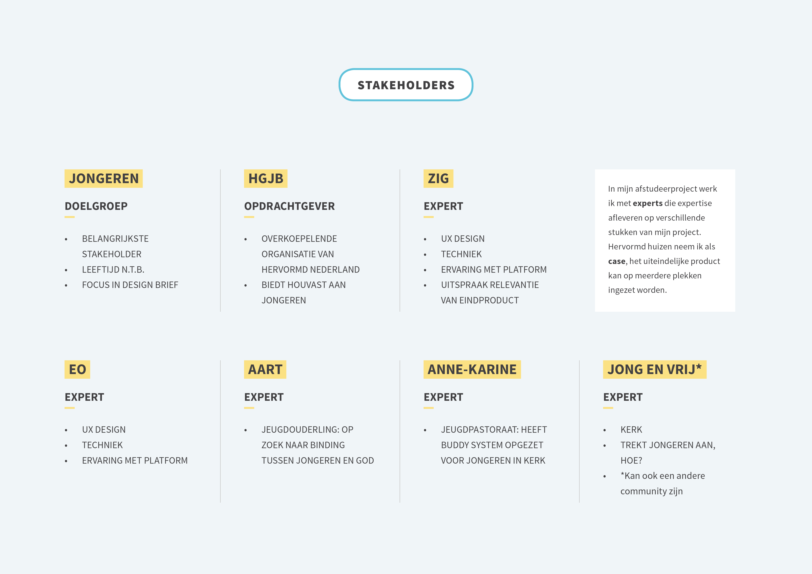

# Inzichten en keuzes

Op deze pagina staan belangrijke inzichten en keuzes die zijn gemaakt tijdens fase 1.

## Proces inzichten en keuzes

Hieronder staan gemaakte keuzes en opgedane inzichten in stapjes weergegeven.



## 06/06/10 Definitieve focus

Tijdens het creëren van de [focus](https://maroeska-productbiografie.gitbook.io/productbiografie/inzichten-april-+-mei/focus), zijn de volgende kern behoeftes naar voren gekomen:

* **Praten over gemeenschappelijke interesses met een bekend of onbekend persoon, inclusief gemeenschappelijke geloofsvragen**
* **Gepassioneerd vrijwilligerstaak doen, zowel korte en afgeronde taken als lange en doorlopende taken**
* **Makkelijk kunnen creëren van een plek van samenkomst over geloof of makkelijk hieraan kunnen deelnemen**

## 23/05/19 Essentie van het project

**Inzicht: de essentie van het project is duidelijk beschreven.**



\*\*\*\*

## 20/05/19 Aanpassing Design Challenge

**Inzicht: jongvolwassenen willen wel meer sociale binding, maar ervaren drempels om fysiek contact te maken of om vrijwilligerswerk te doen.**

Na aanleiding van dit inzicht, is de [Design Challenge](https://maroeska-productbiografie.gitbook.io/productbiografie/#design-challenge) aangepast.

## 02/05/19 Platform / tool

#### Inzicht: het probleem wat opgelost gaat worden, kan verholpen worden door een tool die face-to-face contact mogelijk maakt.

Door een soort platform voor kerkgangers te bedenken waarin men meetings, bezoeken of contactgroepen kan organiseren, wordt de tool zelfdragend en hoeft alleen de techniek uitgewerkt te worden. 

## 24/04/19 Probleem komt op meerdere plekken voor

#### Inzicht: het probleem wat ik aangepakt gaat worden, komt op meerdere plekken voor. 



_Notitie: de aanpak van HGJB als opdrachtgever is vrij snel daarna niet voltooid. Hieronder staat wel de beschrijving van hoe ik rond 24 april erover nadacht._

Tijdens de pitch meeting werden er enorm veel suggesties gedaan wat ik allemaal zou kunnen onderzoeken.

**Verder kijken dan alleen eigen kerk**

  
****Waar ik achter ben gekomen, is dat ik mijn afstudeerproject tot nu toe te klein heb gehouden en te veilig. Hierdoor loop ik het risico teveel in mijn eigen omgeving en ruimte te bevinden. Als ontwerper zijnde moet ik meer geprikkeld worden dan alleen bezig houden met iets wat in mijn eigen kerk gebeurd. Nu weet ik dat er een probleem speelt bij de organisatie: zij bereiken jongeren niet \(of slecht\). De vraag is of jongeren en jongvolwassenen hier ook mee zitten. 

**Hervormd Huizen als beta**

Wat ook een vraag is, is: hoe kan een maatschappelijke organisatie contact maken met haar doelgroep? Er zijn ontzettend veel organisaties en ik moet een keuze maken. Ik kies voor de kerkelijke gemeenschap Hervormd Huizen als "beta", maar onderzoek tegelijkertijd ook wat nuttig is voor meerdere kerkelijke gemeenschappen in Nederland en ik kan mij inspireren door trends en ontwikkelingen in algemene communities of verenigingen. Om mijn afstudeerproject CMD-waardig te maken kies ik voor de opdrachtgever HGJB: een organisatie die jongeren steunt in het christelijk geloof. Deze organisatie biedt verschillende methodes en activiteiten aan voor jongeren waar kerkelijke gemeenschappen mee aan de slag kunnen gaan. Bij de HGJB wil ik het probleem wat ik zelf heb ondervonden toetsen. Wanneer zij dit probleem herkennen, wordt dit mijn potentiële opdrachtgever. 

**Diverse experts**

Om mijn project goed aan te pakken met professioneel advies, schakel ik diverse experts in. De reden dat ik de EO niet als opdrachtgever neerzet, is omdat de EO momenteel te breed is voor mijn afstudeerproject en eerder dient als expert dan opdrachtgever. Het probleem wat ik zie, speelt momenteel in de Hervormde Kerk, daarom wil ik mijn onderzoek hier uitvoeren, want dit probleem is duidelijk zichtbaar. Omdat het probleem waarschijnlijk ook voorkomt op andere plekken, dit is gebaseerd op aannames, schakel ik een grotere opdrachtgever in: HGJB. De EO kan mij hierin helpen door middel van hun expertise, net als Zig. Beide experts hebben evenveel UX-designers in dienst en verstand van platforms bouwen.







Hieronder staat de feedback die ik van Marije heb terug gekregen n.a.v. mijn nieuwe aanpak. Dit betekent weer een nieuwe aanpak die hierboven staat.

* Het is prima als ik hgjb als opdrachtgever kiest en de eo als expert. 
* Het moet wel duidelijk zijn wie het platform gaat onderhouden. Dat heeft namelijk invloed op het ontwerp. 
* Het lijkt er op dat zig betrokken is bij de ontwikkeling en eigenaar is van het ontwerp. Als ik een interne analyse van het bedrijf wil doen, waar ga ik dan naar kijken, kerk, hgjb of ook zig? 
* Kortom **het is belangrijk dat duidelijk is van wie het ontwerp is en wie het gaat ontwikkelen en onderhouden**. 
* De doelgroep en het probleem zijn beide nog vrij breed geformuleerd. Probeer het specifieker te maken, welke jongeren? Welke leeftijd? Welke religies? Of behoren niet religieuze jongeren met interesse in religie ook tot de doelgroep? Zijn er meerdere verschillende doelgroepen te onderscheiden binnen de jongeren. Wat zijn hun behoeftes precies? Contact, praatgroepen, hulp, etc? Maak het concreet, alleen spreken over verbinding geeft waarschijnlijk te weinig richting: wat zijn concrete dingen waar ze behoefte aan hebben en hoe zorgt jouw product voor de oplossing.
* Probeer ook te beargumenteren waarom het een platform moet zijn. Er zitten wel interessante elementen in de opdracht, maar concrete probleem, doelgroep en positie van de verschillende stakeholders kan je wel wat meer uitwerken. 



\*\*\*\*

