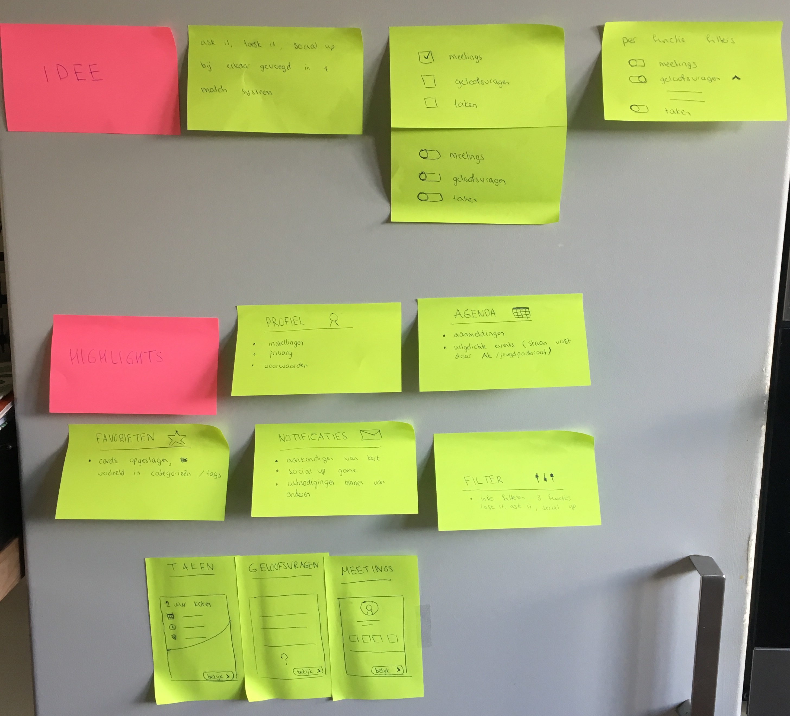

# Eerste ideeën combinatie concepten

| Behandelde onderzoeksvragen |  |
| :--- | :--- |
| **Hoofdvraag: wat is nodig om tot een nieuw product te komen?** | \*\*\*\* |
| Welk concept heeft de meeste potentie? |  |

Uit de gesprekken met Olaf en Henk en uit de Feedback Frenzy kwam naar voren om de 3 concepten te combineren in 1 concept wat tot het eindproduct leidt. Er is nagedacht over hoe dit gecombineerd zou kunnen worden en wat nog steeds past bij de behoeftes van de doelgroep en wat matcht aan de PvE en wensen. Hieronder staan diverse gedachtegangen, dus niet het nieuwe concept.

### Idee: alle 3 de concepten zijn afhankelijk van elkaar

_De gebruiker schrijft zich in voor een taak \(Task it\), kan binnen die taak meetings organiseren \(Social up\) en kan aan de mensen die zich ook hebben ingeschreven voor de taak vragen stellen over geloof en met hen praten \(Ask it\)._

#### Voordelen:

* Alle concepten lopen nauw in elkaar over
* Er zijn niet teveel mogelijkheden, het wordt voor de gebruiker gekaderd 

#### Nadelen:

* De gebruiker zit een bubbel, heeft mindere vrije mogelijkheden
* De gebruiker wil misschien helemaal geen taken uitvoeren, maar wil alleen praten met anderen of geloofsvragen bekijken

Kijkend naar de behoeftes van de doelgroep, doet de 1 al vrijwilligerswerk en wil de gemeente beter leren kennen, de ander wil losse taken uitvoeren als vrijwilligerswerk en weer een ander is alleen op zoek naar erkenning in zijn geloofsleven. 

Conclusie: de 3 concepten \(Task It, Ask It & Social Up\) moeten los van elkaar gebruikt kunnen worden

### **Idee: alle 3 de concepten zijn onafhankelijk van elkaar en hebben niks met elkaar gemeen**

_De gebruiker komt in een online omgeving terecht die bestaat uit 3 onafhankelijke activiteiten: Task It, Social Up & Ask It. De gebruiker kan elke activiteit uitvoeren zonder iets te zien van de andere activiteit. \(Activiteiten zijn in dit geval de 3 concepten Task It, Ask It en Social Up\)_

#### Voordelen:

* De gebruiker kan zelf een activiteit kiezen naar behoefte en krijgt niet iets te zien van een andere activiteit waar zijn behoefte niet ligt

#### Nadelen:

* De gebruiker wordt niet getriggerd tot iets nieuws uitproberen, terwijl hem dat misschien wel heel leuk lijkt
* 3 compleet andere activiteiten in een app zonder dat zij iets met elkaar te maken hebben kan verwarrend overkomen. Waarom zijn het dan niet 3 losse apps?

Wanneer er geen verbanden zitten tussen de 3 concepten wordt het een losse brei aan functionaliteiten. Het is wel belangrijk dat de gebruiker zelf grip heeft over wat hij wil doen binnen de app, maar suggesties vanuit te app en triggers helpt de gebruiker om nieuwe functionaliteiten te ontdekken en te leren.

### **Idee: alle 3 de concepten zijn onafhankelijk van elkaar en hebben wel wat met elkaar gemeen**

**De gebruiker komt in een online omgeving terecht die bestaat uit 3 onafhankelijke activiteiten: Task It, Social Up & Ask It. De gebruiker kan elke activiteit uitvoeren, maar ziet wel subtiele verbanden tussen de 3 activiteiten.** 

#### Voordelen**:**

* De gebruiker kan zelf een activiteit kiezen naar behoefte
* De gebruiker maakt subtiel kennis met de andere activiteiten
* De gebruiker kan geïnspireerd worden door activiteiten waar hij voorheen niet wat mee had
* De gebruiker bevindt zich niet in een bubbel, maar ook niet in een losse brei aan content

#### Nadelen:

* Elke activiteit kan nog steeds los aanvoelen van de ander
* Er is een goede balans nodig tussen de 3 activiteiten en hoe verbanden gelegd kunnen worden

Als ik kijk naar de PvE en wensen, dan moet de gebruiker verschillende acties kunnen verrichten in de app.  Conclusie: het is het meest wenselijk om de 3 concepten te combineren in 1 app, maar moeten er wel verbanden  zijn tussen de 3 concepten en triggers om te ontdekken in de app.

### Ideeën voor combinatie van de 3 concepten

Hieronder zijn ideeën geschetst om de 3 concepten te linken aan elkaar in 1 concept.



### Idee: alle 3 concepten in 1 match systeem toepassen

Hierboven zijn post-it's geplakt rondom het idee om de 3 concepten \(Ask It, Task It & Social Up\) te combineren. 

**Pluspunten**:

* De concepten lopen in elkaar over, het is meer een geheel
* De gebruiker kan filteren wat hij wil zien
* Alles staat op 1 plek, maar staat wel geordend
* Alle afspraken en aanmeldingen staan in 1 agenda 
* Tags filteren voor meetings en taken kunnen overeen komen

**Minpunten**:

* Navigatie: hoe weet de gebruiker waar hij is?
* Ask It lastig in toe te passen vanwege andere functies

## Gebruikers terug laten keren

Een feedback punt tijdens de sessie met Olaf & Henk en de feedback frenzy was om na te denken over hoe gebruikers terug kunnen keren naar de app. Om hier aandacht aan te besteden, is een artikel gelezen.

### Triggeren van de gebruiker

Hoe triggeren we de gebruiker om terug te komen naar de applicatie? Volgens Melis \(2017\) zijn push notificaties een bewezen manier om mobiele app interactie te verhogen en gebruikers terug te laten komen. Het helpt om berichten te sturen op basis van data en voorkeuren. Dit is ook het idee voor het ontwerp, zodat de gebruiker zich persoonlijk aangesproken voelt. 

### Simpele app

Het moet voor de gebruiker makkelijk en snel zijn om zich aan te melden. Ook moet de gebruiker in korte tijd begrijpen waar de app over gaat. Volgens Melis \(2017\) zorgen teveel stappen voor aanmelden, het gebruik van verwarrende functies en een te druk scherm voor app verlaters. 

### Motivatie & gamification

Motivatie en games zijn belangrijke factoren die volgens Melis \(2017\) direct beïnvloeden. Binnen het ontwerp wil ik gebruik maken van een voortgangsbalk met levels en badges of speciale content. Hiermee wordt de loyaliteit en mobiele app interactie verhoogd. 

### Product updates

Volgens Melis \(2017\) blijven gebruikers geïnteresseerd in de app wanneer er nieuwe functies komen, bugs worden verholpen en gepersonaliseerde content wordt aangeboden. Het helpt om feedback te ontvangen van gebruikers en naar hen te luisteren.

