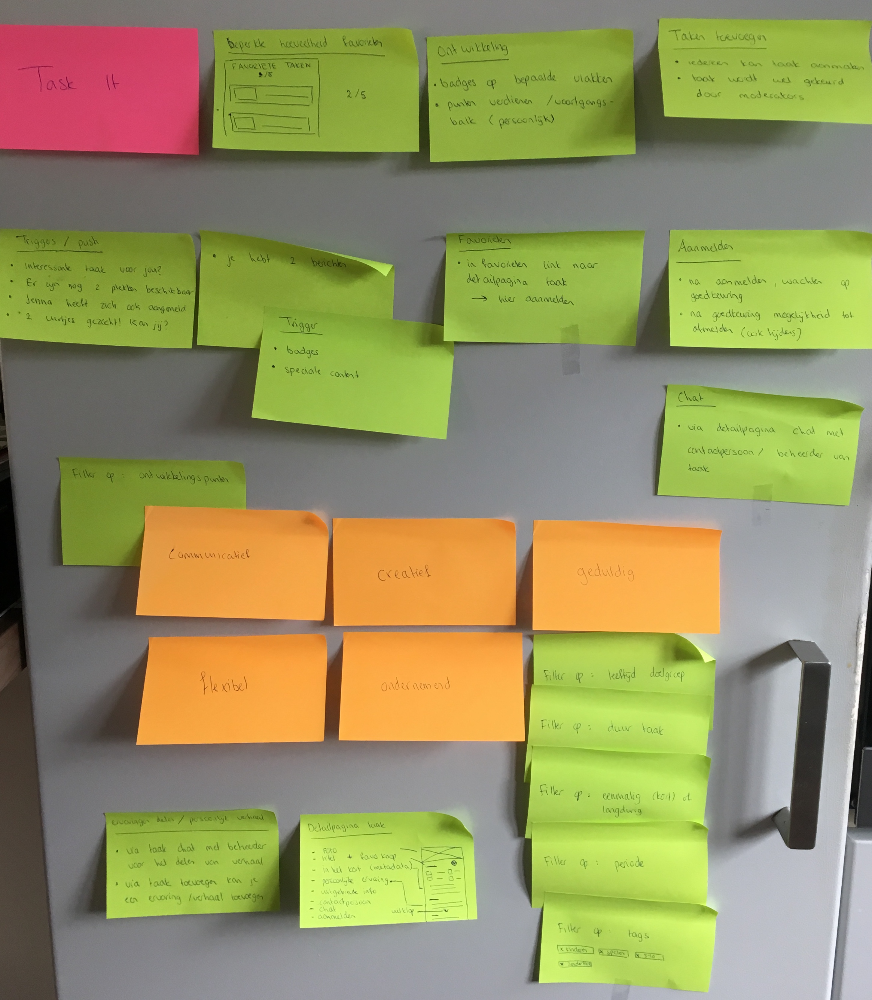
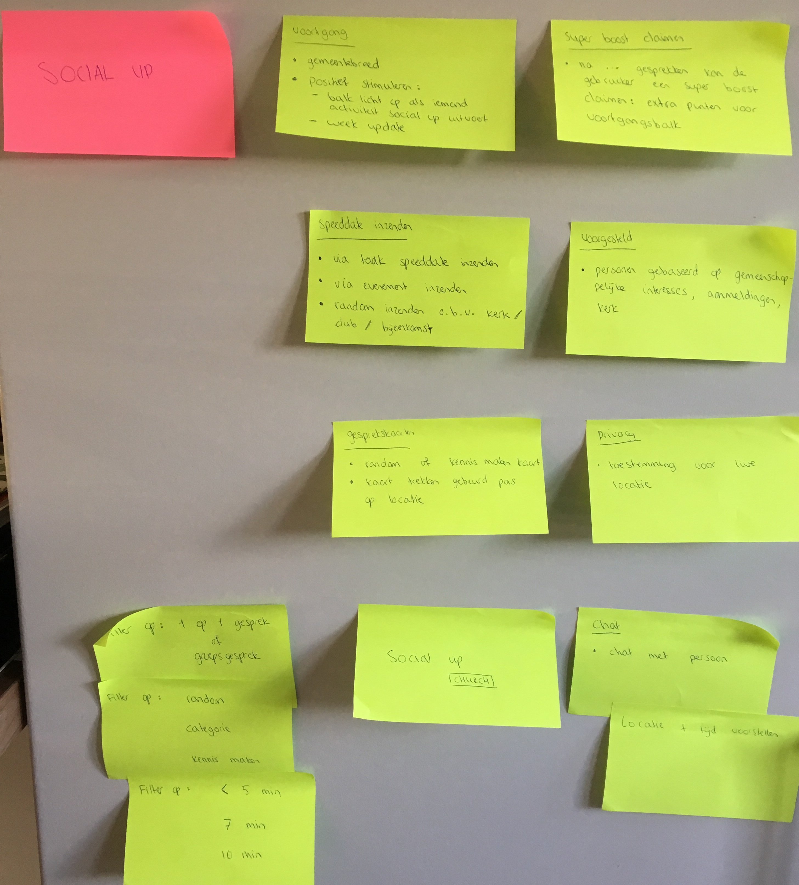
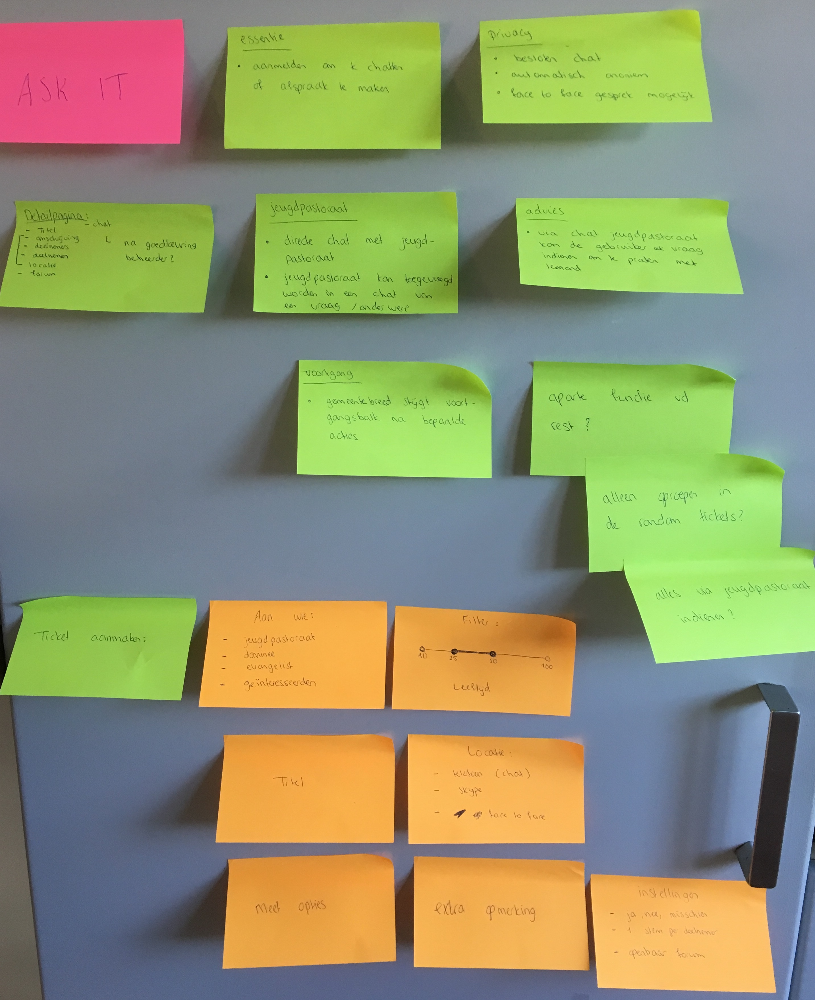

# Ideeën bij de 3 concepten SAMENVOEGEN

| Behandelde onderzoeksvragen |  |
| :--- | :--- |
| **Hoofdvraag: wat is nodig om tot een nieuw product te komen?** | \*\*\*\* |
| Welk concept heeft de meeste potentie? |  |

Naar aanleiding van de Feedback Frenzy, feedback van Olaf & Henk en de design patterns en concurrentie nagedacht is er nagedacht over de details van de 3 concepten Task It, Social Up & Ask It.

## Ideeën bij Task It

**Pluspunten**:

* Goed uit te voeren in de praktijk
* Alle punten zijn logisch en uitgedacht
* Filters zijn logisch

**Minpunten**:

* Hoe te bepalen welke ontwikkelingspunten relevant zijn? 

## Ideeën bij Social Up

**Pluspunten**

* Voortgangsbalk licht op als iemand bezig is met 'sociaal doen'
* Super boost voegt game element toe
* Filters zijn logisch

**Minpunten**

* Verwarrend op welke plekken de gebruiker een speeddate kan aanmaken
* Hoe de Social Up Church aankondigen en waar in app speelt dit af

## Ideeën bij Ask It

**Pluspunten**:

* Privacy 
* Verschillende keuzemogelijkheden voor gesprek
* Gesprek met of jeugdpastoraat
* Logische punten voor ticket aanmaken

**Minpunten**:

* Is Ask It een aparte functie van Task It en Social Up?
* Hoe en waar worden oproepen geplaatst?
* Wordt alles ingediend via het jeugdpastoraat?

