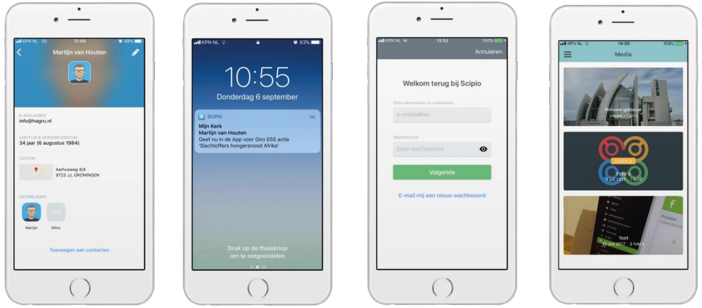
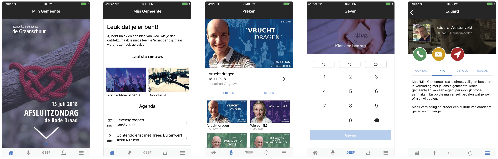
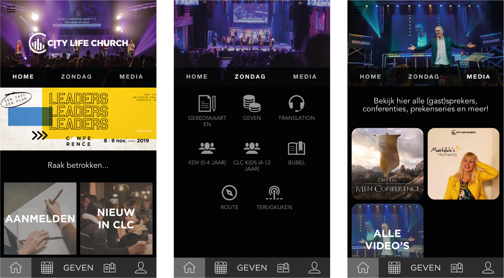
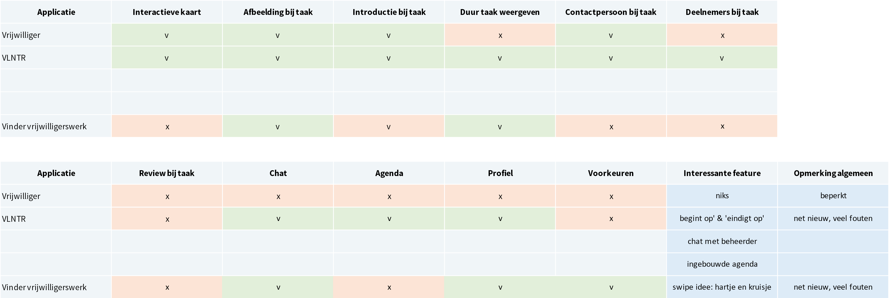
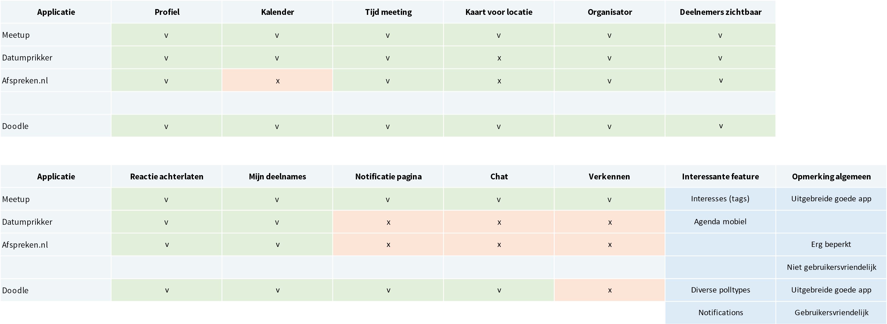

# Concurrentie analyse

| Behandelde onderzoeksvragen |
| :--- |
| **Hoofdvraag: wie is de concurrentie?** |
| Wat kunnen wij leren van de concurrentie? Wat doen zij fout en wat goed? |
| Hoe bieden concurrenten hun content aan? |
| Hoe kunnen we ons onderscheiden van de concurrentie? |

## Wie is de concurrentie?

Ik vind het lastig om de concurrentie te bepalen voor mijn ontwerp, omdat ik 3 verschillende functionaliteiten in 1 ontwerp stop. Deze 3 functionaliteiten hebben verschillende concurrenten. Er zijn comparison charts gemaakt per onderdeel. Zo kan er bekeken worden waarin het ontwerp zich kan onderscheiden. Per comparison chart is bekeken wat relevant is om te vergelijken.

### Algemene concurrenten

Er bestaan al diverse apps om mee te communiceren binnen een kerk. Een aantal digitale platforms die onder Design Patterns staan, kunnen ook als concurrent gezien worden, maar wel op specifiek gebied. Ik kon wel kerk apps downloaden, maar niet de app zelf ervaren, omdat ik niet bij een kerk zit aangesloten die dit al heeft. Daarom is er informatie gehaald uit de beschrijvingen van de app, screenshots en recensies. De volgende apps zijn bekeken:

* Scipio
* Chrch
* Mijn Gemeente
* City Life Church

🌟 = leuk idee voor het project waar nog niet aan is gedacht

#### Scipio

De Scipio kerk app is een communicatieplatform voor kerken. Het is veilig en besloten voor gemeenteleden, de gebruiker kan onder andere zijn privacy instellingen ook wijzigen. Hervormd Huizen gebruikt deze app nog niet, daarom kan ik niet de app verkennen. Via [deze](https://www.hagru.nl/download/Scipio-App-informatiepakket.pdf) brochure is informatie opgedaan over de app.

**Interessante features:**

* Ledenlijst: gemeenteleden kunnen elkaar opzoeken \(als zij hier toestemming voor geven\)
* Pushberichten sturen naar alle leden, groepen of contact opnemen met één specifiek lid
* Toegang voor leden en geregistreerde gasten & misbruik kunnen melden
* Eigen huisstijl, online app beheer, statistieken, beheer zelf of met een team
* Interactie met leden: fotoalbums, reacties achterlaten op nieuws en foto

De app heeft een aantal interessante features ertussen staan. Het zijn wel allemaal standaard dingen die niet speels zijn, maar wel handig zijn om te hebben als basis binnen een kerk app. Het is een app wat zich wel afzondert van de buitenwereld. 

#### Chrch

De Chrch app is een sociaal platform voor kerken. Ik kon de app downloaden en een account aanmaken, maar het werkte niet prettig en ik kreeg niet overal toegang. 

**Interessante features:**

* Smoelenboek
* Kanalen om te communiceren met elkaar
* Persoonlijke agenda
* Push notifications 
* 🌟 Prikbord om iets te vragen of aanbieden

De app heeft basis functies voor een kerk die nuttig kunnen zijn, verder heeft de app geen originele functies naast het prikbord.

#### Mijn Gemeente

Mijn Gemeente is ook een sociaal platform voor kerken met dezelfde features als Chrch. 

#### City Life Church app

City Life Church is een kerk in Nederland. City Life Church heeft een eigen app die gemaakt is via Custom Church Apps. De app is gedownload en bekeken. Veel functies werken niet goed in de app, waarschijnlijk omdat ik geen account heb.

**Interessante features:**

* 🌟 Gebedspunten kunnen opgeven waar voor gebeden wordt in de kerkdienst
* Bijbel lezen
* Diensten terug kijken
* Blog
* Agenda

City Life Church ziet er mooi uit, maar het voelt niet persoonlijk en sociaal aan. Het voorziet de gebruiker wel van informatie over de kerkdiensten, maar nog niet over wie de gemeenteleden zijn.

### Concurrentie m.b.t. taken / vrijwilligerswerk

Er is een comparison chart opgesteld voor concurrentie m.b.t. taken en vrijwilligerswerk, omdat deze apps goed getest konden worden. Opvallend was dat alle geteste apps bugs bevatten en niet ver uitgewerkt zijn. Hier zit dus een kans voor mijn eigen project. De volgende apps zijn bekeken:

* Vrijwilliger
* VLNTR
* Vinder Vrijwilligerswerk

Bij alle 3 de apps had ik geen 'wauw' gevoel. Vinder vrijwilligerswerk maakte ook gebruik van cards waar de gebruiker doorheen kan swipen, alleen werkte dit niet goed.

### Concurrentie m.b.t. afspraken beheren / aanmelden

Voor concurrentie m.b.t. afspraken en aanmelden is ook een comparison chart opgesteld. 

* Datumprikker
* Meetup
* afspreken.nl
* Doodle

Er zit een vrij groot verschil tussen de concurrenten die in de chart zijn verwerkt. Meetup laat evenementen zien over heel Nederland en Doodle is alleen voor afspraken inplannen binnen een groep. 

### Concurrentie m.b.t. speelse kennismaking

Er zijn geen concurrenten gevonden voor gesprekskaarten of speelse kennismaking. Christelijke organisaties zoals JOP en HGJB ontwikkelen wel methodes voor kerkgemeenschappen, maar deze zijn niet digitaal. De Kletspot zou als concurrent gezien kunnen worden, maar deze heeft ook nog geen digitale variant.

## Interessante features vanuit concurrenten

### Algemene concurrentie \(kerk apps\):

* 🌟 Prikbord om iets te vragen of aanbieden
* 🌟 Gebedspunten kunnen opgeven waar voor gebeden wordt in de kerkdienst

### Concurrentie m.b.t. taken / vrijwilligerswerk

* 🌟 Taak begint op ... en eindigt op ...
* 🌟 Chatten met beheerder

### Concurrentie m.b.t. afspraken beheren / aanmelden:

* 🌟 Zichtbaar welke tags/interesses een lid heeft
* 🌟 Meerdere polltypes kunnen aanmaken

## Waar kan ik mij in onderscheiden?

### Algemene concurrentie \(kerk apps\):

* 💡 Mensen buiten de kerk aanspreken
* 💡 Ruimte creëren voor pittige vragen
* 💡 Vrijwilligerswerk taken laten zien
* 💡 Elkaar op een speelse manier leren kennen

### Concurrentie m.b.t. taken / vrijwilligerswerk

* 💡 Duidelijke + visuele taakomschrijving
* 💡 Filter opties of uitgebreide zoek functie voor nog meer personalisatie
* 💡 Persoonlijk verhaal van een vrijwilliger

### Concurrentie m.b.t. afspraken beheren / aanmelden

* 💡 Mogelijkheid voor gebruiker om een eigen poll te ontwerpen

### Concurrentie m.b.t. speelse kennismaking

* 💡 Kletspot digitaliseren
* 💡 Spelelementen toevoegen aan praatkaarten

