# Design pattern research

| Behandelde onderzoeksvragen |
| :--- |
| **Hoofdvraag: wie is de concurrentie?** |
| Wat kunnen wij leren van de concurrentie? Wat doen zij fout en wat goed? |
| Hoe bieden concurrenten hun content aan? |
| Hoe kunnen we ons onderscheiden van de concurrentie? |

| Behandelde onderzoeksvraag |  |
| :--- | :--- |
| Welke design patterns zijn interessant voor het concept? |  |

Naar aanleiding van de 3 concepten is er een nieuw concept bedacht waarin Task It, Ask It en Social Up samenkomen. Voorafgaand is er onderzoek gedaan naar design patterns die antwoord kunnen geven op user stories. 

"A design pattern is simply a reusable idea, design or code structure that has already been optimized for the purpose it is intended for." \(Interaction Design Foundation, 2019\)

## User stories

De user stories komen voort uit de [persona](https://maroeska-productbiografie.gitbook.io/productbiografie/inzichten-april-+-mei/persona) en [PvE en wensen](https://maroeska-productbiografie.gitbook.io/productbiografie/inzichten-fase-3/3.10-programma-van-eisen-en-wensen-2.0).

1. Als jongvolwassene \(zoekend\) christen wil ik weten waarover ik kan praten met een medekerkganger, zodat ik een gesprek durf te voeren en hem/haar beter leer kennen.
2. Als jongvolwassene \(zoekend\) christen wil ik praten met een persoon die dezelfde geloofsvragen en twijfel heeft als ik, zodat ik erachter kom hoe hij/zij met deze vragen en twijfel omgaat wat mij vervolgens inspireert voor mijn eigen leven.
3. Als jongvolwassene \(zoekend\) christen wil ik duidelijke informatie zien over een praatgroep, zodat ik weet waaraan ik deelneem en dit proces makkelijk verloopt.
4. Als jongvolwassene \(zoekend\) christen wil ik duidelijk informatie zien over vrijwilligerswerk wat zowel kortdurig als langdurig is, zodat ik vrijwilligerswerk uitvoer wat bij mij past waardoor ik het werk met plezier uitvoer.

## Als jongvolwassene \(zoekend\) christen wil ik weten waarover ik kan praten met een medekerkganger, zodat ik een gesprek durf te voeren en hem/haar beter leer kennen.

### Card Talk 

Card Talk helpt kinderen communiceren die moeilijk verbaal kunnen communiceren. De gebruiker kan door middel van kaarten selecteren wat hij/zij wil vertellen. De gebruiker of ouder kan ook zelf kaarten maken.

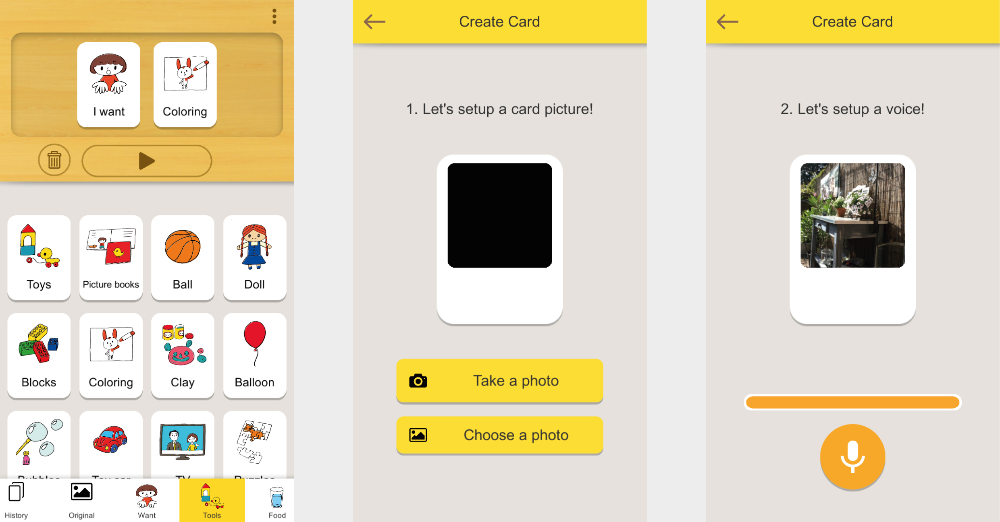

**Interessant**: visueel overzicht van kaarten, meteen zichtbaar welke kaarten er zijn.

**Idee voor het project**: eigen kaart aanmaken stapsgewijs, zelf invloed hebben op de content.

### Pesten

De gebruiker kan pesten zoals hij/zij ook het met een fysiek kaartspel ook zou spelen. Het spel is voorzien van regels en uitleg.

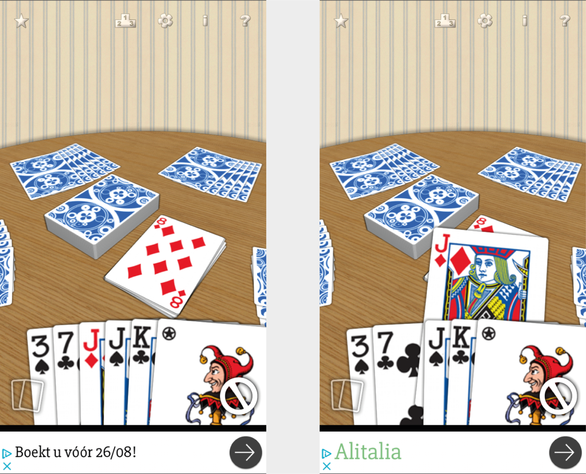

**Interessant**: nagebootst hoe de kaarten met het echte spel erbij liggen, de gebruiker herkent de setting van de kaarten.

### Jigsaw puzzle

De gebruiker kan legpuzzels maken met deze app en kan zelf bepalen met hoeveel stukjes hij de puzzel wil maken.

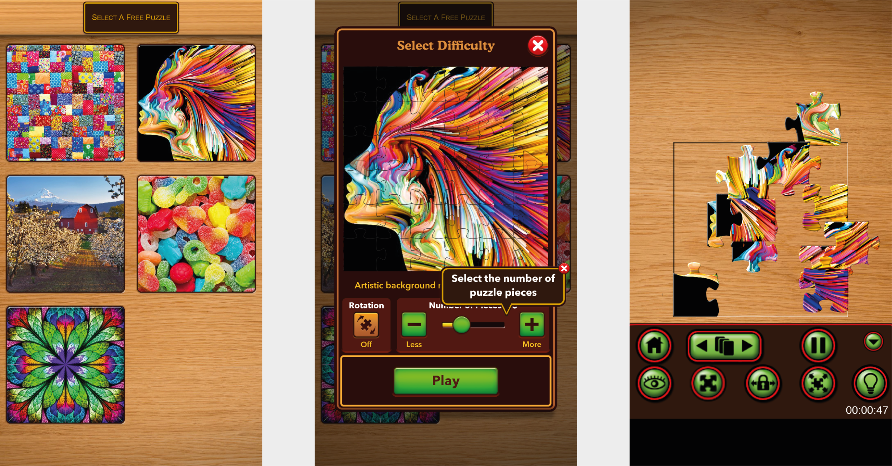

**Interessant:** de gebruiker kan puzzels maken van aantrekkelijke foto’s wat stimuleert om de puzzel te maken.

**Interessant**: de gebruiker kan invloed uitoefenen op de puzzel: zelf bepalen vanuit hoeveel stukjes de puzzel bestaat.

**Idee voor het project**: de gebruiker kan zelf bepalen hoeveel suggestie vragen er worden laten zien of hoeveel tijd hij/zij wil hebben voor een gesprek.

### Messenger 

Een bedrijf kan op Facebook instellen welke vragen het meest gesteld worden en deze in de chat verwerken.

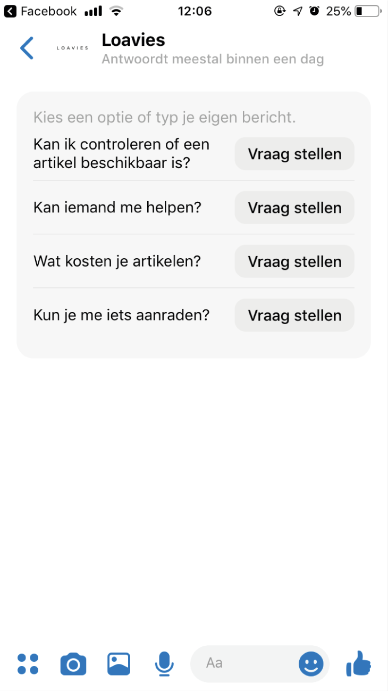

**Interessant**: er wordt een vraag gesuggereerd en de gebruiker hoeft alleen op ‘vraag stellen’ te klikken, hierdoor kost het minder moeite om een vraag te bedenken of te stellen.

### Spotify

Spotify biedt muziek aan op diverse manieren. De gebruiker kan muziek ontdekken en genres bekijken. Ook kan de gebruiker muziek afspelen gebaseerd op zijn stemming.

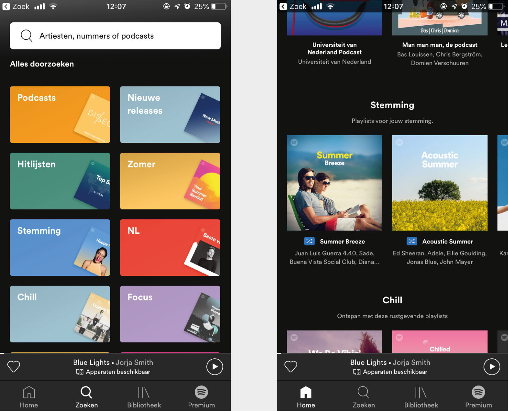

**Interessant**: veel mogelijkheden en inspiratie om tot een nummer afspelen te komen.

**Idee voor het project**: op basis van de stemming of emotie van de gebruiker kan de gebruiker een gesprekskaart kiezen.

### Kletspot

Een kletspot bevat kaarten met vragen of stellingen die een persoon aan een ander kan vragen. De persoon kan zowel random kaarten trekken als van tevoren bekijken wat op de kaarten staat.

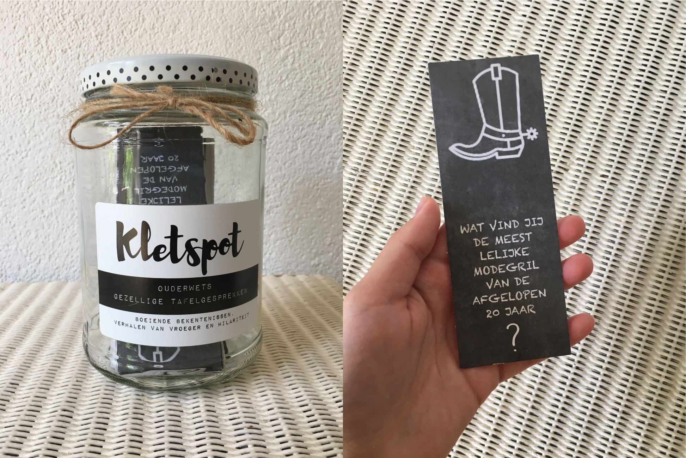

**Interessant**: de persoon hoeft niet zelf vragen te bedenken. In dit geval zijn de meeste vragen en stellingen grappig geformuleerd, waardoor de drempel op een gesprek te voeren lager wordt.

**Idee voor het project**: grabbelpot om gesprekskaarten uit te trekken.

### Dilemma op Dinsdag

Een wekelijkse stelling die volstrekt random en een ongemakkelijk is waar de persoon uit moet kiezen. Via Facebook kan de gebruiker iemand anders taggen die een keuze moet maken uit de 2 stellingen. Er bestaat ook een boek van Dilemma op Dinsdag waar de persoon stellingen met elkaar kan combineren.

**Interessant**: de visualisaties passen goed bij de stelling, het helpt bij de beeldvorming en is grappig.

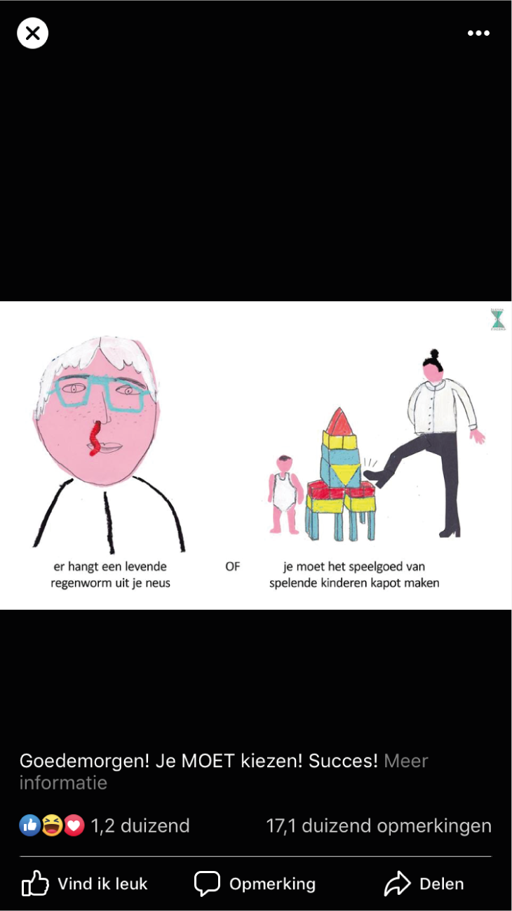

**Idee voor eigen project**: 2 onderwerpen op 1 kaart suggereren, zodat de gebruiker een keuze kan maken waar hij over wil praten.

## Als jongvolwassene \(zoekend\) christen wil ik praten met een persoon die dezelfde geloofsvragen en twijfel heeft als ik, zodat ik erachter kom hoe hij/zij met deze vragen en twijfel omgaat wat mij vervolgens inspireert voor mijn eigen leven.

### Stack overflow

In de community Stack Overflow, een vraag en antwoord forum voor programmeurs, kan de gebruiker badges en punten verdienen als hij/zj goede antwoorden geeft. Hoe meer punten de gebruiker behaalt, hoe meer privileges hij/zij krijgt.

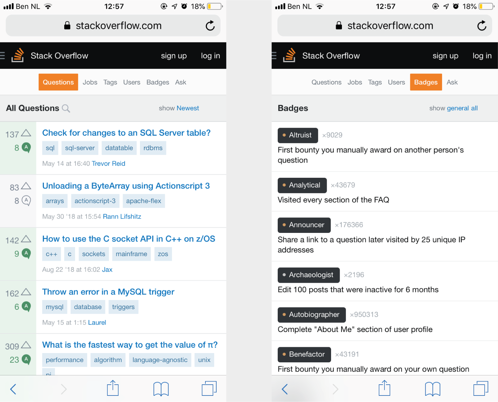

**Interessant**: Badges verdienen door anderen te helpen en toegang krijgen tot privileges door activiteit kan de gebruiker stimuleren anderen te helpen.

**Idee voor het project**: voortgangsbalk laten stijgen wanneer iemand een ander helpt of die persoon belonen.

### Vraag & antwoord - Quest

Quest beantwoord vragen in de vorm van blogposts.

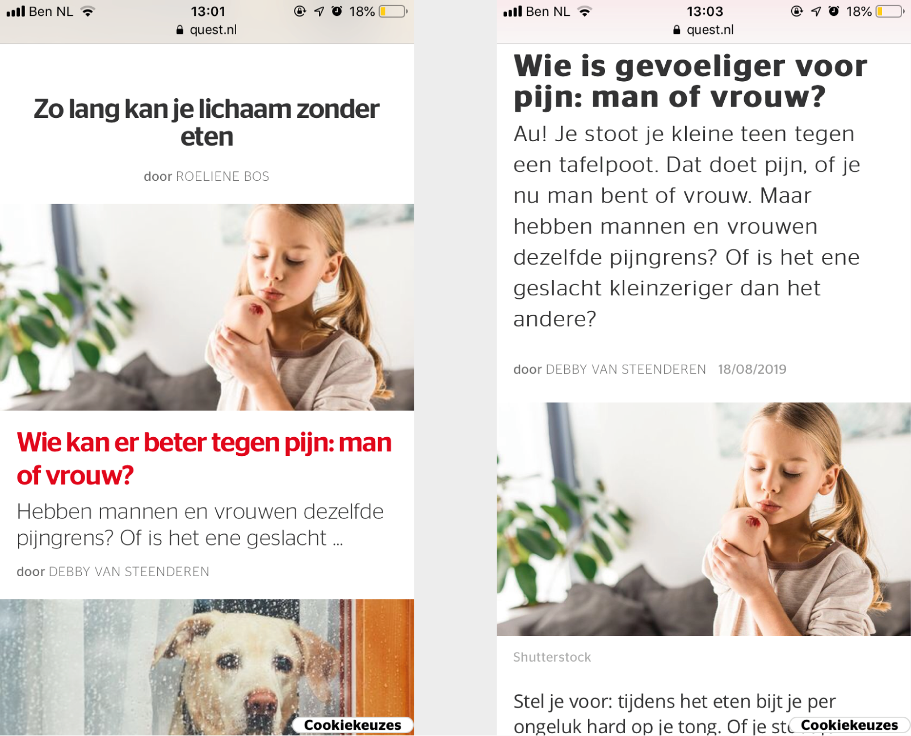

**Interessant**: de vragen zijn herkenbaar als eigen vraag, maar wel pas wanneer het gelezen wordt.

**Idee voor het project**: blogposts in de app die vragen beantwoorden van ingestuurde vragen.

### Goeievraag

De gebruiker kan een vraag stellen en andere gebruikers kunnen hierop reageren met feiten.

**Interessant**: in de lijst met categorieën is de meest recent gestelde vraag zichtbaar, voor de gebruiker is het handig om een voorbeeld van een vraag bij een categorie te zien. 

**Interessant**: als een gebruiker reageert op een vraag, kan hij/zij de bron vermelden. Daardoor kan de andere gebruiker checken waar zijn/haar antwoord op gebaseerd is. 

**Idee voor het project**: antwoorden kunnen upvoten

## Als jongvolwassene \(zoekend\) christen wil ik duidelijke informatie zien over een praatgroep, zodat ik weet waaraan ik deelneem en dit proces makkelijk verloopt.

### Datumprikker

De gebruiker kan een afspraak plannen via Datumprikker. Andere gebruikers geven hun beschikbaarheid op en de beheerder krijgt duidelijk inzicht in de beschikbaarheid van de andere gebruikers.

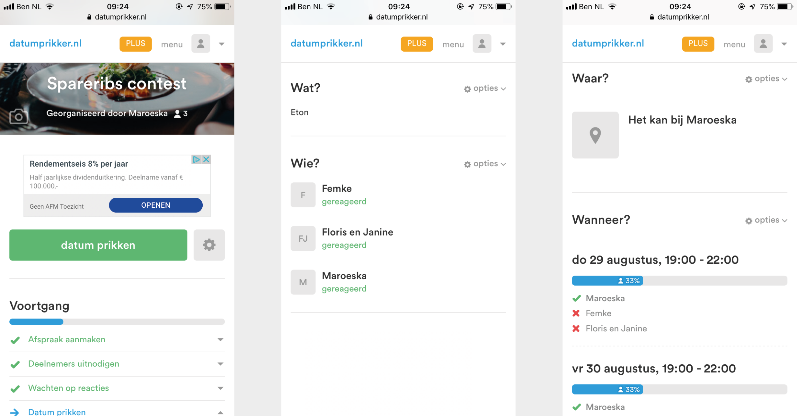

**Interessant**: 

* Datumprikker laat automatisch een favoriete datum zien waarop de meeste mensen kunnen
* De informatie op een logische manier geordend en duidelijk verwoord
* Zonder account kan de beheerder een beheerlink krijgen en wordt hij op de hoogte gehouden via e-mail

**Idee voor het project:** de hele stappenplan van een datum prikken werkt erg gemakkelijk, deze vorm zou ik in mijn project kunnen verwerken.

### Meetup

Bij Meetup staan de evenementen op een rijtje weergegeven waar de gebruiker aan kan deelnemen. De gebruiker kan categorieën bekijken en lid worden van een groep.

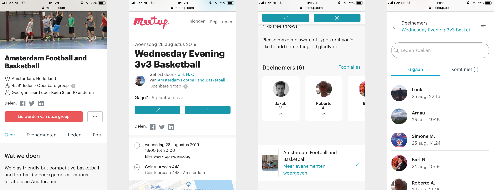

**Interessant**: 

* Deelnemers staan op een rijtje met foto's
* Maps kaartje erin verwerkt voor locatie
* Direct aanmelden in beeld \(fixed\)

### WhatsApp

In WhatsApp kan de gebruiker inzicht krijgen in wie er in een groep zit en wat er is gedeeld. 

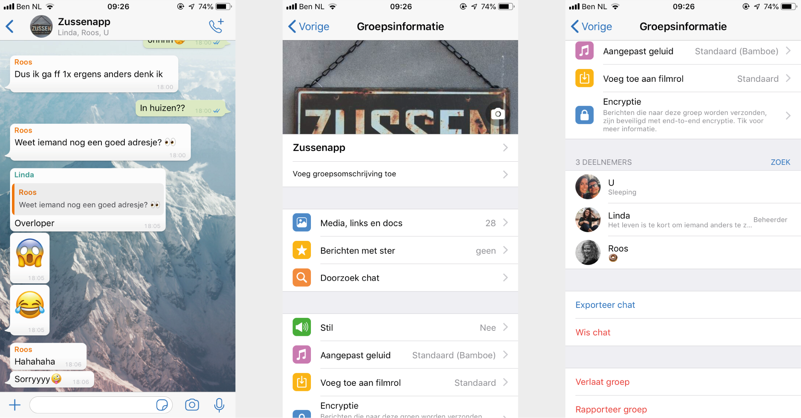

**Interessant**: 

* De gebruiker kan op een andere gebruiker tappen en direct een privé bericht sturen
* Per groep kan de gebruiker instellingen wijzigen

**Idee voor het projec**t: per groep personaliseren naar eigen wens

### Facebook

Op Facebook kan de gebruiker lid worden van een groep en kan hij berichten posten en gedeelde content zien.

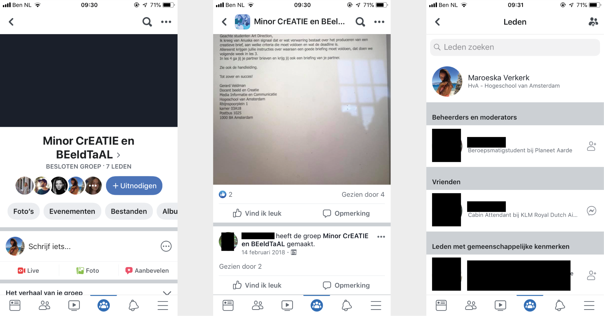

**Interessant**: de 'uitnodigen' button en snel inzicht krijgen in wie er lid zijn van de groep.

**Idee voor het project**: andere mensen kunnen uitnodigen om lid te worden van een groep.

## Als jongvolwassene \(zoekend\) christen wil ik duidelijk informatie zien over vrijwilligerswerk wat zowel kortdurig als langdurig is, zodat ik vrijwilligerswerk uitvoer wat bij mij past waardoor ik het werk met plezier uitvoer.

### Rode Kruis

De gebruiker kan vacatures zoeken die bij hem zouden kunnen passen. Ook krijgt de gebruiker een lijst te zien van vacatures voor vrijwilligerswerk.

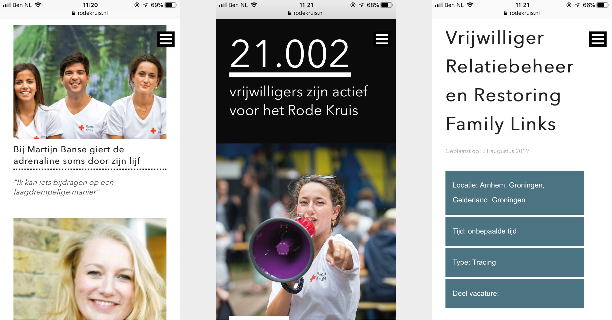

**Interessant**: 

* Verhalen van vrijwilligers
* Zichtbaar hoeveel vrijwilligers er actief zijn
* Schematisch informatie weergeven van de taak met daaronder uitgebreide informatie

**Idee voor het project**: recensies en leuke feitjes

### Zonnebloem

De gebruiker krijgt op de overzichtspagina van de vacatures metadata te zien over de taak.

**Interessant**:

* Filter periode is handig
* Hoeveel plekken er nog beschikbaar zijn 

### Travel Active

De gebruiker kan via Travel Active vrijwilligerswerk doen in het buitenland.

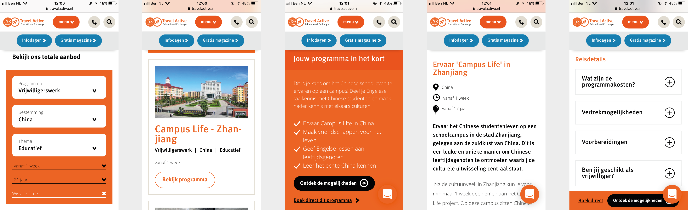

**Interessant**:

* Filter optie voor aanbod bekijken
* De detailpagina van het soort vrijwilligerswerk begint met een korte uitleg
* Reisdetails weergeven, gebruiker kan zelf kiezen welke informatie hij wil zien

**Idee voor het project**: taak in het kort omschrijven, daarna pas volledige uitleg en details geven.

### KiLROY

KiLROY is een reisbureau met een breed aanbod. De gebruiker kan ook via KiLROY vrijwilligerswerk doen.

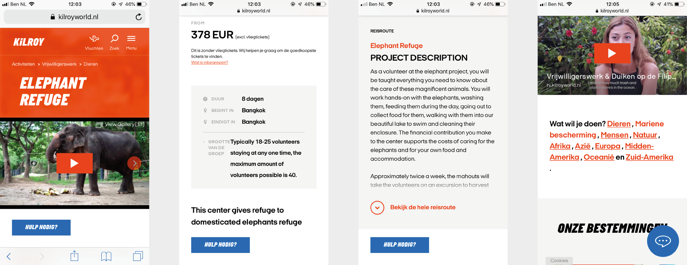

**Interessant**:

* Detailpagina van vrijwilligerswerk begint met een video
* Gebruiker kan op pijl klikken om meer informatie te zien
* De zin 'Wat wil je doen' met tags

**Idee voor het project:** video als omschrijving van taak

