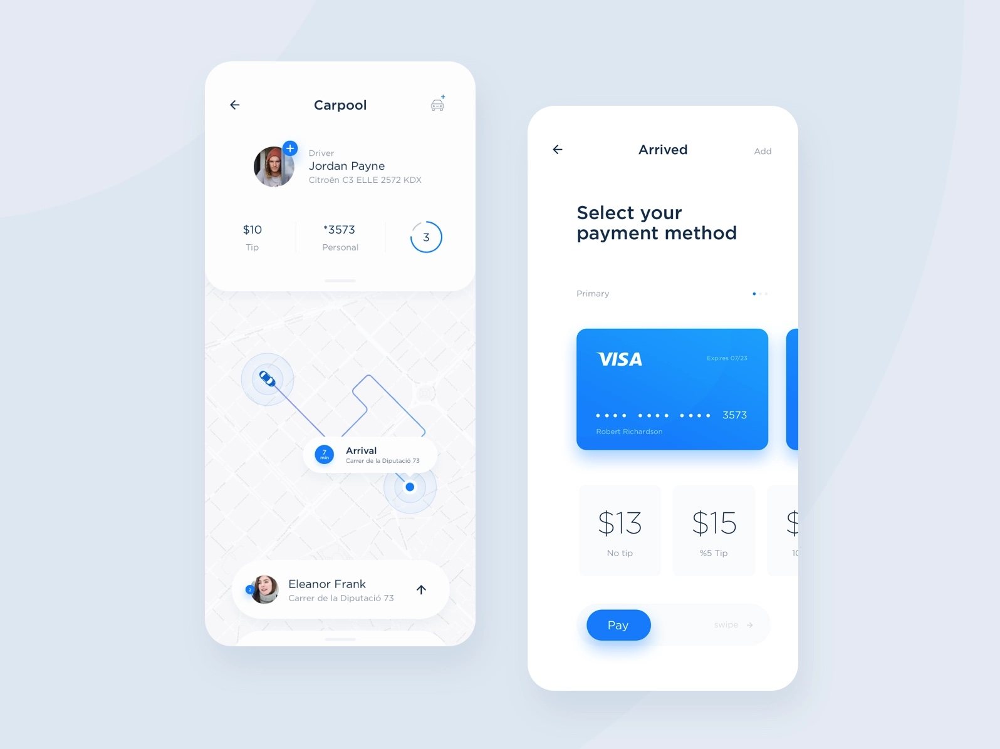

# Inspiratie m.b.t. vormgeving

| Behandelde onderzoeksvraag |  |
| :--- | :--- |
| Welke design patterns zijn interessant voor het concept? |  |

## Inspiratie Dribbble

Hieronder is inspiratie verzameld voor diverse categorieën. Er staat een korte notitie per afbeelding wat ik interessant vind voor mijn eigen ontwerp.

### Agenda























### Kaart























### Kleuren















### Buttons











### Cards











### Header











### Introductie







### Layers











### Review







