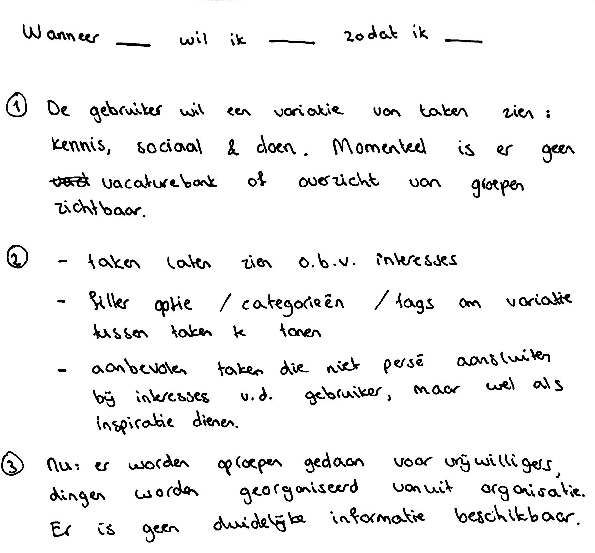

# Features voor nieuwe Task It

| Behandelde onderzoeksvragen |  |
| :--- | :--- |
| **Hoofdvraag: wat is nodig om tot een nieuw product te komen?** |  |
| Hoe creëren we een persoonlijke gebruikerservaring? |  |

## Soorten taken

Voordat er werd nagedacht over features in het ontwerp, is er nagedacht over de soorten taken die een gebruiker kan uitvoeren. Uit het gesprek met Marije en met Olaf kwamen de volgende taken naar boven die de kernbehoeftes van de gebruiker vervullen:

* **Kennis**, bijvoorbeeld gespreksgroepen over geloof. Hier kan de gebruiker zijn geloofsvragen kwijt.
* **Sociaal**, bijvoorbeeld iemand leren kennen tijdens een bezoekje aan diegene. Hier kan de gebruiker de ander uit de kerk leren kennen.
* **Doen**, bijvoorbeeld door een klusje uit te voeren. Hier kan de gebruiker een actieve taak uitvoeren die bij hem past.

## Job stories

Om op features te komen die nodig zijn voor het ontwerp, zijn er job stories bedacht om tot oplossingen te komen. Voor mij was het alweer een tijdje geleden dat ik heb bezig ben geweest met job stories. Daarom heb ik een artikel erbij gepakt en notities gemaakt die ik tijdens het bedenken van job stories erbij hield. De volgende conclusies zijn uit een artikel van Klement \(2019\) gehaald:

Deze methode is toegepast met de stappen 1-3:

Ik vind de stappenplan van Klement best lastig, omdat de vraag 'hoe lossen mensen het probleem nu op?' nog niet digitaal plaats vindt. Daarom heb ik 3 job stories op hoger niveau geformuleerd en vervolgens ben ik 'sub' job stories gaan schrijven. Bij elke Job story heb ik een schets getekend hoe de Job story in vervulling zou kunnen gaan. 

### Job stories hoger niveau

#### Sociaal

1. Wanneer ik tijd heb om een sociale activiteit uit te voeren, wil ik taken zien die met sociale activiteiten te maken hebben, zodat ik kan kiezen welke sociale activiteit ik ga uitvoeren. 

#### Kennis

2. Wanneer ik meer kennis wil opdoen over de bijbel, taken zien die met de kennis te maken hebben, zodat ik kan kiezen welke kennis activiteit ik ga uitvoeren.

#### Daad

3. Wanneer ik mij wil ontwikkelen in een daad, wil ik taken zien die met daden te maken hebben, zodat ik kan kiezen welke daad ik ga uitvoeren. 

### Job stories algemeen

#### Personalisatie

4. Wanneer ik gebruik wil maken van de app, wil ik een account aanmaken, zodat ik gepersonaliseerde content zie.

5. Wanneer ik gebruik maak van de app, wil ik taken zien op basis van mijn interesses, zodat mij aanmeld voor een taak en hem met plezier uitvoer.

#### Inspiratie

6. Wanneer ik gebruik maak van de app, wil ik ook suggesties zien niet op basis van mijn interesses, zodat ik geïnspireerd word om nieuwe dingen te ontdekken.

#### Filteren

7. Wanneer ik mij wil aanmelden voor een taak, wil ik filteren op periodes, zodat ik erachter kom of de taak wel in mijn agenda past.

#### Informatie

8. Wanneer ik als eerste indruk een taak interessant eruit vind zien, wil ik meer informatie zien over die taak, zodat ik mij eventueel kan aanmelden.

#### Persoonlijke ervaring 

9. Wanneer ik twijfel over aanmelden voor een taak, wil ik weten hoe de taak bij een ander is bevallen, zodat ik geholpen kan worden met de keuze om mij aan te melden of niet.

#### Agenda

10. Wanneer ik mij aanmeld voor een taak, wil ik de taak kunnen terug zien in mijn agenda, zodat ik weet wanneer ik de taak moet uitvoeren.

#### Contact persoon

11. Wanneer ik vragen heb bij een taak, wil ik meer informatie ontvangen, zodat mijn vragen beantwoord worden.

#### Chat

12. Wanneer ik behoefte heb om te praten met een persoon die dezelfde taak gaat uitvoeren als ik, wil ik die persoon kunnen bereiken, zodat ik met hem in gesprek kan gaan.

#### Motivatie

13. Wanneer ik geen gebruik maak van de app, wil ik gemotiveerd worden om terug te komen naar de app, zodat ik wat kan betekenen voor de kerk.

#### Ontwikkeling

14. Wanneer ik wil weten hoe het met mijn ontwikkeling gaat, wil hier inzicht in krijgen, zodat ik gemotiveerd word om door te ontwikkelen.

#### Favorieten

15. Wanneer ik taken als favoriet heb toegevoegd, wil ik deze terug zien, zodat ik kan bepalen of ik mij wil aanmelden voor deze taak of niet.

#### Taak aanmaken

16. Wanneer ik iets nodig heb van iemand, wil een oproep kunnen plaatsen, zodat ik geholpen word.

#### Beschikbaarheid

17. Wanneer ik zelf mag bepalen wanneer ik een taak kan uitvoeren, wil ik mijn beschikbaarheid kunnen nalaten, zodat ik de taak kan uitvoeren wanneer het mij uitkomt. 

## Feature lijst

Hieronder staan de belangrijkste features van het ontwerp die voort zijn gekomen uit de job stories en schetsen.

| Features |  |
| :--- | :--- |
| Aanmelden als gebruiker |  |
| Taken op basis van interesse |  |
| Filteren van taken |  |
| Informatie van een taak |  |
| Persoonlijke ervaring bij een taak |  |
| Aanmelden van een taak |  |
| Contact persoon bereiken bij een taak |  |
| Chatten met mede'taskers' over een taak |  |
| Beschikbaarheid opgeven voor een taak |  |
| Voorgestelde taken |  |
| Agenda met taken |  |
| Lijst met favoriete taken |  |
| Zelf een taak aanmaken |  |
| Ontwikkelingsbalk zien \(gemeentebreed of eigen\) |  |
| Push notifications |  |

