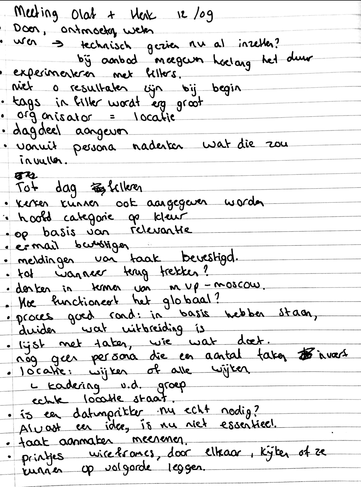

# Meetings met Olaf en Henk

## 14/10/19 Meeting met Olaf en Henk

Op 14 oktober heeft de laatste meeting plaats gevonden met Olaf en Henk. We hebben het design doorlopen en we hebben een aantal dingen besproken en we hebben nagedacht hoe we bepaalde problemen kunnen oplossen waar de gebruikers tijdens de testen tegenaan liepen.

#### Account aanmaken

* In een vroeg stadium is het handig om de privacy voorwaarden voor te leggen aan de gebruiker
* Afbeeldingen laten zien bij interesses is sterk, maar het kan voorkomen dat de gebruiker niet precies weet welke activiteit de afbeelding weergeeft. De tekst van de activiteit kan in beeld komen wanneer de gebruiker op de afbeelding tapt

#### Categorieën 

* De categorie 'weten' werd niet vaak door de gebruiker gesnapt. Een andere term hiervoor zou duidelijker zijn. Voorbeelden: leren, dicussieren, geloofsvragen
* Welke type ontmoeting wil de gebruiker hebben? 1-op-1, groepgesprek? In de aanbeveling zou geschreven kunnen worden hoe dit in zijn werk kan gaan als de app veel content heeft gekregen
* Een datavisualisatie in de profiel met aangegeven hoeveel % de gebruiker scoort op de 3 categorieën kan interessant zijn

#### Taak aanmaken

* Hulpteksten bij de stappen neerzetten
* Contactpersoon standaard de gebruiker zijn gegevens laten zien. Uit de testen kwam naar voren dat iedereen zichzelf wilde invullen als contactpersoon. De mogelijkheid voor iemand anders als contactpersoon opgeven kan ook een optie zijn
* Om Task It visueel aantrekkelijk eruit te laten zien, kan de gebruiker kiezen uit foto's die al voor geselecteerd zijn. De optie voor zelf een foto toevoegen kan er ook bij staan, maar minder prominent
* Het opslaan van een taak klinkt vrij definitief, maar als de gebruiker nog niet meteen wil publiceren dan klinkt het logisch. Een optie zou zijn om publiceren ernaast te zetten

Bovenstaande punten zijn meegenomen naar de iteratie van het ontwerp.

## 27/09/19 Meeting met Olaf en Henk

Op 27 september heeft er een gesprek met Olaf en Henk plaats gevonden over de voortgang van het project. Ik wilde een aantal dingen bespreken, namelijk de chat functie, een taak aanmaken en een taak beheren.

#### Taak aanmaken binnen Task It

#### Zoveel mogelijk visueel

Op dit moment is formulier lang en maakt het geen gebruik van progressive disclosure. Hier moet verandering in komen.

* Het kopje frequentie kan een meerkeuze vraag zijn
* Focus kan zijn om eerst een snelle taak aan te maken en de diepere laag van een taak aanmaken pas als 2e stap in beeld te laten brengen \(maar niet te prominent\)
* Omschrijving van een taak inspreken i.p.v. typen
* Voor het afmelden van een taak: dropdown menu met '1 dag van tevoren', '1 week van tevoren' dus zo een paar opties geven i.p.v. een getal invullen
* Voor het afmelden van een taak kan de gebruiker ook een push notificatie krijgen.
* Tip: Herinneringen van iPhone als inspiratie gebruiken

#### Meldingen ontvangen van aan- of afmeldingen

* Tip: Microsoft forms als inspiratie gebruiken
* Starten met empty states en bijvoorbeeld een lege ticket waar de gebruiker op kan klikken voor een nieuwe taak aanmaken. Aangemaakte taken verschijnen in die lijst

#### Chat functie

* Chat functie kan beschreven worden hoe dit in de toekomst eruit gaat zien. Handig om aan de doelgroep te vragen wat zij prettig vinden. Een optie is om de chat functie te kunnen gebruiken op een detailpagina en voor nu kan de beheerder een bericht krijgen via WhatsApp.

## 12/09/19 Meeting met Olaf en Henk







Op 12 september ben ik langs Olaf en Henk gegaan om mijn project te bespreken. Ik wilde tijdens het gesprek de wireframes zien die ik tot die tijd had gemaakt en ik wilde filters bespreken.

**Filters beperkt houden**

Ik kreeg als feedback van Olaf en Henk om het filter te beperken. Hun argument hiervoor was dat het platform nog opgebouwd moet worden en aan het begin weinig taken aanwezig zijn. Voor mij klopte dit, maar ik vertelde ook dat het goed is om na te denken hoe het platform eruit ziet als het wel veel taken heeft. Daar waren zij het ook mee eens. Henk vroeg aan mij of tags onder de voorkeuren van de gebruiker hoort, of dat tags onder filter moet vallen. 

**Keuze:** Ik heb ervoor gekozen om wel een filter toe te passen, maar niet een overload. Alleen de essentiële zaken kunnen gefilterd worden. De gebruiker kan zijn voorkeuren wijzigen bij zijn profiel. Hier heb ik voor gekozen, omdat de focus moet liggen op relevante content die aangeboden wordt aan de gebruiker. Het idee is dat de gebruiker 'lekker' swipet en niet continu in de filters aan het zoeken is.

**Bij locatie de wijkgemeente neerzetten of alle wijken**

Voor de gebruiker is het handig om te weten waar de oproep vandaan komt. Er zijn zowel activiteiten in een afzonderlijke wijk als in alle wijken beschikbaar. Daarom wil ik de gebruiker de mogelijkheid geven om hierop te kunnen filteren.

**Wat gebeurt er als de gebruiker zich aanmeldt voor een taak?**

Henk gaf aan dat het niet leuk is voor een organisator dat iemand zich op het laatste moment afmeldt. De vraag is tot wanneer de gebruiker zich terug kan trekken van een aanmelding en hoe dit staat aangegeven in de app. Ook is de vraag wat er gebeurt wanneer een aanmelding is ingestuurd. Hier ga ik verder over nadenken tijdens het wireframen.

**Hoe kan iemand een taak aanmaken?**

Olaf vond het belangrijk dat er ook nagedacht wordt vanuit de persoon die een taak aanmaakt. Dit neem ik mij tijdens mijn ontwerpproces.

**Afwegen wat echt essentieel is**

Een datumprikker binnen de app zou handig zijn, maar is nog niet nodig om het platform echt op te starten. Het is handig voor mij om te bepalen wat bedacht moet worden en wat de basis vormt van het ontwerp. Dus eerst moet het globale plaatje compleet zijn, voordat ik alle details wil uitwerken.



## 05/09/19 Meeting met Olaf

Na de vakantie is er met Olaf gesproken over de voortgang van het project. 

#### Inzichten uit het gesprek

* Een taak zou een label kunnen hebben, bijvoorbeeld kennis, sociaal en doen. Elke taak heeft een label en de vraag is welke ontwikkel mogelijkheden er zijn.
* Goed voorbeeld van 2 dimensies in interesses: TEDx, de gebruiker geeft interesse gebieden aan en geeft de motivatie voor die interesse gebieden
* Door middel van aanbevelingen kan de gebruiker geïnspireerd worden en uit zijn eigen bubbel komen.
* Door vanuit een platform te denken, kan het op gang komen. Vooral voor het opstarten van een nieuwe app is vraag en aanbod handig. 
* Een gecontroleerde authenticatie is wel handig, bijvoorbeeld door te koppelen aan een Google account of e-mail of telefoonnummer. 
* Ask It verwerken in Task It kan bijvoorbeeld door de label kennis of bijbel op een taak te plakken. Dit kan een onderdeel van een taak zijn, of veelgestelde vragen hoek. Ask It op zich is al een een groot concept, dus hiervan kan ik niet alles meenemen, maar ik kan wel een ontwikkel richting opnoemen
* In een scenario kan ik schrijven hoe het product zich in de toekomst kan ontwikkelen met bijvoorbeeld grotere schalen. 

