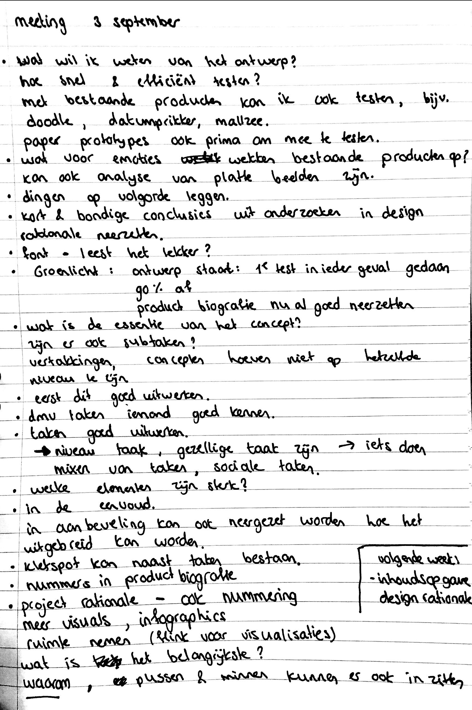

# School meetings \(week 11-18\)

## 03/09/19 Meeting met Marije en medestudenten







**Idee voor iteratie**

De eerste meeting na de zomer vond op 3 september plaats. Ik merkte dat ik moeite had met de 3 concepten samen voegen, zonder dat het te los en globaal zou worden. Marije vroeg aan mij welk concept het belangrijkst is. Dit was dan toch Task It, het concept waarbij vrijwilligerstaken worden gematcht aan de gebruiker. 

**Niveaus in taken**

Marije gaf aan dat ik goed de taken kan uitwerken en hier verschillende niveaus in kan aanbrengen: het kan een gezellige taak zijn \(bijvoorbeeld koffie drinken\), maar ook klus taken. De taken kunnen ook sociale taken zijn. Via zo'n taak kan de gebruiker ook mensen leren kennen en zijn \(geloofs\)vragen kwijt. 

**Social Up en Ask It worden vertakkingen van Task It**

Zo kan Task It het hoofdelement zijn wat uitgewerkt wordt en kunnen Social Up en Ask It kleine vertakkingen zijn van Task It. Een concept in zijn eenvoud zorgt namelijk voor herkenbaarheid. Ik kreeg als tip van Martijn mee, dat ik een aanbeveling zou kunnen schrijven over hoe het ontwerp nog meer uitgebreid kan worden in de toekomst. 

**Testen met bestaande producten**

Met bestaande producten kan ik ook flows of visualisaties testen. In mijn geval kan dit bijvoorbeeld Doodle, Datumprikker en Mallzee zijn. Ik kan aan de testpersoon vragen wat voor emoties bepaalde platte beelden opwekken van bestaande producten. 

**Design rationale & productbiografie**

Ik kreeg als tip mee om nummering te gebruiken in mijn design rationale en productbiografie. Ook mag ik de ruimte nemen in mijn design rationale en infographics gebruiken. Het is belangrijk om mij steeds weer de 'waarom?' vraag te stellen.



## 10/09/19 Meeting met Marije en medestudenten

De aantekeningen die ik tijdens deze meeting heb gemaakt, zijn niet goed leesbaar op de scan. Tijdens de meeting gaf Marije veel tips over de groenlicht presentatie, de productbiografie en de design rationale. Onderstaande punten zijn meegenomen ter verbetering van mijn afstudeerproject.

#### **Productbiografie**

* Productbiografie moet hierarchie bevatten: hoofd categorieën en sub categorieën
* Meer en duidelijke kopjes boven alinea's
* Minder zinnen in de ik-vorm, meer formeel taalgebruik
* Onderzoeksvragen onder een titel zetten
* Aparte pagina maken met literatuurlijst
* Final versies van documenten als eerste tonen

#### **Onderzoek**

* Conclusies uit testen beschrijven
* Conclusies Coop observatie beschrijven dat het geen goed idee was geweest
* Aantonen hoeveel mensen ik heb gesproken en getest

#### **Ontwerp**

* Experimentatie tonen
* Voor nieuwe dingen die ik bedenk, wel consistent doorvoeren. Bijvoorbeeld een detailpagina van een taak

#### **Design rationale**

* Eerst een inhoudsopgave maken die al het project laat zien: hoofd categorieën en sub categorieën, dit mag overdreven beschreven worden
* Inleiding kan bestaan uit: aanleiding, doel project en de opbouw van het document
* Voor ideeën laten zien per concept: impressie schetsen en niet in detail vertellen
* Onderzoek en ontwerp samen laten komen
* Beschrijven waarom ik welke ontwerp methodes heb gebruikt
* Visualisaties mogen vaker terug komen in document als dat verduidelijkt
* DR heeft voldoende info, maar voor verdieping naar productbiografie verwijzen. Vaak gaat dit per hoofdstuk 1 link

#### **Groenlicht presentatie**

* Hele project in zijn volledige context vertellen
* Welk onderzoek heb ik gedaan? Wat is mijn project? Welke ontwerpen heb ik?
* Doel: argumenteren
* Als afsluiting van groenlicht presentatie kan ik de planning voor de laatste weken vertellen

## 4/10/19 Meeting met Marije via telefoon

Via een telefonisch gesprek heb ik met Marije gesproken. De feedback die ik kreeg, ging voornamelijk over de structuur van mijn productbiografie en design rationale. Alle punten neem ik mee. Ik ga er niet direct mee aan de slag, omdat ik momenteel werk aan het concept. Dit waren de belangrijkste feedback punten, de overige punten staan in mijn notities:

#### **Productbiografie**

* Schema erbij pakken van moodle als richtlijn voor de structuur van het document
* Meer grote hoofdstukken i.p.v. de 4 die ik nu heb, bijvoorbeeld een apart hoofdstuk voor elk onderzoeksding
* Er mag een verschil gemaakt worden tussen onderzoek, ideeën en inzichten. Ideeën en inzichten zijn vertalingen uit onderzoeken. Het andere gedeelte is meer ontwerp gedeelte
* Het liefst zo min mogelijk losse stukjes. Meer per thema uitleg geven
* Er worden nu belangrijke conclusies getrokken uit meetings, maar deze conclusies moeten juist ook staan bij het gedeelte waar het relevant is
* Schetsen mogen uitleg bevatten
* De belangrijkste informatie naar voren laten komen

Aanvulling achteraf in de laatste week: Niet alles heb ik letterlijk overgenomen, omdat ik vanaf begin af aan vanuit een chronologische volgorde werkte in mijn product biografie. Daarom is het voor mij niet gunstig om de hele productbiografie om te gooien. 

**Design rationale**

* Vergelijkbare structuur als bij productbiografie hanteren
* Inzichten van de persona's kunnen ook gekoppeld worden aan de concepten
* Sneller concepten laten zien 
* Concepten compacter maken

Aanvulling achteraf in de laatste week: de design rationale heeft niet dezelfde structuur van de productbiografie, omdat deze veel meer ingaat op het definitief concept en de argumentatie hiervan. 

#### Design

* Filter herzien, nu is het bijna beperkend. Het is interessanter om een overall beeld te zien. Inspiratie kan ik gebruiken uit bioscoop agenda's, theater etc.
* Takenlijst kan ook geïnspireerd zijn door overzichtspagina. Het kan ook op een andere manier getoond worden. Ik mag hier exploratie laten zien, dit mag ook door middel van schetsen

Aanvulling achteraf in de laatste week: de exploratie is een interessant punt, alleen dit had ik dan eerder moeten doen en testen. Ik ben er wel mee eens dat het ook in andere vormen kan.

* Taken kunnen ook voor mensen buiten de kerk zijn

## 9/10/19 Meeting met Marije en medestudenten

#### Testen van ontwerp

* Elk testpersoon dezelfde instructie geven
* Een scenario-achtige situatie schetsen aan de gebruiker i.p.v. 'Zoek het filter'
* Met paper prototype zelf het volgende scherm aangeven
* Camera op het gezicht van de persoon zetten

#### Vervolg van de test

* Eerlijke inzichten uit de test halen, dus ook als niemand er wat van snapte
* De belangrijkste delen meenemen in mijn iteratie
* Ik kan ook 1 scherm uitwerken en uitleggen hoe deze manier ook op andere schermen te zien zijn, of een voorbeeld geven hoe mijn ontwerp er uit zou kunnen zien
* Snel winst halen met itereren

#### Profielen van gebruikers

* Mensen kunnen het interessant vinden wie deelnemen aan de taak

#### Feedback op taak aanmaken

* Volgens Marije de i onderaan de stap
* Volgens Marije veel stapjes, volgens Daan niet. Die vindt dit juist prettig
* Een afbeeldingen toevoegen zou ook aan het begin van een taak aanmaken kunnen 
* Afbeelding / icoontje bij de stapjes

## 22/10/19 Meeting met Marije en medestudenten

Tijdens deze meeting gingen wij het hebben over de laatste loodjes, wat we moeten inleveren en kregen wij een aantal tips mee voor de video maken en de presentatie. Aan de tips voor de het presenteren had ik echt wat aan, omdat Marije specifiek benoemde wat verstandig is om te vertellen. In de groenlicht presentatie had ik hier moeite mee en ook met achter mijn concept staan. Tijdens de eindpresentatie wil ik hier extra aandacht aan besteden.

