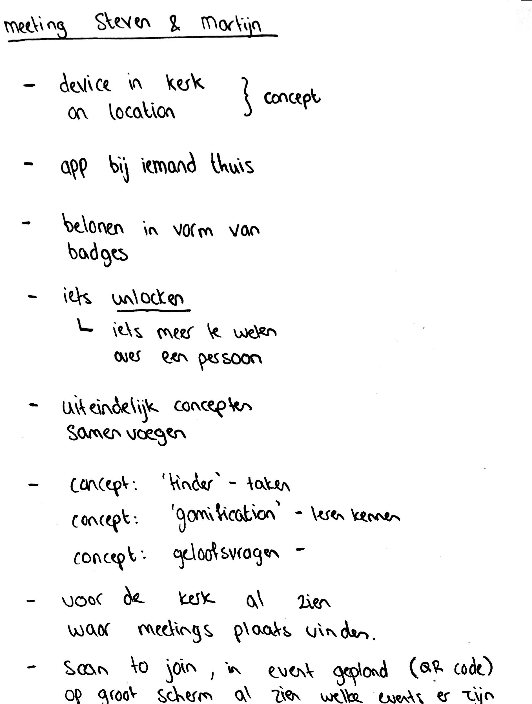
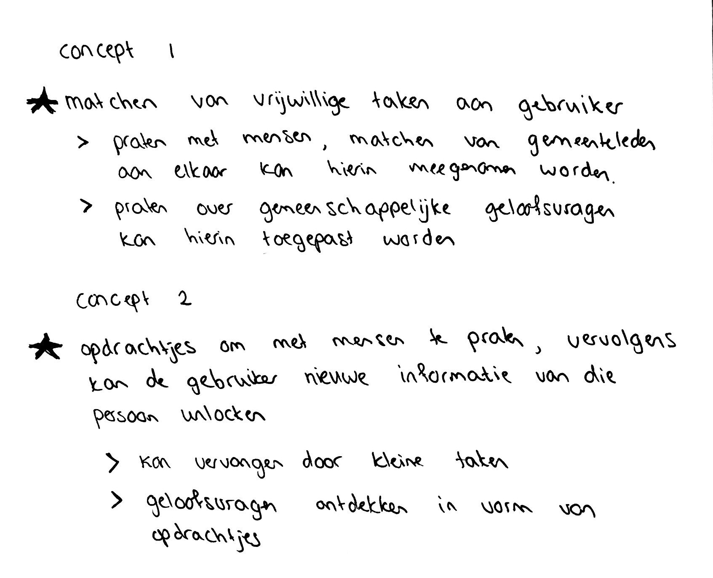

# Inspiratie sessies

| Behandelde onderzoeksvraag |  |
| :--- | :--- |
| **Hoofdvraag: wat is nodig om tot een nieuw product te komen?** | \*\*\*\* |

## 12/06/19: Brainstormsessie met EO 

Op 12 juni is er samen met 3 UX-designers van de EO nagedacht over ideeën voor het afstudeerproject. 

### Voorbereiding

Als voorbereiding voor de brainstormsessie is er een methode uitgezocht voor tijdens de brainstorm: negatief brainstormen en vervolgens spiegelen.



### De brainstormsessie

Tijdens de sessie kwamen interessante punten naar voren en werd er gelachen over de negatieve ideeën die genoteerd stonden. Voor alle 3 de kernbehoeftes zijn negatieve ideeën bedacht en vervolgens gespiegeld naar positieve ideeën. 

Ik kwam erachter dat ik bij kernbehoefte 1 geen foto heb gemaakt van de groene briefjes. Maar ik heb zelf nog de briefjes nagekeken en hier conclusies uit gehaald.



### Conclusies

Tijdens de brainstormsessie kwamen de volgende interessante ideeën naar voren:

#### **Kernbehoefte 1:** Praten over gemeenschappelijke interesses met een bekend of onbekend persoon, inclusief gemeenschappelijke geloofsvragen

* Kerk tinder: mensen met elkaar matchen die dezelfde interesses hebben
* Een punten systeem bedenken voor actieve deelname in de gemeenschap
* Bible buddies: met een random iemand buddy worden en over geloofsvragen praten
* Gebruik maken van gamification, bijvoorbeeld in de vorm van opdrachtjes: 'Ga op zoek naar iemand met bruin haar en stel de volgende vraag...'

#### **Kernbehoefte 2:** Gepassioneerd vrijwilligerstaken doen, zowel korte en afgeronde taken als lange en doorlopende taken

* Iemand uit lichten of in het zonnetje zetten vanwege een taak die diegene uitvoert. Mogelijkheid om applaus te geven zowel digitaal als fysiek
* Recensies van anderen bekijken die ook een vrijwilligerstaak doen, het lezen van hun ervaringen en hierdoor enthousiast worden
* Flexibel eigen uren en taken indelen zonder dat een ander dit oplegt
* Het belonen van uitgevoerde taken
* Online al aangeven wat diegene precies moet doen tijdens het uitvoeren van de taak i.p.v. op de locatie zelf pas uitleg geven

#### **Kernbehoefte 3:** Makkelijk kunnen creëren van een plek van samenkomst over geloof of makkelijk hieraan kunnen deelnemen

* Budget vrijmaken voor activiteiten die niet-evangeliserend zijn
* Helder communicatie: wie, wat, waar, wanneer?
* Stemmen voor een locatie, i.p.v. een locatie al vastzetten

Voor kernbehoefte 3 kwamen minder ideeën naar voren dan kernbehoefte 1 & 2. Achteraf gezien had ik de stelling misschien wat makkelijker kunnen maken. Tijdens het bedenken van negatieve ideeën voor kernbehoefte 3 kwam er namelijk wat minder input.

Alle post-it's zijn bewaard en zijn meegenomen naar het genereren van [ideeën](https://maroeska-productbiografie.gitbook.io/productbiografie/inzichten-mei-+-juni/ideeen). 

## Brainstorm sessie met Olaf

Op 12 juni ben ik samen met Olaf \(Zig\) begonnen aan een klant klantprofiel en een waardepropositie voor het afstudeerproject. 

### Voorbereiding

Als voorbereiding heb ik mij ingelezen in wat een waardepropositie is en zijn de gains en pains op een rijtje gezet naar aanleiding van de [persona's](https://maroeska-productbiografie.gitbook.io/productbiografie/inzichten-april-+-mei/persona) en [customer journey](https://maroeska-productbiografie.gitbook.io/productbiografie/inzichten-april-+-mei/customer-journeys). De belangrijkste punten zijn geel gemarkeerd.



### Deel 1: kennismaken met methode en start klantprofiel

Tijdens de eerste meeting hebben Olaf en ik de methode bekeken voor het maken van een klantprofiel en een waardepropositie. We spraken af hoe wij de waardepropositie wilden gaan insteken. Zo wilden wij voor klanttaken de taken invullen die vanuit de kerkelijke organisatie gewenst zijn voor een jongvolwassene. Voor producten & diensten wilden wij neerzetten wat er nu aangeboden wordt vanuit de kerk. Voor pijnpunten en voordelen wilden wij vanuit de gebruiker het formuleren en voor voordeel verschaffers en pijn verzachters wilden wij nieuwe oplossingen bedenken, zodat wij kunnen bewijzen dat er een mis match is tussen wat de organisatie wil en wat de jongvolwassenen willen. In een uur tijd hadden we de klanttaken geformuleerd. Het idee was dat ik het klantprofiel en waardepropositie ging afmaken en dat Olaf hem volgende week kan aanvullen waar nodig.

## Conclusies waardepropositie

De belangrijkste punten voor het project hebben een groene sticker gekregen. De post-it's met een groene sticker in een vak matchen met post-it's uit een ander vak. De overige post-it's waar geen sticker op staat, zijn in gedachten gehouden tijdens het ontwerpen.

Hierboven zijn de belangrijke doelen en pijnpunten vanuit de doelgroep voor het project gecombineerd met de klanttaken en producten en diensten vanuit de organisatie. 

#### Geen middel die drempels verlaagd

Er is wel mogelijkheid tot gesprek met andere mensen, zij zijn immers ook aanwezig bij een kerkdienst, maar er is geen middel die dit voorziet en drempels \(spannend om op iemand af te stappen, waar moet je over praten\) verlaagd. 

#### Genoeg samenkomst plekken, geen duidelijke informatie voorziening

Hetzelfde geldt voor een plek van samenkomst: er zijn genoeg plekken, maar de informatie voorziening van deze plekken is niet duidelijk. Daarbij zorgt het opzetten van of aansluiten bij een bijbelkring voor drempels \(hoe te organiseren, welke mensen zitten er, die mensen kennen elkaar waarschijnlijk al goed\).

#### Geen duidelijke informatie voorziening over vrijwilligerswerk en het aanmelden 

Vanuit de organisatie is de wens dat jongeren en jongvolwassen actief deelnemen aan de gemeenschap. Een voorbeeld hiervan is het uitvoeren van vrijwilligerswerk. Maar er is geen duidelijke informatie voorziening waar behoefte is aan vrijwilligers of waar een persoon zich kan aanmelden. 

## Ideeën vanuit Martijn en Steven

Tijdens de meeting met Steven en Martijn heb ik een aantal ideeën gekregen voor mijn project. Zo waren de ideeën van gamification en iets unlocken interessant. Dit is speels en kan drempels verlagen tussen personen. In concept 2 is is hier meer op in gegaan.

## Meeting met Olaf & Henk \(UX designer\)

Er heeft een gesprek plaats gevonden met Olaf & Henk vanuit Zig over het project. Henk werkt als UX designer bij Zig. 

### Vertrouwen 

Henk zei als eerste dat het product vertrouwen moet opwekken bij de gebruiker en betrouwbaar moet zijn, omdat de doelgroep bepaalde drempels ervaart. Het eerste waar hij aan dacht, is een anonieme modus. De gebruiker kan zowel anoniem acties verrichten als zichtbare acties. Volgens Henk is het belangrijk om veiligheid te bieden en naar de emoties van de doelgroep te kijken. 

### 3 concepten met kopieerbare interacties

Olaf gaf aan dat de 3 onderdelen \(praten met mensen, geloofsvragen en vrijwilligerswerk\) op een gemeenschappelijke wijze kunnen plaats vinden. Dus dat de interactie hetzelfde is, maar de inhoud niet. Op een rijtje:

