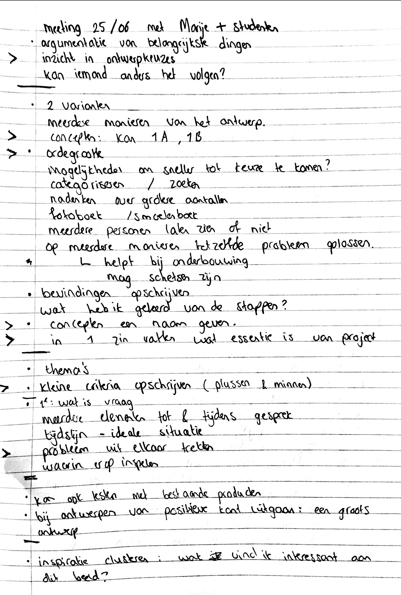
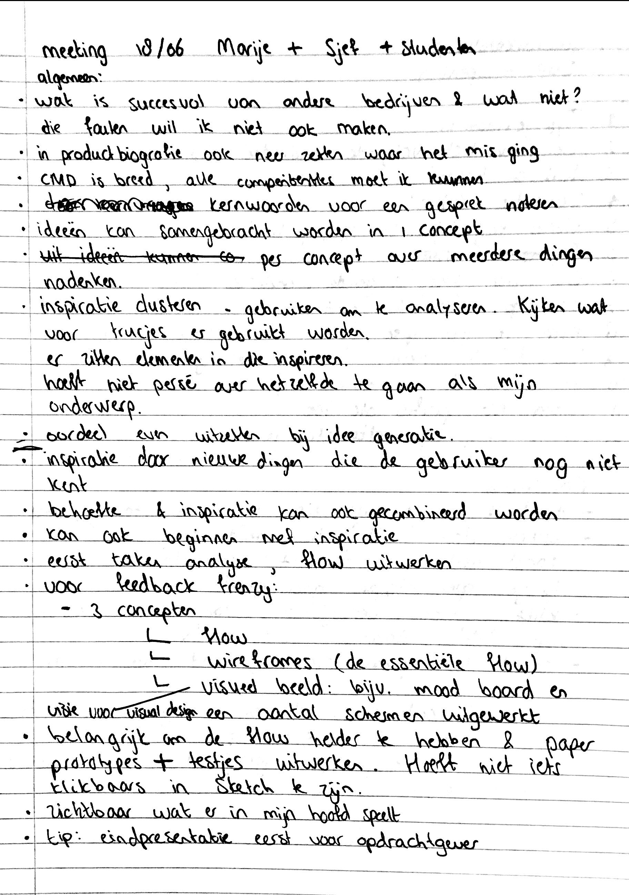

# School meetings \(week 9-10\)

## 25/05/2019: Meeting met studenten en Marije







**Meer argumenteren**

Uit de meeting heb ik voor mijzelf gehaald dat ik meer mag argumenteren bij concepten, ook al is dit kort beschreven. Ook kunnen concepten meerdere schetsen bevatten van mogelijke oplossingsrichtingen en kan een concept een titel bevatten. 

**Kleine criteria**

Om tot een concept te komen, kan ik al een kleine criteria schrijven wat het concept wel en niet moet bevatten.

**Nadenken over ordegrootte**

Voor mijn concepten is het handig om de ordegrootte in beeld te brengen en nadenken over grotere aantallen. De gebruiker moet snel tot een keuze kunnen komen.

**Tijdlijn van de gebruiker**

Voor een concept met geloofsvragen is het handig om een tijdlijn van de gebruiker in beeld te brengen: de elementen voordat de gebruiker een vraag heeft, tot aan het gesprek met iemand anders over deze vraag.



## 18/06/19: Meeting met studenten en Sjef+Marije







**Inspiratie bieden aan de gebruiker**

Tijdens de meeting kwam ik tot het inzicht dat ik voor de gebruiker ook inspiratie kan aanbieden wat betreft vrijwilligerswerk dat nog niet perse hun eerste interesse is waar zij aan denken. Volgens Sjef en Marije weten sommige mensen niet wat zij nu echt interessant vinden. Dit gegeven neem ik mee tijdens mijn concept fase. 

**Eerst flow chart maken, daarna wireframen**

Ik kreeg nog een aantal handige tips voor de concepten uitdenken. Ik had nog niet aan een flow chart gedacht en was al meteen begonnen met wireframes tekenen. Voordat ik verder ga wireframen, wil ik eerst de flow chart uitgedacht hebben. 



