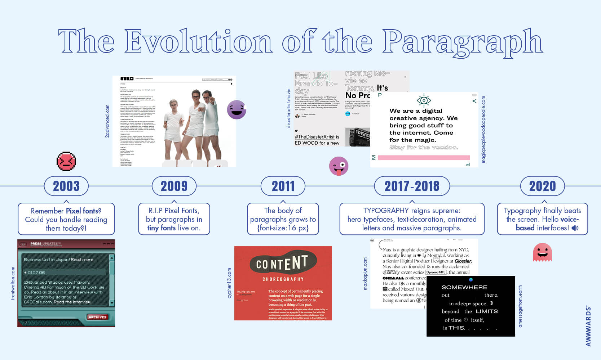
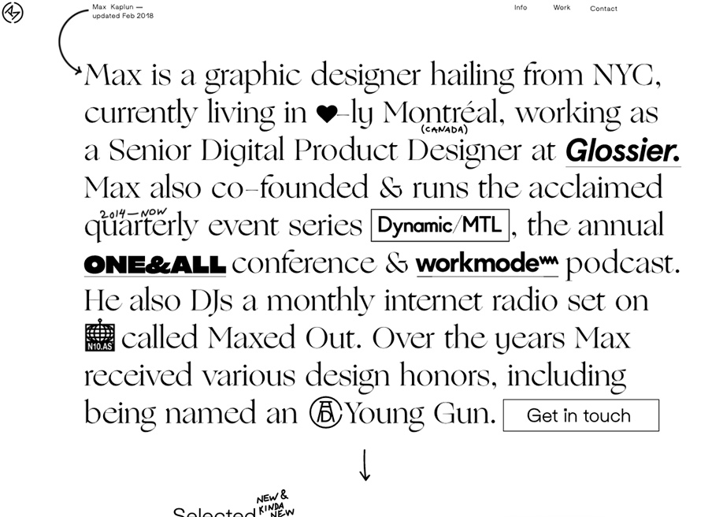
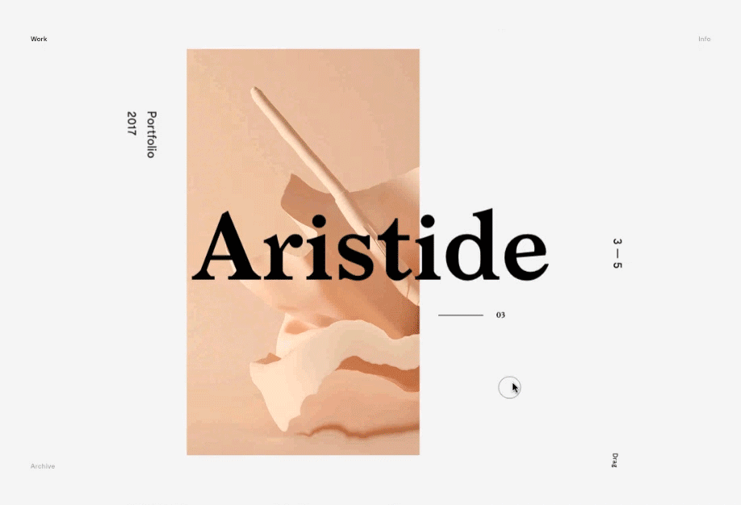

# Typografie trends

| Behandelde onderzoeksvraag |  |
| :--- | :--- |
| **Hoofdvraag: wat is nodig om tot een nieuw product te komen?** |  |

Voor de keuzes van typografie in de 3 concepten zijn er 2 artikelen van awwwards erbij gehouden. Zo heb ik mij als ontwerper ingelezen in de trends van typografie.

### Trends in typografie

* Serif fonts zijn terug, met name bold + serif
* Binnen het creatieve gebruik van typografie zien we een afname van de letters op de penseelstreek en een toename in 3D- en geïllustreerde type
* Hero fonts en grote lettertypes worden nu ook gebruikt in paragrafen
* Pictogrammen, iconen en emoji's versieren paragrafen. Er zijn veel typische \(en niet zo typerende\) manieren van tekstversiering die naast elkaar kunnen bestaan ​​in dezelfde alinea, zoals de klassieke onderstrepingen en cursivering van verschillende gewichten om ideeën te uiten of te versterken

Binnen de ontwerpen is geëxperimenteerd met bold en serif fonts en de combinaties hiervan. Er is gekozen voor het gebruik maken van Google Fonts binnen het ontwerp, omdat het een open source karakter heeft waardoor de lettertypes zowel commercieel als persoonlijk gebruikt kunnen worden. Ook houdt Google rekening mee met de leesbaarheid van web- en mobiele typografie.

