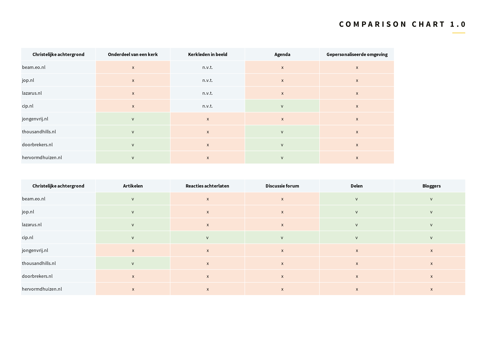

# Verkennende benchmark creation

| Behandelde onderzoeksvragen |
| :--- |
| **Hoofdvraag: wie is de concurrentie?** |
| Wat kunnen wij leren van de concurrentie? Wat doen zij fout en wat goed? |
| Hoe bieden concurrenten hun content aan? |
| Hoe kunnen we ons onderscheiden van de concurrentie? |

Hoe gaan andere kerken en christelijke organisaties om met binding via hun website en wat zijn gave functies? Er is een vergelijkingstabel opgesteld waarin de verschillen tussen de organisaties en kerken zichtbaar worden.

## Comparison chart en interessante functies











## Conclusies verkennende benchmark creation

Wat opvalt aan de vergelijkingstabel is dat er meer rode vakjes zijn dan groene vakjes. Reacties achterlaten en een discussie platform is op 1 plek zichtbaar van de 8. Geen enkele website maakt nog gebruik van gepersonaliseerde content en geen enkele kerk of organisatie maakt gebruik van een soort ledenboek waarin de leden een gezicht krijgen. Hierin zou mijn concept zich kunnen onderscheiden. De huidige website van Hervormd Huizen heeft de minste groene vakjes...

