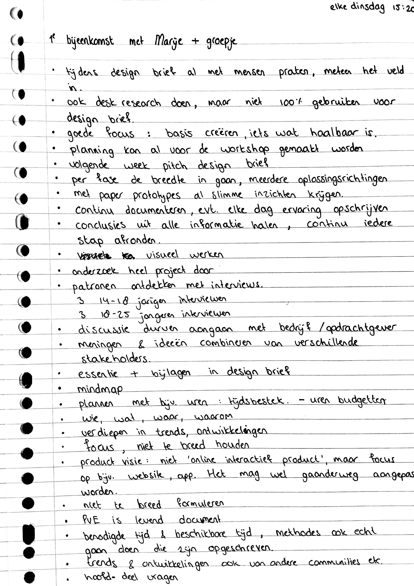
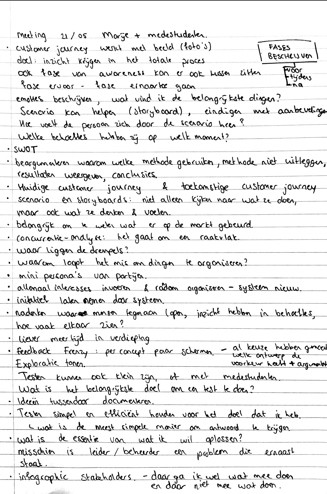
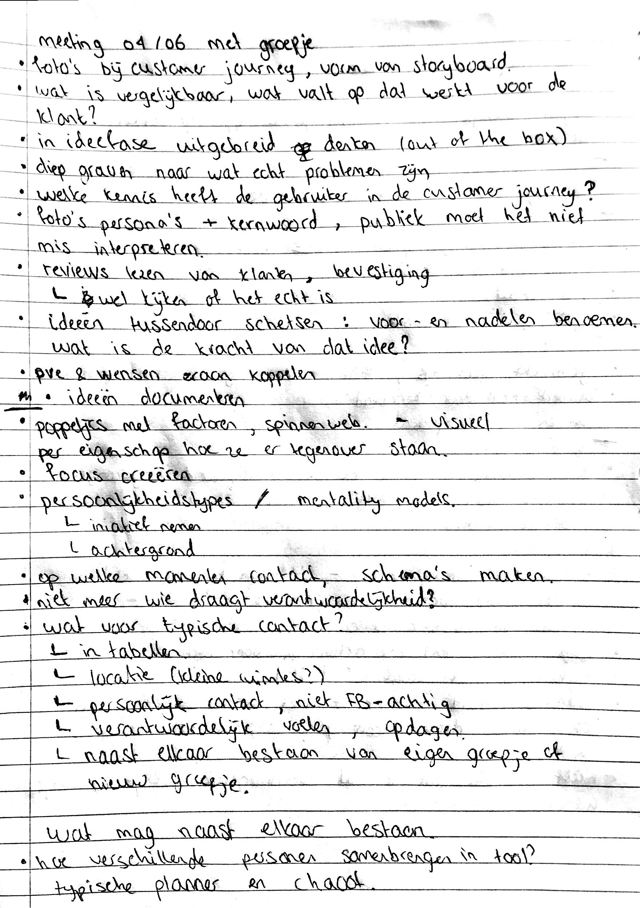

# School meetings \(week 1-8\)

## 16/04/19: Meeting met begeleider en projectgroep

Tijdens deze meeting heb ik kennis gemaakt met mijn projectgroep en afstudeerbegeleider \(Marije ter Beke\). We vertelden aan elkaar wat ons project is. Ik kreeg handige tips van Marije met betrekking tot het afstudeerproject. Tijdens de meeting heb ik aantekeningen gemaakt:

## 17/04/2019: Workshop Design Brief

Tijdens de workshop werkte ik samen met een andere studenten. We gingen brainstormen aan de hand van een worksheet voor onze projecten. De ingevulde worksheet is hieronder te bekijken.



## 23/04/19: Pitch voor 2e lezer





Tijdens de meeting met Marije en de tweede lezer \(Sjef\) kwam naar voren dat het probleem wat in mijn eigen kerkelijke gemeenschap voorkomt ook op meerdere plekken in Nederland voorkomt. Dit betekent dat ik wat mag gaan uitzoomen en een andere stakeholder erbij kan betrekken als opdrachtgever. Ik heb over de feedback die ik heb gekregen, nagedacht en ben een gesprek aan gegaan met mijn investeerder Olaf. Zie [hier ](https://maroeska-productbiografie.gitbook.io/productbiografie/onderzoek/stakeholders-1/olaf-zig#24-04-19-gesprek-met-olaf)het vervolg.



## 02/05/19: Meeting met Marije en medestudenten





Tijdens de meeting op 2 mei kwam naar voren dat ik inspiratie kon halen van tools die mensen bij elkaar brengen. Een goed voorbeeld zijn datings apps. Ook is het voor mij interessant om te kijken naar websites/apps die content aanbieden op basis van interesses. Uit mijn doelgroep interviews heb ik onder andere gehoord dat men contact wil met mensen die op hetzelfde 'level' zitten qua geloof of die dezelfde leeftijd hebben. Hervormd Huizen en Zig zijn in eerste instantie uit op een community, hier kan ik nog steeds naar luisteren en wat meenemen. Het is voor mij belangrijk om in beeld te hebben wie de product owner is en wie de product user is. Door een soort dating platform voor kerkgangers te bedenken, zorg ik ervoor dat de tool zelfdragend is en hoeft alleen de techniek uitgewerkt te worden. De ideeën van deze meeting neem ik mee naar mijn Design Brief.



## Feedback Design Brief 0.9 met Marije en medestudenten





Tijdens de meeting op 8 mei heb ik samen met de andere studenten elkaars draft van de Design Brief doorgenomen en hebben wij elkaar feedback gegeven. Marije vulde dit aan. Ik heb er goede punten uitgehaald om mee te nemen naar Design Brief 1.0. Voor mij is de deadline van de Design Brief donderdagavond i.p.v. vrijdagavond, want ik ga tot dinsdag met mijn familie weg. Dit betekent dat ik keuzes moet maken in welke feedback ik meeneem naar Design Brief 1.0. In de weken na de oplevering van de Design Brief zal ik mijn onderzoek voort zetten en dit betekent ook dat de Design Brief aangevuld gaat worden, ook al heb ik een GO gekregen. 



De volgende punten wil ik meenemen naar Design Brief 1.0:

**Persona**

* Titel bij persona
* Typische quote neerzetten, bijvoorbeeld met welke gedachtegang zitten zij in de kerk?
* Stukje over social media uitbreiden: waarvoor gebruiken zij bepaalde platforms
* Hoe gaat de persoon met vrijwilligerswerk om; frustraties, gedoe, tijd?
* Interviews in bijlage zetten + aangeven hoeveel mensen ik heb gesproken
* \*Extra persona maken

**Stakeholders**

* Schrijven vanuit stakeholder perspectief 
* Belangen en behoeften goed in kaart brengen

**Design challenge**

* Specifieker en concreter maken

**Omgevingsfactoren**

* Bij elke ‘concurrent’ waarom vraag stellen en wat het voor mijn project betekent
* \*Wat is goede interactie aan de voorbeelden die ik heb neergezet?

**Focus**

* Focus van design brief beschrijven
* Waarin wil ik onderscheiden? In hoeverre wil ik het product uitwerken en wat voor prototype lever ik op?
* Helder definiëren of mijn uiteindelijke product meer met sociale binding te maken heeft of met religie
* Hoe groot zijn de aantallen in de kerk? Schalen beschrijven
* Specifiek beschrijven wie de gebruikers zijn en wie de stakeholders

**Planning fase 2+3 maken**

Mijlpalen

* Niveau van prototype er in zetten

\*= hoop ik te kunnen doen voor vrijdag



## 14/05/19: Meeting met Marije en medestudenten







Tijdens de meeting met Marije en medestudenten bespraken we elkaars project na aanleiding van onze Design Brief. Marije zei dat we nog wel een dagje onze Design Brief kunnen verbeteren, maar dat we daarna de diepte in moeten gaan.

Uit de meeting kwam naar voren dat wij allemaal niet alleen de kant van de opdrachtgever moeten kiezen, maar de informatie en wensen van de opdrachtgever moeten meenemen tijdens het onderzoek en ontwerp. Uiteindelijk gaat het om wat de gebruiker wil en niet wat de opdrachtgever wil. Aan mij is de taak om erachter te komen wat de wat er mis gaat en wat goed gaat bij de gebruiker, zij bedenken niet mijn oplossing. Vanuit sterk onderzoek naar de doelgroep, kan ik met goede argumenten komen naar de opdrachtgever waarom ik bepaalde keuzes maken. 

Observaties, interviews en literatuur mixen, zorgt voor een onderbouwd onderzoek. Ik kan ook experimenteren met verschillende observatie methodes. 

Voor mijn project is het nodig om de essentie neer te zetten en wat de problemen en drempels van de partijen zijn. Het is handig om de rollen van de stakeholders die zij nu hebben op een rijtje te zetten en welke rollen de stakeholders krijgen in het uiteindelijke product die ik ontwerp. 

We hebben het ook nog over persona's maken gehad en een design challenge schrijven. Ik kan nog een persona maken. Bij de persona's kan ik de drempels beschrijven die de doelgroep ervaart en merken en producten neerzetten \(merk associatie\). In mijn design challenge mag ik een bredere challenge schrijven en in de focus mijn casus van Hervormd Huizen en de randvoorwaarden beschrijven. 



## 21/05/19: Meeting met Marije en medestudenten







Na de meeting met Marije kwam ik tot het inzicht om alvast te beginnen met een customer journey van de doelgroep. Zo ontdek ik ook de punten waar ik nog onderzoek naar moet doen of die ik moet valideren. Ook kwam ik tot het inzicht om de stakeholders uit te schetsen en de essentie van mijn project te beschrijven, zodat ik een beter beeld krijg wat ik nu eigenlijk wil en wat nodig is. Marije gaf mij als tip mee om innovatief te gaan denken, in nieuwe oplossingen.



## 04/06/19: Meeting met begeleider en medestudenten







Uit de meeting op 4 juni kwamen een aantal algemene punten uit die voor iedereen van toepassing zijn. Wat voor mij een goed punt is, is om te visualiseren en tussendoor de ideeën die ik in mijn hoofd heb, uit te tekenen.

De volgende punten neem ik mee om aankomende week uit te werken:

* **\(Digitale\) tekening:** Alle stakeholders op een vel papier tekenen, eigenschappen tekenen en tekenen hoe de stakeholders daar tegenover staan. Voorbeeld van een eigenschap kan zijn: praten met anderen.
* **Schema:** Concreet maken wat voor typische contact er is waar ik wat mee ga doen in mijn product.
* **Persona's + Customer journey**: Concreet maken op welke typische gebruikers ik mij ga focussen. Punten van verschil kunnen naast elkaar bestaan in mijn product. Bijvoorbeeld: de 1 wil met vrienden staan praten, de ander wil nieuwe mensen leren kennen. Of: de 1 is een chaoot en de ander een typische planner.
* **Ideeën schetsen** die nu in mijn hoofd zitten
* **Start Programma van eisen en wensen** 
* **Waardepropositie** maken met Olaf
* **Inspiratiesessie** met EO UX'ers



## 11/06/19: Meeting met Marije en Steven







Tijdens de meeting met Marije en Steven heb ik een aantal goede tips gekregen voor het opstellen van een PvE en hoe ik een brainstormsessie kan organiseren. De feedback op mijn [PvE 0.8 ](https://maroeska-productbiografie.gitbook.io/productbiografie/inzichten-april-+-mei/pve-en-wensen)neem ik mee naar mijn PvE 0.9. Marije gaf als tip om de onderzoekjes en interviews die ik heb gedaan na te lopen en op deze manier de eisen en wensen in kaart te brengen. Dit kan ook in de vorm van een MoSCoW. 

Daarnaast vond ik de tip voor een brainstormsessie om negatieve oplossingen te bedenken interessant. Die heb ik meegenomen naar de brainstorm sessie met de EO. 



