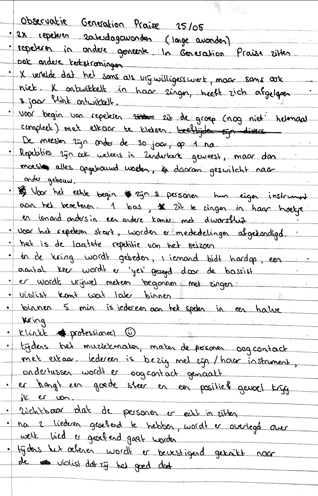

# Observaties van de doelgroep

| Behandelde onderzoeksvraag |
| :--- |
| Hoofdvraag: wie is de doelgroep? |

## Generation Praise repetitie

Om te kijken hoe het in een community gaat binnen de kerk, is er meegekeken bij het repeteren van Generation Praise. Generation Praise organiseert maandelijks een worship & praise dienst in de Zenderkerk.











**Verbondenheid in kleine community**

Tijdens de repetitie van GP was er een kleine community zichtbaar die samen hun passie uitvoeren en hierdoor ook verbonden met elkaar zijn. Die verbondenheid komt terug in de gezamenlijke passie die zij met elkaar uitvoeren: muziek maken, elkaar tips geven en elkaar bevestiging geven dat het goed klinkt. ****Dit gebeurt meestal door middel van oogcontact en kleine knikjes.  
Een aantal personen kwamen wat later binnen, die sloten aan. 1 persoon gaf iedereen een knuffel bij binnenkomst. 

De sfeer was open en gezellig. Iedereen was met zijn eigen instrument bezig, maar ondertussen werd het wel als 1 geheel uitgevoerd. Wat ik ook mooi vond, is dat er verschillende kerkstromingen bij elkaar komen tijdens het oefenen, maar ook tijdens de Generation Praise avond zelf.



## Generation Praise avond

Naast de repetitie bekijken, heeft er ook een observatie plaatsgevonden op de praise avond in de Zenderkerk.











Er waren veel jongeren aanwezig tijdens de praise avond die hard mee zongen. Doordat de zijkanten waren afgesloten, zaten de mensen wat meer op elkaar en oogde dit meer verbonden. Na de afloop van de dienst bleven nog best wat mensen hangen om wat te drinken en te praten met elkaar.



## Kerkdienst in Zenderkerk

Om bewust van te zijn hoe een kerkdienst nu eigenlijk verloopt, is er in de Zenderkerk geobserveerd.











Wat opviel toen ik achterin zat, is dat veel geluiden hoorbaar zijn en dat ik ook snel afgeleid was door beweging. Dit komt omdat er veel jonge gezinnen in de kerk zitten, wat \(logisch\) voor wat rumoer zorgt met kinderen in de buurt. Mensen keken vaak op of waren afgeleid.

**Voor en na de kerkdienst is gelegenheid om koffie te drinken, het was erg druk tijdens het koffie drinken. De jongeren stonden een beetje bij elkaar of bij hun ouders.**

Tijdens de kerkdienst was er ook een moment van delen aanwezig waarin komende activiteiten verteld worden en wordt gevraagd wie een bloemetje bij iemand wil brengen. 



## College Tour 18+

**Uitleg College Tour**

College Tour is een discussieprogramma voor jongeren vanaf 18 jaar. Op 2 juni was het thema 'Geweld in de Bijbel'. Tijdens dit programma hadden Gerben en Tom zich in het onderwerp verdiept en beantwoorden zij stellingen nadat de jongeren hierover een antwoord hadden gegeven. Een groot deel van de jongeren bleef stil, maar er waren ook best wat mensen aanwezig \(zo'n 40/50\). Tijdens het programma werd er niet heel fel gediscussieerd, maar er werden wel kritische antwoorden gegeven door een aantal jongeren. Er waren wat vragen rondom het onderwerp.

**Vorm van College Tour**

Voordat het programma begon, werd ik welkom geheten en kreeg ik wat drinken, daarna kwam vrijwel meteen Gerben met mij praten. Na afloop van het programma verscheen er een telefoon nummer op de beamer van de gespreksleider die de jongeren konden bereiken als zij nog vragen hadden of behoefte hadden om nog een keer over het onderwerp te praten. Hierna werden er statafels neergezet en konden jongeren met elkaar napraten. De mensen die elkaar goed kenden, stonden bij elkaar. 

