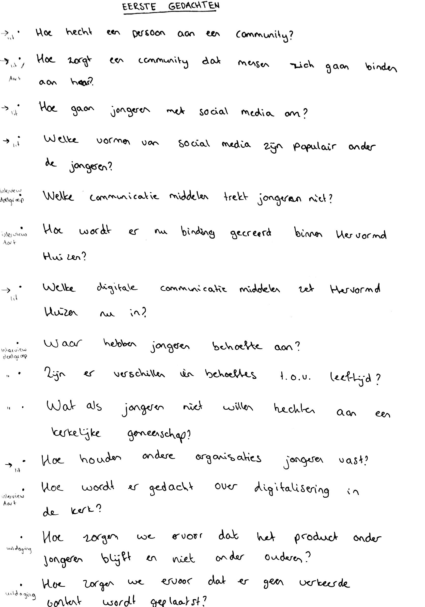
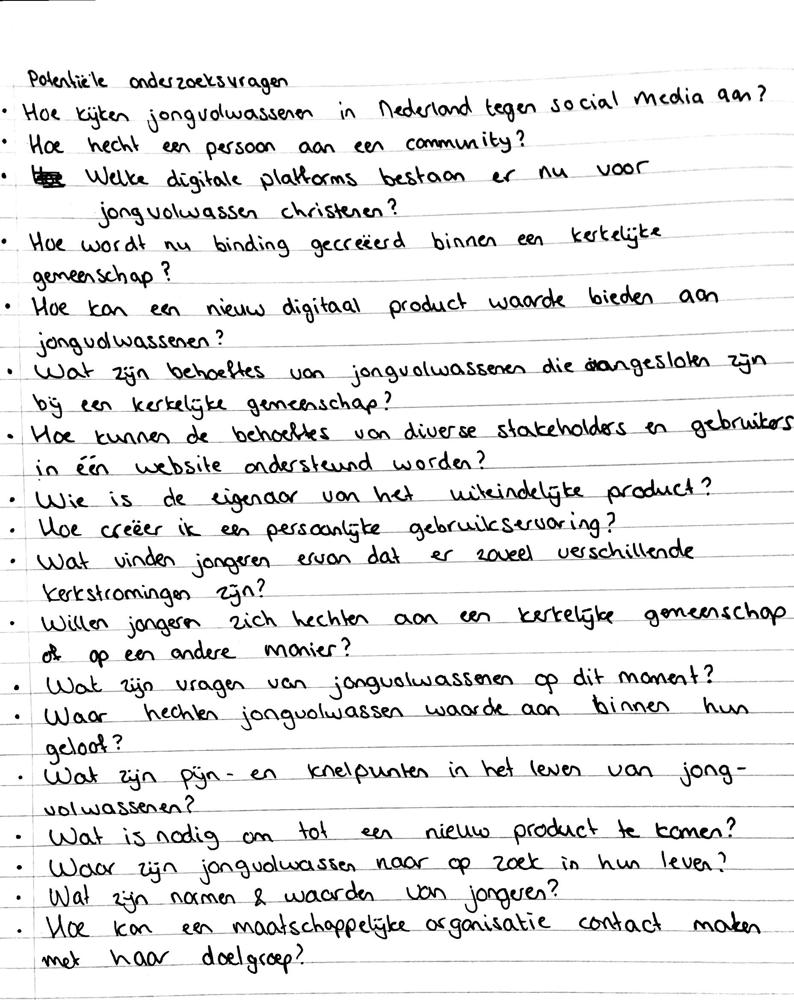

# Onderzoeksvragen

## Interessante onderzoeksvragen





Ik kwam op 15 mei erachter dat fase 2 en 3 in elkaar overlopen en dat bij de concepten bedenken ook een prototype hoort. Ook kreeg ik wat feedback van Sjef op mijn onderzoeksvragen. Aan de hand van deze gegevens zijn een aantal vragen gewijzigd.







## Voorafgaande gedachtespinsels 

Tijdens de eerste week van het afstudeerproject zijn een aantal vragen genoteerd die in mijn hoofd zaten of die ik ben tegen gekomen:



 




 




