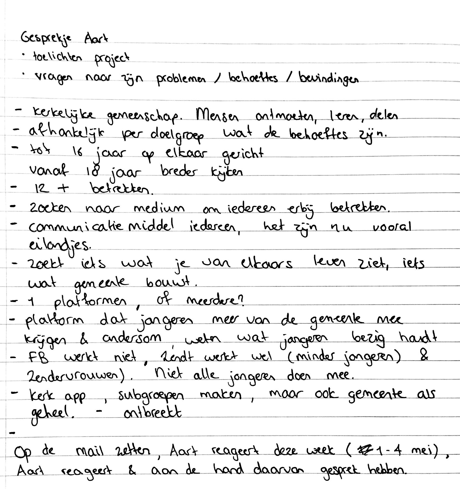

# Aart \(Jeugdouderling\)

## 23/04/19: Gesprek met Aart

Op 23 april is er een bel afspraak uitgevoerd met mijn toenmalige opdrachtgever, Aart, om de opdracht vanuit zijn kant helder te krijgen. Vanwege te weinig contact, ben ik verder gegaan met het [jeugdpastoraat](https://maroeska-productbiografie.gitbook.io/productbiografie/onderzoek/stakeholders-1/anne-karine-jeugdpastoraat) als belanghebbende.











