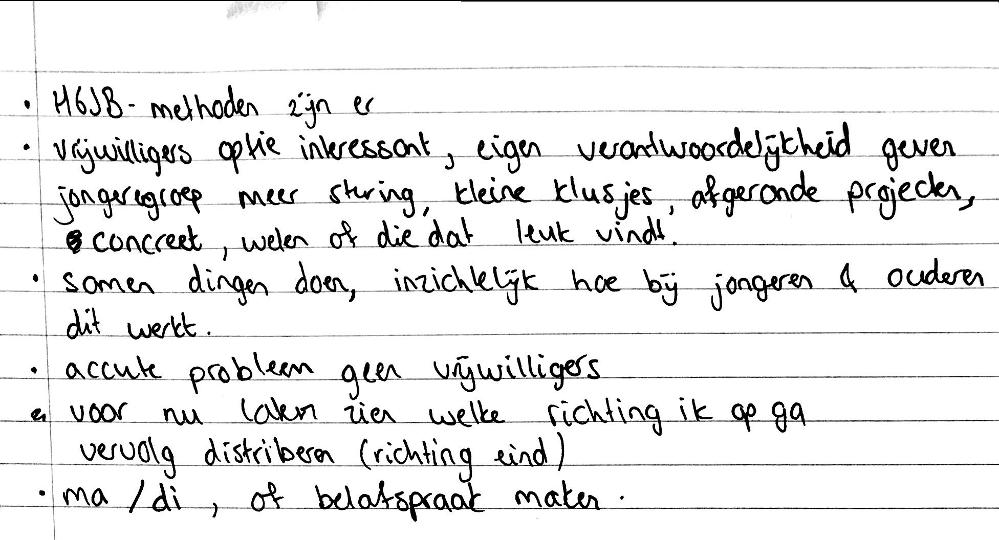

# HGJB

## De rol van de HGJB

De HGJB is een organisatie die jongeren steunt in het christelijk geloof. Deze organisatie biedt verschillende methodes en activiteiten aan voor jongeren waar kerkelijke gemeenschappen mee aan de slag kunnen gaan. De HGJB is eventjes betrokken geweest bij het project, omdat zij weten wat er speelt in de Hervormde kerken in Nederland, vooral wat onder de jongeren speelt.

### Eenmaling gesprek

Na het gesprek met de HGJB heb ik hen niet meer betrokken bij mijn project, omdat er al veel stakeholders bij mijn project betrokken waren. Ook reageerde HGJB niet meer op mijn berichten terwijl ik toch door moest werken aan het project.

## 23/05/19: kennismakingsgesprek HJGB







In het gesprek met de HGJB is er gesproken met Martine \(stages & afstuderen\) en Arjen \(relatiebeheer en gemeenteadvies\).

* De HGJB vond het idee om een digitale tool voor het matchen van vrijwilligerswerk bij een persoon interessant. Volgens hen is het acute probleem in kerkelijke gemeenschappen het niet \(of weinig\) hebben van vrijwilligers. Volgens HJGB is een tool voor alle gemeenteleden interessant.
* De HGJB vertelde in het gesprek dat wanneer  jongeren een verantwoordelijkheid krijgen, zij hier ook mee aan de slag gaan. Meestal werken kleine en afgeronde taken het beste.

Na het gesprek is er besloten om het thema 'vrijwilligerswerk' en 'inzetten voor de gemeente' te bespreken tijdens interviews met de doelgroep, omdat vrijwilligerswerk ook sociale binding bevordert. Vrijwilligerswerk kan voor nieuwe contacten zorgen. Ook kwam ik op het idee om iets te ontwikkelen waarbij een combinatie plaatsvindt van vrijwilligerswerk en overig fysiek contact tussen mensen.

**Notitie 25/09/19**

Het is interessant om dit terug te lezen, omdat het ontworpen product uiteindelijk toch een combinatie is geworden van vrijwilligerswerk en fysiek contact.



