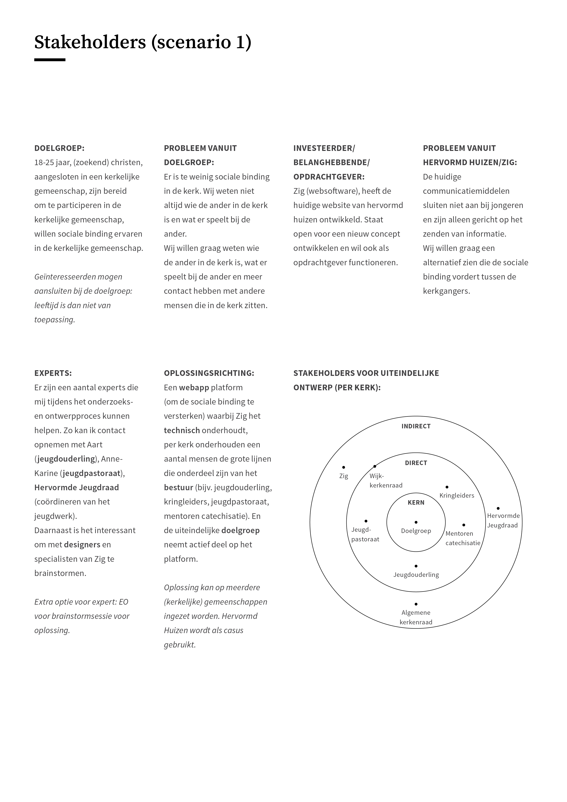
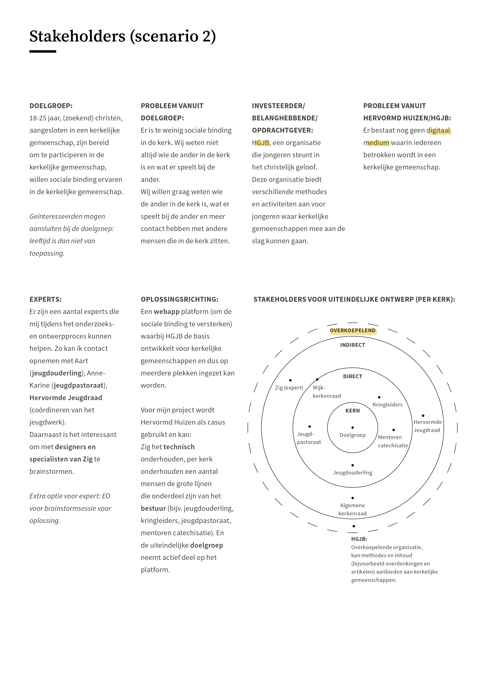

# Stakeholder analyse

| Behandelde onderzoeksvragen |
| :--- |
| **Hoofdvraag: Wie zijn de stakeholders?** |
| Wat zijn de behoeftes, doelen en pijnpunten van de stakeholders? |
| Welke rollen hebben de stakeholders nu en welke rol krijgen zij met de komst van mijn product? |
| Wie is de eigenaar van het uiteindelijke product? |
| Hoe wordt nu binding gecreëerd binnen Hervormd Huizen? |

Hieronder staan de stakeholder analyses \(**let op**: meest recent staat bovenaan\)

## Rating van de belangrijkste stakeholders

Hieronder is een rating gemaakt van de 2 persona's en het jeugdpastoraat en de AK. Alleen het jeugdpastoraat en de AK zijn hierin meegenomen, omdat zij de belangrijkste stakeholders zijn in het project. Zig kan de techniek uitwerken, maar de echte behoeftes zijn te vinden bij mensen die over de inhoud gaan.



Het vervolg van de rating staat [hier](https://maroeska-productbiografie.gitbook.io/productbiografie/inzichten-april-+-mei/focus).

## Huidige situatie \(Zenderkerk\)

De stakeholder map is gebaseerd op [het onderzoek](https://maroeska-productbiografie.gitbook.io/productbiografie/onderzoek/literature-study#sociale-binding-algemeen) naar welke partijen er nu zijn in Hervormd Huizen.



## 23/05/19: Belangen van stakeholders

Hieronder is de essentie voor mijzelf duidelijk gemaakt. In de verbeterde versie van de Design Brief staat de essentie nog een keer met de eventuele verbeteringen.











## 04/05/19: Verkenning van de stakeholders

Er zijn 3 scenario's geschetst van de stakeholders. Momenteel ligt nog de vraag bij de HGJB of zij de overkoepelde stakeholder willen zijn. Ondertussen is het onderzoek voortgezet binnen Hervormd Huizen, want daar weet ik zeker dat er een probleem is. Scenario 1 schetst de stakeholders vanuit meerdere partijen met zicht op een platform. Scenario 2 schetst de stakeholders wanneer HGJB betrokken is met zicht op een platform en scenario 3 schetst de stakeholders vanuit een zelfdragend perspectief. Ik kom dan niet uit op een platform, maar op een tool \(die wel wat uitgebreider is dan 1 taak uitvoeren\). Scenario 3 staat in de Design Brief. Bij scenario 3 is er gekozen voor een tool, omdat op deze manier het gedragen wordt door de doelgroep zelf en alleen de techniek uitgevoerd hoeft te worden.















