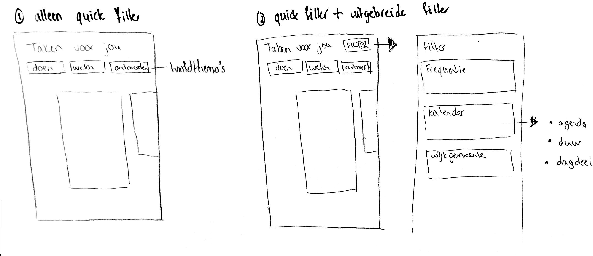

# Filteren

## Mogelijkheden voor filteren

### 2 soorten filters

#### De uitgebreide filter

De filter werd door de gebruiker begrepen tijdens het testen \(versie 0.8\) en de filter opties vonden gebruikers ook belangrijk. De vraag vanuit Zig en Marije is of het filter niet te beperkend is. De gebruiker kan namelijk kiezen uit veel opties en dan gaat het idee van laagdrempelig verkennen weg. Mijn visie hierop is dat de vele filter opties gebruikt kunnen worden wanneer Task It veel taken bevat en de gebruiker wil personaliseren. Die mogelijkheid wil ik geven. Stel, de app bevat weinig taken, dan kan de uitgebreide filter weggelaten worden.

#### De 'quick' filter

Om de gebruiker te helpen bij het verkennen en snel te filteren, is de keuze gemaakt om de gebruiker snel selecties te laten maken.

### Inspiratie voor de quick filter

#### Datum kiezen

Een datum kiezen met een agenda weergave wordt in Kinepolis en De la mar toegepast. 

#### Quick filter

De quick filter wordt toegepast bij Pathé waarbij de button 'binnenkort' erg interessant is voor mijn concept.

### Ideeën voor nieuwe filter

