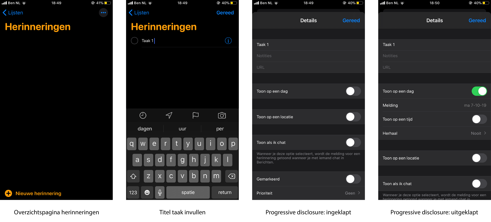
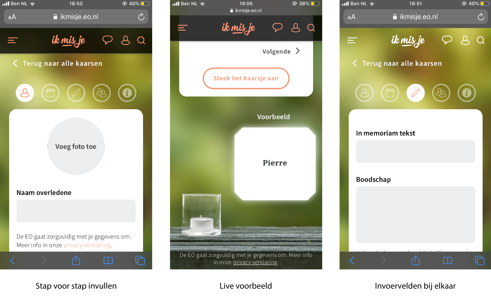
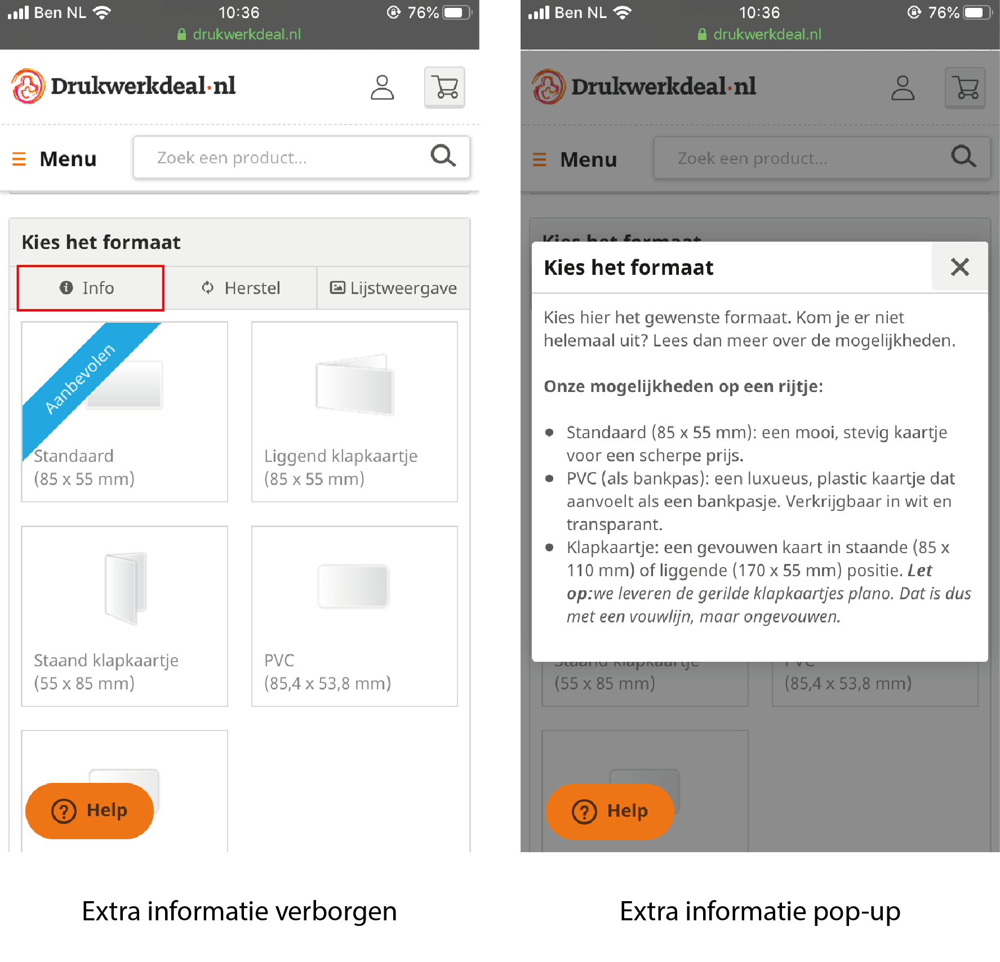
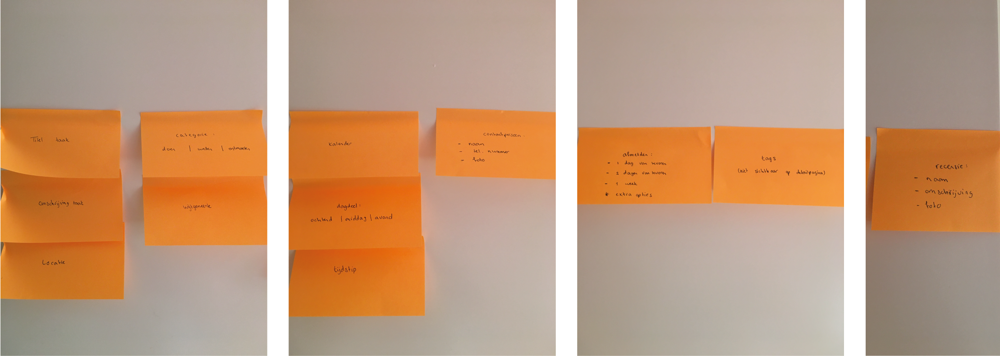
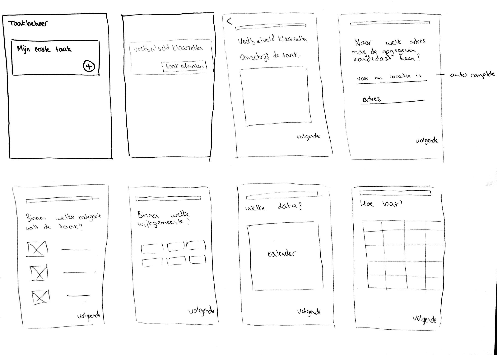
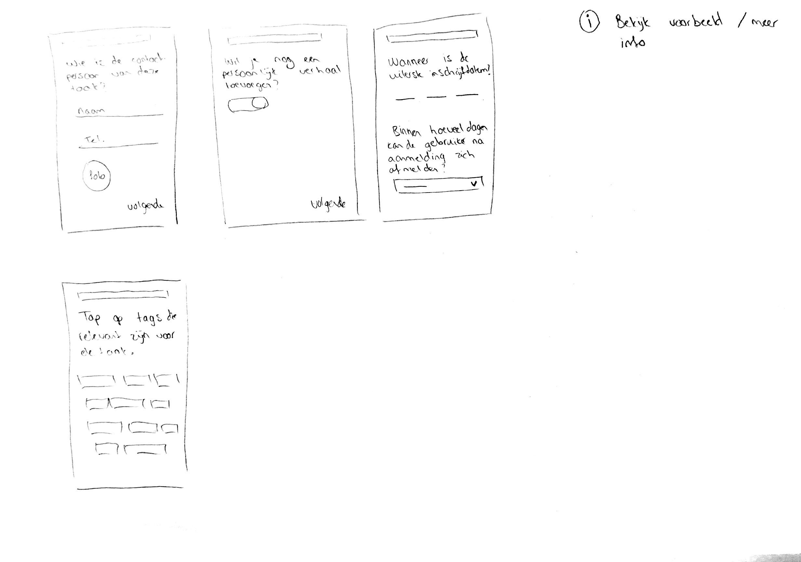
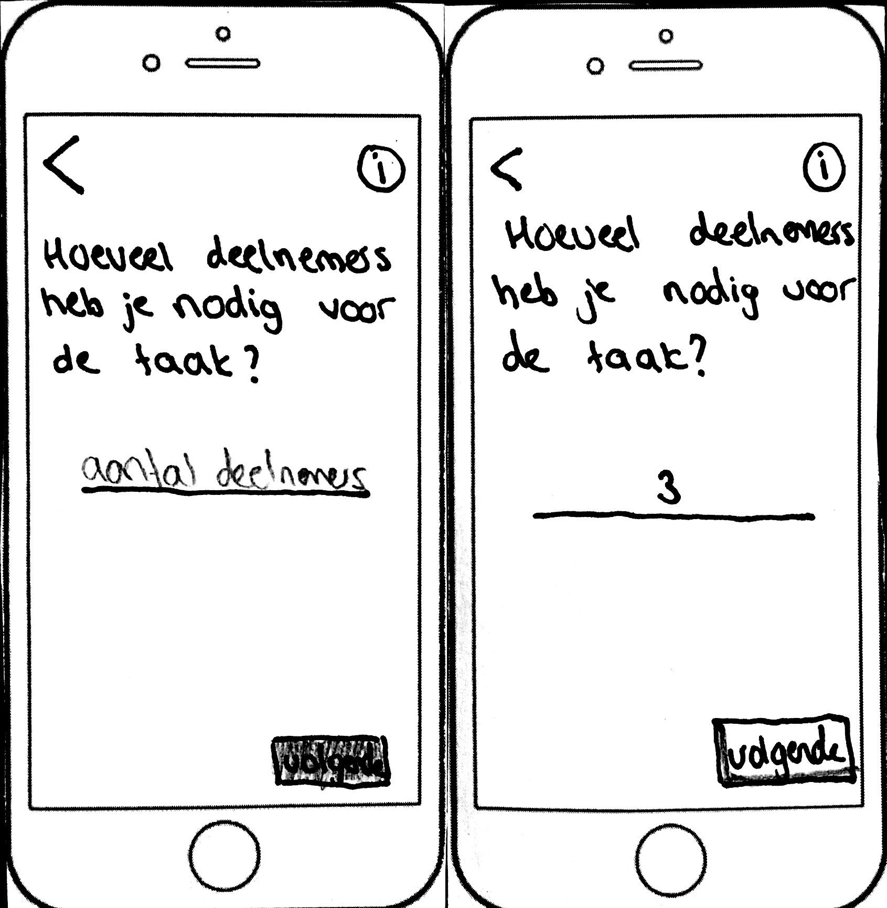

# Taak aanmaken

In een gesprek met Olaf en Henk hebben wij gepraat over hoe de gebruiker een taak zou kunnen aanmaken. Daar kwamen de volgende punten naar voren:

* Gebruik maken van progressive disclosure
* Omschrijving van een taak inspreken i.p.v. typen
* Voor het afmelden van een taak: dropdown menu met '1 dag van tevoren', '1 week van tevoren' dus zo een paar opties geven i.p.v. een getal invullen
* Voor het afmelden van een taak kan de gebruiker ook een push notificatie krijgen.
* Tip: Herinneringen van iPhone als inspiratie gebruiken

### Inspiratie: Herinneringen op iPhone

### Inspiratie: Ik Mis Je kaarsen

Tijdens mijn stage bij de EO heb ik de nieuwe kaarsen pagina ontworpen en ook het proces van een kaarsje aansteken. Het interessante aan dit formulier is dat het stapsgewijs gaat en dat live zichtbaar is hoe het formulier eruit komt te zien.

### Inspiratie: Drukwerkdeal

Op drukwerkdeal kan de gebruiker drukwerk laten drukken. Bij elke stap kan de gebruiker optioneel extra informatie lezen. Zo kan zowel een beginner als gevorderde de stappen makkelijk doorlopen.

### De stappen van een taak aanmaken

Op post-it's is neergezet hoe de volgorde van het formulier invullen kan gaan.

### Schetsen van de stappen

De stappen zijn als volgt:

* Titel, omschrijving, adres
* Categorie, wijkgemeente
* Datums, tijdstip \(systeem ziet automatisch ochtend, middag of avond\)
* Contactpersoon 
* Persoonlijk verhaal
* Uiterste inschrijfdatum, afmelden
* Tags

### Paper prototype taak aanmaken

Er is gekozen voor een paper prototype, omdat in vergelijking met versie 0.8 het hele formulier is veranderd. Naast het digitale prototype wordt dus ook deze paper prototype getest met de gebruikers. Het scherm van het aantal deelnemers toevoegen, was ik vergeten te maken. Die staat onderaan de PDF en kwam na de stap 'omschrijf de taak'



