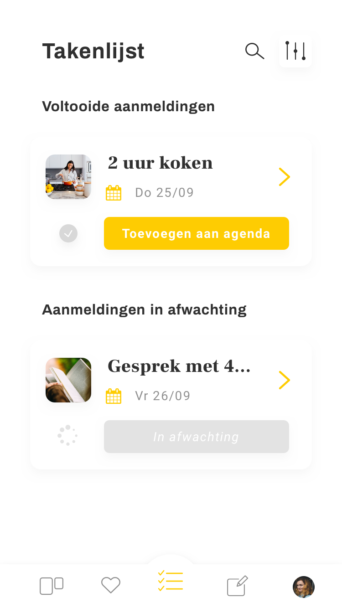
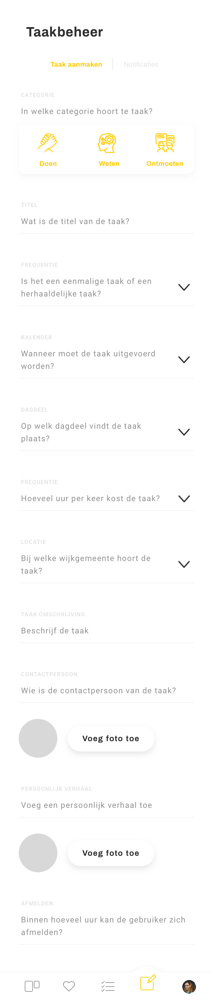
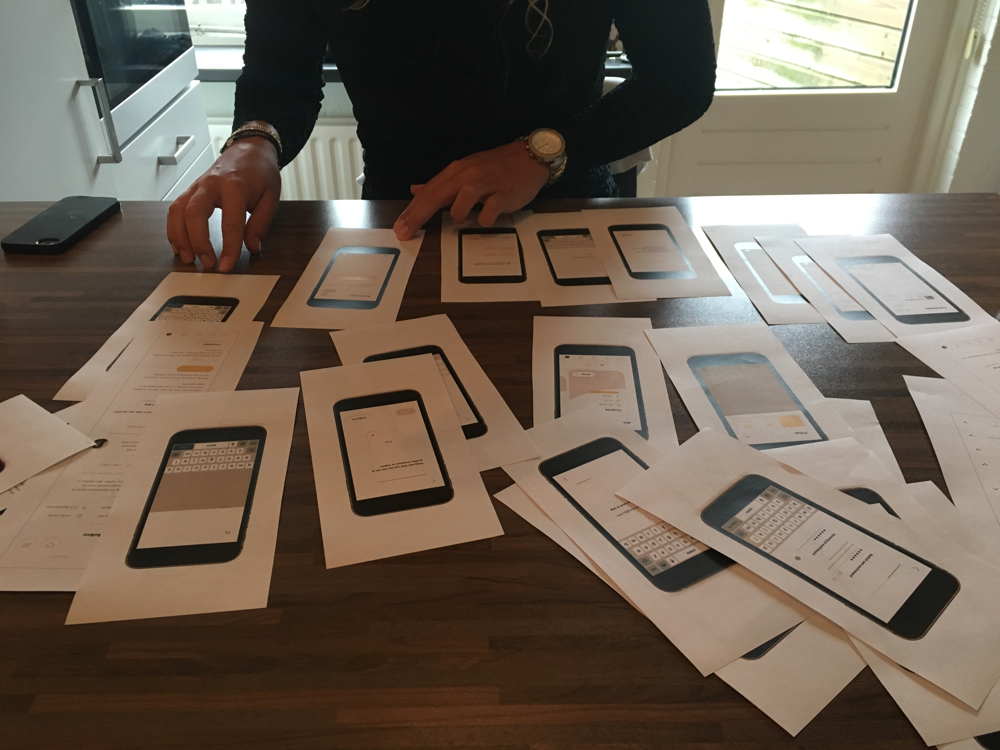

# Prototype 0.8 + gebruikerstest

| Behandelde onderzoeksvragen |  |
| :--- | :--- |
| **Hoofdvraag: wat is nodig om tot een nieuw product te komen?** |  |
| Hoe creëren we een persoonlijke gebruikerservaring? |  |

| Behandelde onderzoeksvragen |  |
| :--- | :--- |
| **Hoofdvraag: hoe stel ik een goede prototype + test op?** | \*\*\*\* |
| Welke prototyping tool is het meest geschikt om het ontwerp in te testen? |  |
| Waarin lopen gebruikers vast tijdens het testen? |  |

## Schermopname prototype 0.8

Hieronder staat de schermopname van prototype 0.8. Niet alle schermen zijn volledig uitgewerkt en er is alleen nog gebruik gemaakt van tap interacties. De schermen voor Takenlijst en Taakbeheer \(taak aanmaken\) zijn los laten zien, omdat hier nog geen interacties op mogelijk waren en ik nog niet tevreden was met het formulier voor een taak aanmaken. Het formulier was in mijn ogen erg lang.



## Schermen takenlijst 0.8

## Scherm taak aanmaken 0.8

## Uitleg over de test

Hieronder staat het testplan. Het prototype is zeker niet volledig en ook qua vormgeving nog niet helemaal consistent. Dit is meegenomen in de iteratie van Task It. Vandaar de naam 'prototype 0.8'. Hierna volgen 2 iteraties. De accenten zijn gelegd op het globale ontwerp en niet de werking van diepere paden in het ontwerp en motion design. Hier is voor gekozen, omdat het belangrijk is dat de basis van Task It staat, dus wat in ieder geval nodig is om het ontwerp te kunnen bouwen.



## Individuele conclusies per test

De test is uitgevoerd met 6 testpersonen.



























## Gezamenlijke conclusies van de test

Hieronder staan de conclusies van de testen in een excel bestand getypt. Dit zijn alleen de conclusies waar de gebruiker moeite mee had. Alle elementen die de gebruiker snapte, staan dus niet in de excel sheet. Op deze manier kon ik een goed overzicht krijgen van de 'fouten' in het ontwerp.



## Belangrijkste conclusies uit de test

De meningen waren verdeeld over het prototype. De 1 wilde extra bevestiging en de ander niet. Om hierin keuzes te maken, is er gekeken naar hoe het ontwerp zo duidelijk mogelijk kan zijn zonder dat er te veel acties nodig zijn. Titels en buttons anders verwoorden kan voor meer duidelijkheid zorgen. De volgende punten zijn meegenomen in de nieuwe iteratie:

#### Account aanmaken

* Volgorde van account aanmaken verandert: eerst persoonlijke gegevens \(naam, geboortejaar, e-mail, foto, interesses\) daarna wachtwoord 
* 'Volgende' blijft in beeld tijdens typen. Wanneer de gebruiker hierop klikt, gaat hij direct naar het volgende scherm. Tegelijkertijd kan hij zijn antwoord nakijken, want hij ziet al 'volgende' in beeld staan
* Extra uitleg over e-mail bevestigen

#### Home

* Duidelijkere titel, bijvoorbeeld 'taken voor jou'

#### Filter

* Andere filter button met tekst
* Titel 'locatie' veranderen, bijvoorbeeld 'wijkgemeente'

#### Buttons footer

* Andere button voor 'taak aanmaken'
* \*Andere button voor 'takenlijst'

#### Takenlijst

* Vinkje weghalen of op andere plek neerzetten

#### Taak aanmaken

* Informatie bij persoonlijk verhaal verduidelijken of anders verwoorden
* Gebruik maken van progressive disclosure, niet alle opties direct laten zien

#### Taak verwijderen

* Button 'bewerk' veranderen
* Swipe toevoegen in taak verwijderen

