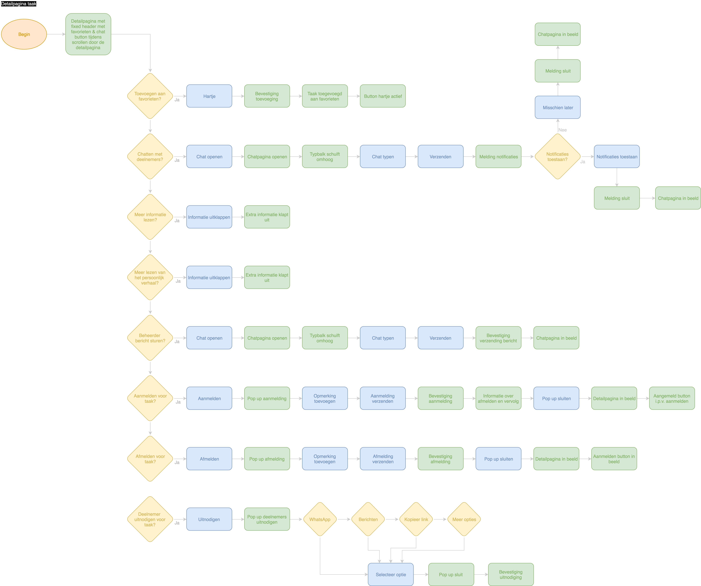

# Flows

| Behandelde onderzoeksvragen |  |
| :--- | :--- |
| **Hoofdvraag: wat is nodig om tot een nieuw product te komen?** |  |
| Hoe creëren we een persoonlijke gebruikerservaring? |  |

Naar aanleiding van de job stories en de features die daaruit zijn gekomen, zijn er diverse flows gemaakt. Per flow kan de gebruiker nog meer kanten op, maar er is 1 flow uitgedacht die de functies van de app doorloopt.

## Soorten flows in een tabel

Hieronder staan de onderdelen neergezet die uitgedacht zijn in een flow.

| Soort flow | Plan van aanpak |
| :--- | :--- |
| Account aanmaken | Oude flow erbij pakken, aanpassingen doen |
|  | 1 flow  |
| Swipen door taken | Oude flow erbij pakken, aanpassingen doen |
|  | Zoekbalk erin verwerken |
|  | 1 flow |
| Filteren | Opties voor filter uitdenken |
|  | Overstap van daad naar sociaal |
|  | 1 flow |
| Detailpagina taak | Informatie uitklappen |
|  | Taak opslaan \(hartje\) |
|  | Direct aanmelden voor taak |
|  | Chat bericht sturen of openen |
|  | Personen uitnodigen voor taak |
|  | 'Dit bekeken anderen'  |
|  | 1 flow |
| Favorieten | Maximum aantal favoriete taken |
|  | Notificaties zichtbaar bij een taak \(bijv. chatbericht\) |
|  | Overzicht favoriete taken |
|  | Link naar detailpagina |
| Aanmelden taak | 1 flow |
| Takenlijst | Overzicht aangemelde taken |
|  | Notificaties zichtbaar bij een taak \(bijv. chatbericht\) |
|  | Link naar detailpagina |
|  | Agenda synchroniseren  |

## Footer met functies

De volgende onderdelen komen in de footer, omdat dit de meestgebruikte pagina's zijn binnen het ontwerp:

* Home: taken matchen
* Takenlijst: aangemelde taken
* Favorieten: favoriete taken
* +: taak aanmaken
* Profiel

## Flows door de app heen

### Aanpassingen na het maken van flows

De flows die zijn gemaakt, zijn de stap geweest na het bedenken van de features. DIt betekent dat het nog pril was. Na het maken van de flows zijn er namelijk gesprekken geweest met Zig en zijn er gebruikerstesten uitgevoerd. De veranderingen zijn doorgevoerd in de wireframes of het ontwerp.

### Account aanmaken

#### Account aanmaken lijkt op eerder gemaakte flow

Tijdens de ideeontwikkeling fase is er een flow gemaakt voor een account aanmaken. Deze flow lijkt op die er nu staat. Wat er bij is gekomen, zijn de kennis onderwerpen die de gebruiker kan aanvinken.

### Home \(swipen door taken\)

#### Home lijkt op eerder gemaakte flow

Er is een filter en zoekbalk bijgekomen.

### Filters

#### Onderscheid hoofd categorieën en sub categorieën

Hieronder is een tabel gemaakt van de opties voor filters. De tags zijn niet meegenomen in het ontwerp, omdat dit te veel keuzes geeft aan de gebruiker. Onderaan de pagina staat hier meer informatie over.

#### Verdere uitwerking in wireframes

De filters zijn niet in een schematische flow gezet zoals hierboven, omdat er vele opties en combinaties mogelijk zijn. In de wireframes heb ik wel laten zien hoe dit eruit ziet en hoe dit werkt.



### Detailpagina

#### Uitbreiding van de detailpagina

In vergelijking met de vorige detailpagina tijdens de ideeontwikkeling, is deze uitgebreid. Zo is een chat functie bijgekomen en kan de gebruiker andere personen uitnodigen voor de taak. Ook kan de gebruiker er zelf voor kiezen of hij meer informatie wil lezen of niet.

### Favorieten

#### Maximaal 10 favorieten

De gebruiker kan maximaal 10 favorieten in zijn lijst hebben. Hier is voor gekozen, om de keuzemogelijkheid te beperken waardoor hij sneller tot een keuze komt. Eindeloos taken blijven liken is niet de bedoeling.

#### Minimalistische filter

Er is gekozen om alleen te kunnen filteren op 'doen', 'ontmoeten', en 'weten'. Omdat de gebruiker een lijstje heeft van 10 items zijn te veel filters onnodig.

### Takenlijst

#### Meerdere flows voor takenlijst

Wanneer de gebruiker zich heeft aangemeld voor een taak, wordt de taak verplaatst van favorieten naar takenlijst. Uit de testen met bestaande apps kwam naar voren dat de testpersonen niet begrepen waarom er een agenda functie aanwezig was in de vrijwilligersapp. Toch is er een flow gemaakt voor als er een agenda functie in de app aanwezig is.

#### Keuze voor takenlijst

Uit het gesprek met Olaf & Henk kwam naar voren dat een taak koppelen aan de agenda van de gebruiker zijn telefoon handiger is. Als voorbeeld gaven ze datumprikker. Dat ziet er op deze manier uit:

Er is besloten om te gaan voor een lijst weergave van taken waarin onderscheid wordt gemaakt tussen aangemelde taken en taken die in afwachting zijn. De gebruiker kan zich terug trekken van zijn aanmelding als de taak in afwachting is. Push notifications zijn nodig om de gebruiker op de hoogte te houden van zijn aanmeldingen.

## Aanpassingen tijdens proces

### Aanpassingen na gesprek met Olaf en Henk \(12/09\)

Uit het gesprek met Olaf en Henk kwam tot een aantal handige inzichten. De grote lijnen zijn [hier](https://app.gitbook.com/@productbiografie-2/s/productbiografie/3.-ontwerp/meetings-met-olaf-zig#meeting-met-olaf-en-henk-op-12-09-19) beschreven. 

#### Afwegingen wat betreft wireframen

Ik merkte dat ik met mijn wireframes te veel de diepte ben in gegaan. Mijn bedoeling was om het platter te ontwerpen, maar ik heb toch meer visual erin verwerkt. Het voordeel hiervan is dat het omzetten van wireframes naar visual design sneller gaat en dat ik kan testen of de gebruiker de visuals tot nu toe begrijpt. Het nadeel is dat ik veel tijd heb gestopt in het tot in detail uitwerken. Achteraf gezien had ik minder tijd moeten besteden aan het netjes maken van de wireframes. Een punt voor de volgende keer.

#### Afwegingen wat betreft tijd

Door het gesprek met Olaf & Henk zijn er weer een aantal dingen bijgekomen waar ik over moet nadenken. Omdat dit best belangrijk is, moet ik wat schuiven in mijn planning. Ik wil toch meer tijd besteden aan het uitdenken van een filter, een taak aanmaken en het aan- en afmeld proces. Dit zijn namelijk essentiële onderdelen die nodig zijn om het ontwerp te laten werken. Ik heb wat tijd van het visual designen afgehaald om het weer in balans te krijgen.

#### Idee voor een nieuwe testvorm

Olaf kwam met een goed idee: printjes maken van de wireframes en de gebruiker de prints op volgorde laten zetten. Ik wil graag weten of de gebruiker de buttons snapt die in de footer staat en of de gebruiker kan voorspellen waar het ontwerp heen gaat, zonder dat er feed forward wordt gegeven. Daarom wil ik het idee van Olaf uitvoeren.

#### Daad, sociaal & kennis anders verwoorden

Henk gaf aan dat 'doen' actiever klinkt dan daad. Daarom heb ik de 3 woorden in werkwoorden omgezet: doen, ontmoeten & weten.

#### 

